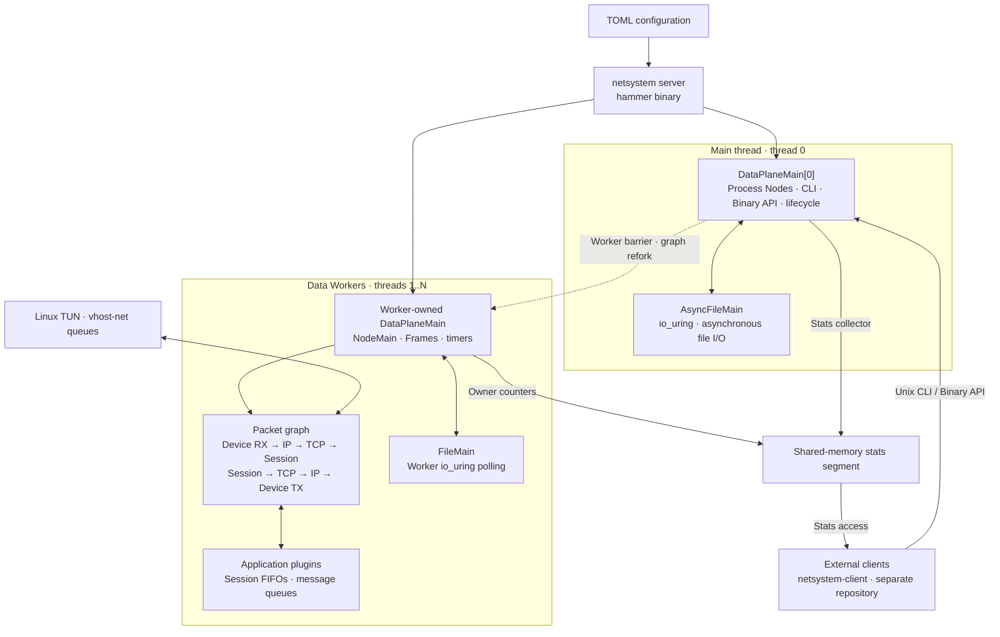

# netsystem

**Rewrite VPP into Rust.**

netsystem is a standalone network data-plane framework that rewrites the core
architecture of [FD.io Vector Packet Processing (VPP)](https://fd.io/vpp/) in
Rust. It builds on VPP's packet graph, vector processing, worker ownership,
buffers, sessions, and control-plane model, with Rust ownership and async
Futures for main-thread processes. The rewrite is under active development.

## What is VPP?

VPP is an open-source packet-processing platform, originally developed at
Cisco and maintained within FD.io. Written primarily in C, it provides an
extensible userspace networking stack with switching, routing, transport,
and application services on commodity CPUs.

Its central idea is **vector packet processing**: a graph node processes a
batch of packets, then sends those packets to the next nodes. Processing a
batch through the same code amortizes dispatch overhead and improves
instruction-cache locality. Workers execute their own graph state, and
plugins extend the graph with protocols, device drivers, and applications.

netsystem follows these architectural principles across the framework. The
VPP source checkout under `third_party/vpp/` is the primary reference for
ownership, lifecycle, batching, and protocol behavior. Design decisions and
their VPP source references are recorded in [architecture decision records](docs/adr/).

Upstream: [VPP source](https://github.com/FDio/vpp) ·
[VPP documentation](https://s3-docs.fd.io/vpp/).

## Architecture



The graph above shows the TUN/IP/TCP/session path. Other graph branches,
including forwarding, ICMP, drop, and worker handoff, use the same runtime.

### Execution and ownership

The main thread runs control-plane work. Each Process Node is a Future
scheduled through Tokio on that thread. CLI sessions, Binary API handling,
stats collection, and lifecycle work share this scheduling model. Thread
zero uses `AsyncFileMain` for asynchronous file operations; packet frames and
handoff queues run on Data Workers.

Each Data Worker owns a `DataPlaneMain` with its `NodeMain`, Node Runtimes,
Next Frames, Pending Frames, timer wheel, and trace state. Nodes process
frames of compact Buffer Indices and enqueue batches onto graph arcs.
Explicit handoff queues transfer packet ownership between workers. The
main thread uses worker barriers when changing worker-visible graph or
topology state; graph refork updates worker-local graph state.

Session separates applications from transports. Applications exchange data
through RX/TX FIFOs and notifications through message queues. Session owns
retained TX bytes and scheduling; TCP owns connections, sequence numbers,
ACKs, recovery, congestion control, and transport timers. Device and protocol
implementations remain in their owning plugins.

Memory has explicit owners. `MemMain` owns the fixed-capacity Main Heap and
active-heap selection used by ordinary Rust allocations. `BufferMain` owns
packet Buffer Pools backed by NUMA-aware physical-memory mappings, with
hugepage configuration. Shared-memory API, FIFO, and stats segments have
their own backing and lifetimes.

### Modules

| Module | Responsibility | VPP reference |
| --- | --- | --- |
| [`hammer`](crates/hammer/) | Daemon startup, TOML configuration, plugin loading, and builtin CLI commands. | `vpp` |
| [`hammer-runtime`](crates/hammer-runtime/) | Graph execution, thread administration, worker barriers, Process Nodes, CLI registration, file scheduling, trace, and plugin lifecycle. | `vlib` |
| [`hammer-core`](crates/hammer-core/) | Shared packet-graph ABI: Node, Frame, Buffer, Index, and Next. | Core contracts split out of `vlib` |
| [`hammer-infra`](crates/hammer-infra/) | Main Heap, memory mapping, pools, bitmaps, timers, Bihash, FIFOs, and shared-memory queues. | `vppinfra` and `svm` |
| [`hammer-service`](crates/hammer-service/) | Protocol-neutral interfaces, devices, feature arcs, sessions, and transport contracts. | Shared infrastructure in `vnet` |
| [`hammer-stats`](crates/hammer-stats/) | Shared-memory statistics directory, collectors, and simple/combined counters. | `vlib/stats` and counter mains |
| [`hammer-ipc`](crates/hammer-ipc/) | Server-side Binary API declarations, message registration, shared-memory transport, and socket transport. | `vlibapi` and `vlibmemory` |
| [`hammer-component-macros`](crates/hammer-component-macros/) | Declarative graph, lifecycle, CLI, and architecture-specific function registration. | VPP registration and multiarch macros |
| [`hammer-plugins`](crates/hammer-plugins/) | Independently loaded TUN, IP, ICMP, session, TCP, and iperf3 implementations. | Protocol/device/application plugins |

The server repository owns the daemon, shared contracts, and server-side
state. External CLI, Binary API, and stats clients live in the separate
`netsystem-client` repository. Applications stay outside generic framework
crates; builtin applications such as iperf3 live in independent plugins.

## Build

Use a Rust toolchain supporting the Rust 2024 edition and a C compiler for
the allocator dependency:

```sh
cargo build --workspace --release
```

The daemon takes a TOML configuration path: `hammer <config.toml>`. CPU
placement, Buffer Pools, memory, stats, and plugin configuration belong to
their respective owners. The Linux TUN data path uses `/dev/net/tun` and
`/dev/vhost-net`.

## Documentation

- [Domain terminology and ownership](CONTEXT.md)
- [Architecture decisions and VPP source references](docs/adr/)
- [CLI registration and Unix CLI processes](docs/adr/0049-cli-main-and-unix-process.md)
- [Runtime, errors, memory, buffer, and clear commands](docs/adr/0053-runtime-errors-memory-cli.md)
- [Packet tracing](docs/adr/0051-packet-trace-main-and-cli.md)
- [TUN multiqueue and vhost-net data path](docs/adr/0047-tun-vhost-multiqueue.md)
