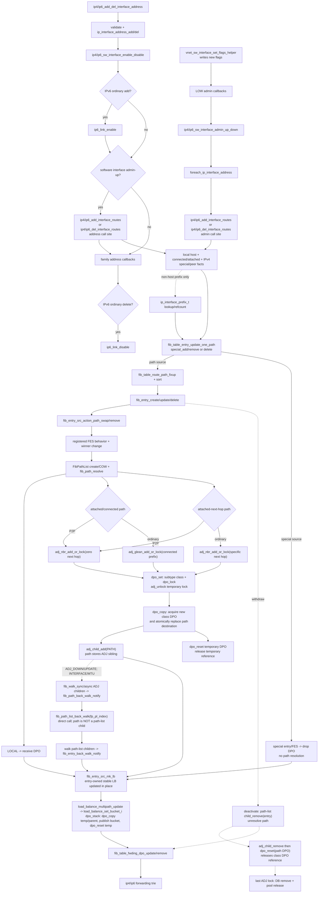
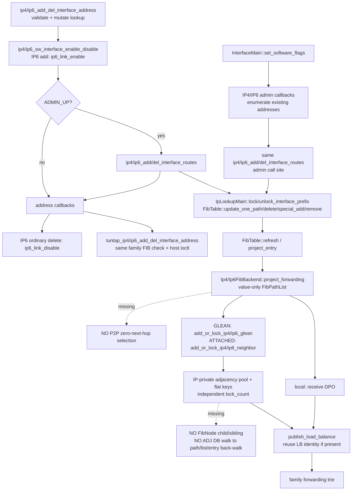
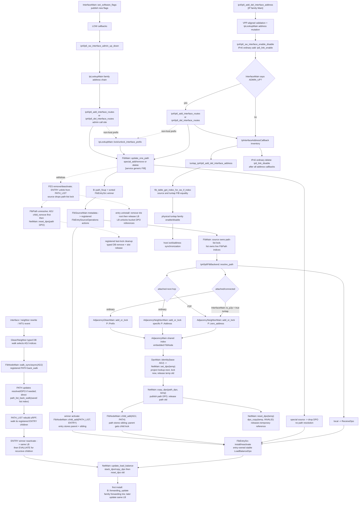
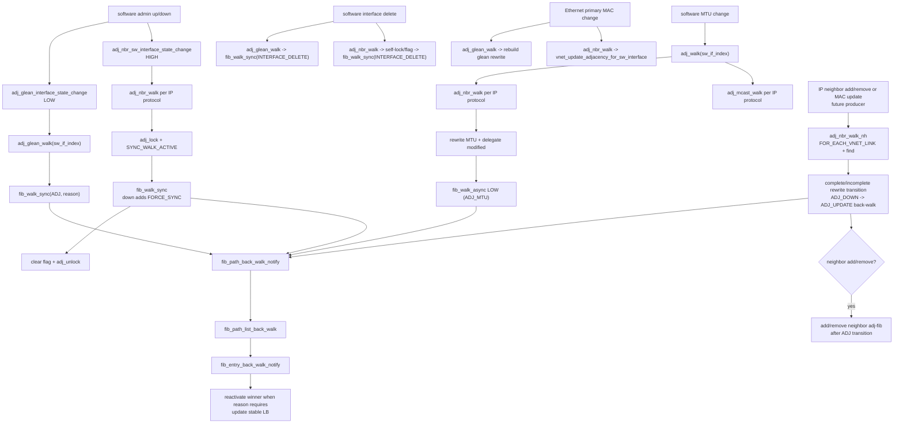
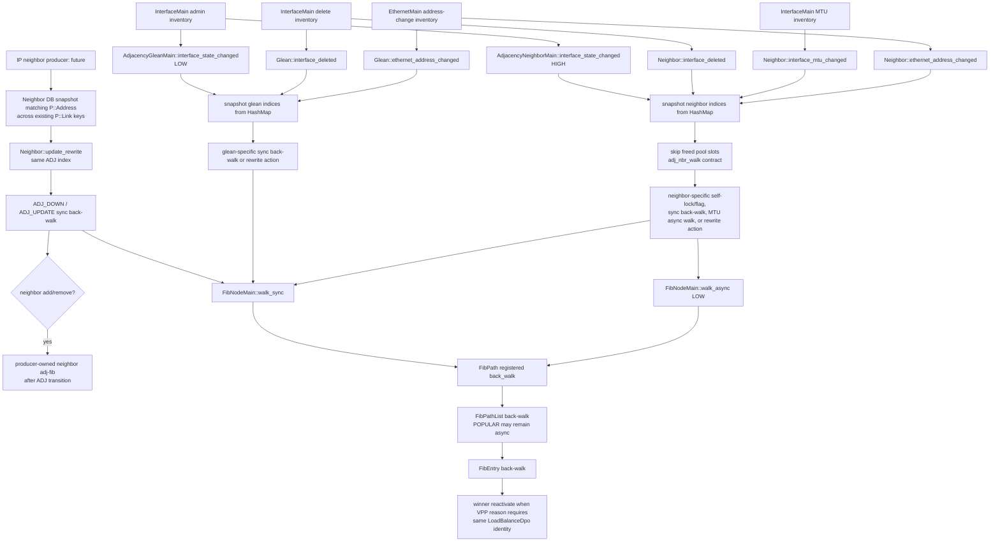

# ADR-0029: VPP 风格 IP interface admin 与地址路由生命周期

Status: accepted

Date: 2026-09-19

本文定义 software-interface admin up/down 与 IPv4/IPv6 interface-address route contribution
的 owner、调用顺序、FIB/DPO 结果、具体 IP adjacency layout 和验收合同。

本文补全 ADR-0028 的地址生命周期。ADR-0028 中把 interface route contribution、
prefix pool/hash 和 IPv6 link-local table route 延期的表述由本文取代；ADR-0028 已确定的
地址 owner、enable 引用、not-enabled Feature Node 与 tuntap callback 合同保持不变；
ADR-0028 第8.4节的“保留六个 Rust address error variant”合同由本文第8节取代，
不能用已有 Rust enum 反推 VPP 返回值。
ADR-0005 已批准的 service FIB、`ReceiveDpo<A>`、`LoadBalanceDpo` 和具体 IPv4/IPv6
forwarding owner 边界继续有效。`adj`、`adj_glean`、`adj_nbr`、`adj_delegate`、`rewrite`的
协议无关抽象进入`hammer-service::net`；IPv4/IPv6 address、prefix构造和typed DB key仍由
IP plugin拥有。vendored VPP的具体对象叫`ip_adjacency_t`，其union和两个DB都直接保存
`ip46_address_t`/`fib_prefix_t`，所以它只能作为ADJ生命周期、DPO、rewrite和事件语义证据，不能作为
把IP payload下沉service的owner证据。本文此前提出的service `Ip46Address`、service `IpFibPrefix`和
service concrete `Adjacency`方案被本轮复审否决；在无字节擦除、无`dyn`且不让service依赖IP plugin的
约束下，具体泛型实例已确定由现有`Ip4Main`/`Ip6Main`分别按值持有，本文不得再用改名后的IP46
storage冒充解耦。该owner placement与subtype静态操作合同见第4.6.6节，Rust实现仍待按合同完成。

## 1. 问题与范围

`ip4_add_del_interface_address` / `ip6_add_del_interface_address` 不能只修改地址池、
enable 引用并通知 callback。vendored VPP 在 ordinary address mutation 成功后，如果
software interface 当前 admin-up，会同步调用 family-specific interface route helper；
admin 状态变化时又会遍历该 interface 的全部 ordinary addresses，成对安装或撤销相同路由。

当前工作区已经把ordinary address与admin两个入口接到family route helper；local、connected和IPv4
special contribution可进入现有FIB，tuntap也已订阅地址回调。但现有FIB value-only path投影没有
`adjacency -> path -> path-list -> entry`依赖图，IP-private ADJ draft无walk/rewrites，P2P仍被当成
ordinary glean；因此**已有route入口不等于VPP route生命周期已完成**。本ADR保留这些入口，补齐缺失的
FIB/ADJ行为，并明确net/IP的类型边界。

本文纳入以下完整合同；第1-8项在当前工作区已有实现，本ADR复用且重新核验其行为，不能作为待新增
代码清单。第9项起包含待补的generic FIB/ADJ依赖与事件链：

1. service-owned software-interface admin-up/down callback inventory 与 dispatch；
2. private `ip4_add_interface_routes` / `ip4_del_interface_routes`；
3. private `ip6_add_interface_routes` / `ip6_del_interface_routes`；
4. ordinary address add/delete 与 admin up/down 的 route call sites；
5. `IpLookupMain` 内的 per-interface prefix pool/hash/refcount；
6. IPv4 local `/32`、connected prefix、network/broadcast special route 与 `/31` peer route；
7. IPv6 local `/128` 与 connected prefix route；
8. IPv6 link owner维护的 per-interface link-local FIB `/128` local route；
9. `hammer-service::net`中的协议无关`adj`/`adj_glean`/`adj_nbr`/`adj_delegate`/`rewrite`抽象，
   以及不把IP address/prefix/key放入service的concrete owner合同；
10. IP插件中的`Ip4FibProtocol`/`Ip6FibProtocol`、typed adjacency payload/DB key实现，以及按family拆分的
    glean/incomplete/rewrite packet nodes；
11. interface-source route 所需的 receive、glean、attached-neighbor、drop 与 load-balance
    forwarding projection；
12. 两个family FIB对SIMPLE/API/INTERFACE/ADJACENCY behavior的显式operations registration，以及
    `FIB_SOURCE_ADJ` cover/refinement FES lifecycle；
13. service FIB entry直接拥有的cover/import/export状态、fixed `ATTACHED_EXPORT` source与
    cross-table winner transition；
14. service-owned Ethernet primary-address change callback inventory，以及glean/neighbor对MAC变化的
    rewrite更新；
15. 现有`DpoClass`与`FibSource` derive macro的registration生成能力改造，并在ADJ/FIB初始化中真实使用；
16. 只验证上述生命周期的聚焦测试。

本文不纳入：

- external route Binary API、table create/delete/bind 或 route dump；
- MFIB、IPv4/IPv6 multicast interface route；
- ARP/ND packet generation与neighbor resolution/completion、neighbor Binary API、DAD、RA、MLD；
  net ADJ framework、ADJ FES、incomplete neighbor adjacency identity、P2P selection及FIB依赖链仍属于
  本文的control-plane前置合同；
- classify table 配置。VPP `ip[46]_add_interface_routes` 的 classify branch 只有在
  `classify_table_index_by_sw_if_index` 已配置时才执行；Hammer 当前没有该 owner 或配置入口，
  本文不创建永远不可达的 classify state；
- directed-broadcast 配置 API。Hammer 当前没有对应 interface flag；本文实现 VPP 默认的
  directed-broadcast-disabled 分支，即 IPv4 subnet broadcast `/32` 为 drop + loose-uRPF-exempt；
- 邻居解析完成后的 adjacency replacement/back-walk。本文必须发布真实 glean 或 attached
  adjacency identity，不能用 drop、receive 或 interface-RX DPO 冒充，但解析它的 ARP/ND owner
  由后续 ADR 完成。

## 2. VPP 源码证据

| ID | vendored VPP source | 源码事实 | 本文约束 |
| --- | --- | --- | --- |
| V1 | `third_party/vpp/src/vnet/ip/ip4_forward.c:609-788`, `ip4_add_del_interface_address_internal` | ordinary address pool mutation和IP/MFIB enable之后，仅在`vnet_sw_interface_is_admin_up`为真时调用`ip4_add_interface_routes`或`ip4_del_interface_routes`，随后才调用address callbacks | Hammer ordinary IPv4 address成功路径必须保留同一条件与相对顺序；admin-down时地址仍存在但不安装route |
| V2 | `third_party/vpp/src/vnet/ip/ip6_forward.c:263-477`, `ip6_add_del_interface_address` | ordinary address mutation后执行family enable和link enable；admin-up时add/del routes；然后address callbacks；delete最后link disable | Hammer必须保留IPv6 route相对link enable、callback、link disable的顺序 |
| V3 | `third_party/vpp/src/vnet/ip/ip4_forward.c:412-460`, `ip4_add_interface_routes` | 每个地址安装interface-source local `/32`；prefix小于32时再安装prefix routes；classify是独立可选source | local host与prefix contribution都是address operation的一部分，不得延期或用地址池存在代替 |
| V4 | `third_party/vpp/src/vnet/ip/ip4_forward.c:309-409`, `ip4_add_interface_prefix_routes` | prefix key为`(network/prefix_len, sw_if_index)`；重复prefix只增加refcount；首次安装connected+attached path；`<= /30`另装network drop与broadcast route；`/31`另装peer attached host | Hammer prefix owner必须按interface计数；最终adjacency类型由path resolver和interface link facts决定，同prefix多个地址共享prefix route但各自保留local host route |
| V5 | `third_party/vpp/src/vnet/ip/ip4_forward.c:462-563`, `ip4_del_interface_prefix_routes`, `ip4_del_interface_routes` | IPv4先删除local `/32`，再减少prefix refcount；只有最后一个地址才删除special hosts与glean prefix，随后释放prefix record | delete不能按每个地址重复撤销共享prefix，也不能先删pool record后丢失route facts |
| V6 | `third_party/vpp/src/vnet/ip/ip6_forward.c:35-138`, `ip6_add_interface_prefix_routes`, `ip6_add_interface_routes` | 每个地址安装interface-source local `/128`；prefix小于128时按`(network/prefix_len, sw_if_index)`共享connected+attached path | IPv6与IPv4共享prefix owner算法和resolver分支，但没有IPv4 network/broadcast或`/31`分支 |
| V7 | `third_party/vpp/src/vnet/ip/ip6_forward.c:140-203`, `ip6_del_interface_prefix_routes`, `ip6_del_interface_routes` | IPv6 delete先减少/删除prefix route，再删除local `/128` | Hammer保留family-specific delete顺序，不用一个统一函数抹平IPv4/IPv6差异 |
| V8 | `third_party/vpp/src/vnet/ip/ip4_forward.c:843-876`, `ip4_sw_interface_admin_up_down`; `ip6_forward.c:486-518`, `ip6_sw_interface_admin_up_down` | 两个family callback都读取family FIB mapping，遍历该interface的ordinary address list；up逐个add routes，down逐个del routes | IP plugin注册两个concrete admin callbacks；不使用`IpVersion` dispatcher或`IpFamilyMain` |
| V9 | `third_party/vpp/src/vnet/interface.c:390-445`; `interface.h:239-257` | interface先写新flags，再调用按priority排序的global software-interface admin callbacks，之后才调用device/hw-class callbacks；global callback错误恢复flags | Hammer增加独立admin callback inventory并保留成功路径调用顺序；不能复用device/hw-class单一callback或software add/del inventory |
| V10 | `third_party/vpp/src/vnet/fib/fib_table.c:483-560`; `fib_types.c:768-800`; `fib_path.c:1267-1413` | connected+非local且零next-hop的path fixup为attached/glean语义；local path转为receive；attached host转为attached-next-hop；attached predicate和live path-mode分类是两个不同源码合同 | IP backend必须返回typed live mode并单独回答fixed route是否attached，generic FIB不能读取plugin-owned path flags；`InterfaceRxDpo`改变packet RX identity并重新进input，不是receive或adjacency替代品 |
| V11 | `third_party/vpp/src/vnet/fib/fib_path.c:609-718,2120-2127` | attached-next-hop解析为neighbor adjacency；attached path再按P2P/NBMA/ordinary选择zero-neighbor/drop/glean；local path解析为receive DPO | interface-source contribution通过path/DPO owner与interface facts构建forwarding，不直接把`sw_if_index`写成FIB index或DPO index |
| V12 | `third_party/vpp/src/vnet/adj/adj_glean.c:10-147`, `adj_glean_add_or_lock` | glean identity按protocol/interface/normalized connected-prefix共享；DB key是`ip46_address_t`，对象是`ip_adjacency_t`，subtype保存`fib_prefix_t`，node选择直接switch IP4/IP6 | Hammer保留add-or-lock、单一index、node/rewrite和delegate通知语义；这段源码同时证明VPP实现本身是IP-coupled，不能据此要求service保存IP key/prefix |
| V13 | `third_party/vpp/src/vnet/ip/ip4_forward.c:270-306`, `ip4_add_subnet_bcast_route` | directed broadcast关闭时broadcast `/32`是interface-source drop + loose-uRPF-exempt；开启时才使用broadcast adjacency | 本文没有directed-broadcast配置，因此只实现源码默认关闭分支并在测试中固定该事实 |
| V14 | `third_party/vpp/src/vnet/ip/ip6_link.c:139-243,260-310,340-371`; `ip6_ll_table.c:83-154` | link首次enable在per-interface link-local FIB中以`FIB_SOURCE_IP6_ND`安装`/128` local route；replace先删旧route再装新route；last lock删除route并在无entry时释放该table | `Ip6LinkMain`必须同时拥有link identity/locks和per-interface link-local table；link-local route不进入ordinary unicast table或ordinary address callback |
| V15 | `third_party/vpp/src/vnet/ip/lookup.h:45-104`, `ip_interface_prefix_t`, `ip_lookup_main_t` | prefix pool/hash与address pool同属family lookup main；prefix record保存key/refcount，IPv4还保存source address record index | `IpLookupMain`补入真实prefix owner；不能把prefix引用放进`InterfaceMain`或临时从FIB entry count推导 |
| V16 | `third_party/vpp/src/vnet/fib/fib_source.h:190-291`; `fib_source.c:27-132,208-213` | source identity与其metadata registry分离；fixed source和dynamic source都得到唯一`(priority class,slot)`，数值更小者优先；`FIB_SOURCE_INTERFACE`为`0x03/INTERFACE`，`FIB_SOURCE_IP6_ND`为fixed `0xc1/API`；dynamic空间耗尽返回`FIB_SOURCE_INVALID` | service提供通用identity/metadata registry；fixed source声明可由实际owner所在crate持有，不能因IP6-ND属于IP plugin就把VPP fixed identity改成dynamic allocation；interface routes不能旁路winner选择 |
| V17 | `third_party/vpp/src/vnet/fib/fib_table.c:483-560,771-851`; `fib_entry_src.c:1548-1674` | ordinary route先做path fixup和排序，再以`update`/`update_one_path`替换该source的完整path set；source record保存entry flags并连接path-list | local、connected/attached和`/31`peer必须提交现有`FibPath`，不能先构造LB再把`DpoId`塞给FIB |
| V18 | `third_party/vpp/src/vnet/fib/fib_entry_src.c:1247-1445`; `fib_entry.c:770-805,823-858,1159-1210` | special add使用per-source refcount；source只在0->1建立、1->0销毁；winner变化执行deactivate/activate/reactivate，loser仍保留在entry | Hammer的live table必须用现有`FibEntrySrc`承载refcount、entry flags、path-list和source flags，不能用平行map代替 |
| V19 | `third_party/vpp/src/vnet/fib/fib_path_list.c:160-310,553-583,1195-1224`; `fib_entry_src.c:243-407` | path-list按paths与key flags共享并拥有生命周期；path解析后由contributing source收集forwarding、构造LB | Hammer必须把现有`FibPathList`接入live entry/source graph，由backend从winner path-list投影LB；forwarding trie只接收最终projection |
| V20 | `third_party/vpp/src/vnet/fib/fib_path_list.c:420-447,553-583`; `fib_entry_src.c:548-695`; `dpo/load_balance.c:337-365` | path-list烘焙uRPF，entry构造把该uRPF绑定到LB；loose-uRPF-exempt是entry-local例外；LB替换uRPF时先后维护引用 | Hammer复用现有`FibPathList::bake_urpf`、`FibUrpfList`和`set_load_balance_urpf`，但必须由live projection自动完成，不能由interface helper手工拼装 |
| V21 | `third_party/vpp/src/vnet/fib/fib_entry_src_interface.c:18-115,163-305` | interface behavior的local source跟踪less-specific connected cover；首个local地址为glean提供source address，winner/cover变化时移交；deactivate移除cover sibling | 本slice所需的interface behavior必须完成cover/sibling与`PROVIDES_GLEAN`语义，不能把cover仅当forwarding trie回退项 |
| V22 | `third_party/vpp/src/vnet/fib/fib_path.c:609-718,2120-2127` | path resolver把attached-next-hop投影为neighbor adjacency、attached path按link facts投影neighbor/drop/glean、local path投影receive DPO，并由path/adjacency依赖承接更新 | concrete IPv4/IPv6 backend必须从现有`FibPath`与interface事实解析DPO并建立依赖；route helper不直接调用DPO pool |
| V23 | `third_party/vpp/src/vnet/fib/fib_table.c:320-480,606-920`; `fib_entry_src.c:1400-1412`; `ip4_forward.c:463-491`; `ip6_forward.c:141-168` | FIB add/update返回entry index，remove/delete为void；不存在prefix的table删除为no-op，source record不存在时remove action不返回error；interface-prefix record缺失只`clib_warning`并返回 | Hammer不得给这些路径增加`FibError`、boolean missing结果、rollback、transaction或panic语义 |
| V24 | `third_party/vpp/src/vnet/fib/fib_types.h:191-230`; `vnet/adj/adj.h:210-359`; `adj.c:58-106`; `adj_nbr.c:225-251` | `fib_prefix_t`为length/protocol/pad加16-byte IP46 address；具体类型名是`ip_adjacency_t`，其subtype直接保存IP next-hop/prefix，整体64-byte aligned且4个cache line | IP plugin concrete representation保留`IpFibPrefix`的20-byte事实；service通用ADJ只可对齐embedded node、rewrite cache lines、delegate/lookup/link等公共热字段，不能宣称其协议无关对象与`ip_adjacency_t`逐字段同型 |
| V25 | `third_party/vpp/src/vnet/fib/fib_node.h:180-376`; `fib_node.c:20-190`; `fib_node_list.h`; `fib_node_list.c` | 每个FIB graph object嵌入12-byte `fib_node_t`；node type必须注册get/last-lock/back-walk/memory operations；child由`(node type,index)`定位并返回sibling handle；add child取得parent lock，remove child释放 | service net必须定义可注册的`FibNode`抽象和`FibNodeList`容器；插件注册自己的concrete node operations并继续拥有typed pool，不能靠IP插件私有`match FibNodeType`假装完成通用FIB graph |
| V26 | `third_party/vpp/src/vnet/adj/adj.c:256-355,558-628`; `fib_path.c:609-718,860-914,1940-1965` | adjacency lock就是embedded FIB-node lock；path解析到adjacency后以`adj_child_add(...FIB_NODE_TYPE_PATH...)`保存sibling，path销毁/重解析先remove child；last adjacency lock断言child list为空再删除DB/pool | Hammer path不能只在projection时临时创建DPO；必须成为有稳定index/sibling的node-backed对象，并在adjacency child list中建立/解除依赖 |
| V27 | `third_party/vpp/src/vnet/adj/rewrite.h:40-102`; `adj/rewrite.c:75-109,163-171`; `adj.c:458-493`; `adj_glean.c:151-177`; `adj_nbr.c:412-595` | rewrite header含interface、next、`u16 data_bytes`、MTU、flags和mcast offset，连同data固定128 bytes；neighbor rewrite/type transition自行进入worker barrier并在type变化前后back-walk；glean direct rebuild与generic MTU callback本身不进入barrier，MTU只发`ADJ_MTU` async walk；glean/incomplete node index是对象事实 | service `AdjacencyRewrite`逐字段对齐而非opaque padding；对象保存真实family node index；Hammer因Rust worker-visible mutation合同要求这些入口由外层pending barrier包围，这是同步安全适配，不能伪称VPP glean/MTU helper自身进入barrier |
| V28 | `third_party/vpp/src/vnet/fib/fib_entry_src.h:25-207`; `fib_entry_src.c:20-61`; `fib_entry_src_default.c`; `fib_entry_src_interface.c` | FES是按behavior显式注册的VFT，包含init/deinit、activate/deactivate/reactivate、add/remove、path swap/add/remove、cover change/update、installed、forwarding update、source data及copy等操作；source record通过其source找到behavior operations | service FIB定义泛型`FibEntrySrc<S,...>`和`FibEntrySourceOperations<P,B,S>`函数表；IP插件定义`S`并把concrete operations显式注册进每个family Main，不能用一个trait declaration或封闭`match FibSourceBehavior`冒充registration |
| V29 | `third_party/vpp/src/vnet/fib/fib_entry.h:193-337`; `fib_entry_src.c:67-119` | `fib_entry_src_t`是每个entry的`fe_srcs` value vector元素，按source priority排序；它直接保存path-list、flags、refcount和behavior-private data，不是按behavior分散到多个pool再以index间接引用 | Hammer的`FibEntry.sources`直接保存`FibEntrySrc` records；FES抽象是这些records的注册行为，不是另一组source-record pools |
| V30 | `third_party/vpp/src/vnet/adj/adj.h:216-359`; `adj.c:58-106`; `adj_nbr.c:10-96`; `adj_glean.c:10-94` | 第1 cache line的subtype union是IP payload；neighbor key为`ip46_address_t+link`，glean key为normalized `ip46_address_t`，两个DB按IP protocol/interface分区并使用ordinary memory hash | `HashMap`是合适容器，但其typed key属于具体`FibProtocol`实现；service可定义泛型DB算法，不能把`Ip46Address`放入非泛型service owner，也不能用opaque byte/index carrier规避类型边界 |
| V31 | `third_party/vpp/src/vnet/adj/adj.c:458-568`; `adj_nbr.c:744-957`; `adj_glean.c:315-430` | generic `adj_walk`只遍历neighbor/mcast，所以MTU callback不遍历glean；neighbor admin up/down和delete都临时自锁、设置`SYNC_WALK_ACTIVE`并同步walk，只有admin-down增加`FORCE_SYNC`；glean admin/delete直接同步walk；interface add不触发resolve | Hammer必须分别实现neighbor与glean event路径，并保留neighbor self-lock与flag生命周期；不得写一个“遍历所有adjacency”的统一回调改变VPP可观察语义 |
| V32 | `third_party/vpp/src/vnet/fib/fib_path.c:609-718,1030-1150,1940-1965` | attached path在P2P interface解析为zero-next-hop neighbor adjacency，在NBMA解析为drop，其他interface才解析为glean；attached-next-hop在P2P也使用zero next hop；两者都成为adjacency child，但attached初始resolved只看interface状态，attached-next-hop初始resolved同时看interface和`adj_is_up`，各自back-walk分支也不同 | backend resolver必须读取interface link/admin facts并保留两种path的resolved语义；connected route不能无条件声称得到glean，尤其tuntap的hw class已经标记P2P |
| V33 | `third_party/vpp/src/vnet/fib/fib_entry_src_adj.c:18-420`; `fib_entry_src.c:1908-1920`; `fib_source.h:250-263`; `ip-neighbor/ip_neighbor.c:330-410` | `FIB_SOURCE_ADJ`以priority `0xd0`选择独立ADJ behavior；模块初始化显式注册ADJ VFT；neighbor host route通过该source增删path；ADJ FES跟踪less-specific cover、维护per-path refinement extension，只在attached cover与相同或unnumbered interface path匹配时安装 | 两个family Main都必须显式注册ADJ operations，IP source state与path extension必须承载cover/sibling和refinement；不能用API/simple behavior代替neighbor host-route语义 |
| V34 | `third_party/vpp/src/vnet/fib/fib_path.c:181,375,957-1203`; `fib_path_list.c:28,451-529,1280-1315`; `fib_entry.h:327-344`; `fib_entry_src.c:1040-1228`; `fib_entry.c:1453-1528` | path保存所属`fp_pl_index`并在收到parent back-walk后直接调用`fib_path_list_back_walk`；winner entry以`fe_parent`/`fe_sibling`成为path-list child；path-list达到64 children后标记popular并异步walk；entry只对源码列出的reasons reactivate，随后把原因归一成`EVALUATE`继续传播 | Hammer必须形成`adjacency -> path -> path-list -> entry`完整依赖链；只有adjacency child/sibling不足以使route forwarding收敛 |
| V35 | `third_party/vpp/src/vnet/fib/fib_entry_src.c:597-650,685-755`; `fib_entry.c:1379-1405` | 每个entry拥有稳定`fe_lb`；首次install创建并插入forwarding trie，后续winner/path/loop变化通过`load_balance_multipath_update`原地修改；只有uninstall才从trie删除并reset | Hammer entry在一次installed生命周期内保持同一LB DPO identity；不得把每次projection建新root并replacement当作对齐语义 |
| V36 | `third_party/vpp/src/vnet/fib/fib_entry_src.c:1247-1341`; `fib_path_list.c:553-575`; `adj_nbr.c:783-797` | FES/path/adjacency操作可能递归分配并使pool relocation，VPP在调用后按稳定index重新取得对象；临时对象指针不得跨越这些调用 | Rust mutation FES function pointer只接收owner、当前`DataPlaneMain` direct borrow、entry index、source identity及action facts；callback内部按index分段借用，任何可能扩容的owner operation前必须结束record borrow，返回后重新取得，禁止同时传`&mut FibMain`与其内部`&mut FibEntrySrc` |
| V37 | `third_party/vpp/src/vnet/fib/fib_entry_src_interface.c:296-316`; `fib_entry_src_adj.c:336-418` | INTERFACE VFT只注册init/add/remove/path-swap/activate/deactivate/format/installed/cover-change；ADJ cover-change会deactivate+activate且仅重新可安装时返回`EVALUATE`，cover-update只读取cover的`ATTACHED`并始终返回`bw_reason=NONE` | 每个concrete FES operations table必须逐slot匹配VPP；不能给INTERFACE私增reactivate/cover-update/fwd-update，也不能合并ADJ cover-change与cover-update结果 |
| V38 | `third_party/vpp/src/vnet/interface.h:180-257`; `interface.c:203-225`; `ip4_forward.c:843-876`; `ip6_forward.c:486-518`; `adj_glean.c:326-345`; `adj_nbr.c:801-832` | 普通registration默认为LOW，IP4/IP6与glean admin callbacks均为LOW，neighbor callback显式为HIGH；dispatcher先执行全部LOW再执行HIGH，同级源码没有额外priority合同 | Hammer callback inventory必须保存LOW/HIGH并保证所有LOW先于neighbor HIGH；测试只断言跨priority相对顺序，不把同级安装顺序提升成VPP语义 |
| V39 | `third_party/vpp/src/vnet/adj/adj_glean.c:96-147`; `rewrite.c:85-109,163-171`; `interface.c:1814-1835` | glean创建立即调用interface `update_adjacency`；`vnet_rewrite_init`根据adjacency packet node与interface TX node建立graph edge并写`rewrite.next_index`，之后才由hw class构造rewrite bytes | Hammer复用现有DPO/graph stack API得到真实next slot，并类型化调用hw-class build/update callbacks；只写`node_index`、伪造常量next arc或延期interface rewrite均不算完成 |
| V40 | `third_party/vpp/src/vnet/fib/fib_path_list.c:34-55,297-329,533-583`; `fib_entry_src.c:1290-1298,1435-1444` | path-list只含embedded node、flags、path indices和uRPF；source ownership与entry child ownership都通过embedded node lock表达，last lock统一销毁path与uRPF | Hammer path-list不得另设`source_count`形成第二套引用事实；source/entry child都使用同一个`FibNode.lock_count`生命周期 |
| V41 | `third_party/vpp/src/vnet/fib/fib_path.c:42-99,1541-1677`; `fib_path_list.c:673-704` | path type有稳定排序值；path-list排序调用通用`fib_path_cmp_for_sort`，先比较preference，再按path type、next-hop protocol和该type字段比较；算法不由IPv4/IPv6 backend各复制一份 | service generic FIB以显式VPP discriminant的`FibPathMode`和通用字段实现一次静态单态化 comparator；next-hop protocol由family Main静态固定，地址差异由`N: Ord`提供，不增加runtime family分支 |
| V42 | `third_party/vpp/src/vnet/fib/fib_walk.c:50-83,640-723,725-805`; `fib_walk.h:24-42` | async walk是pool中的内部FIB node，复制context，以child身份挂到被walk parent从而持锁，同时挂入HIGH/LOW queue；`FORCE_SYNC`拒绝异步并立即sync；完成时解除两个sibling/lock | Hammer async queue不能只保存可能过期的parent index；service必须拥有internal walk record及parent/queue sibling，按同一node-list lifetime完成或取消 |
| V43 | `third_party/vpp/src/vnet/fib/fib_types.h:478-605`; `fib_path.c:1260-1500`; `fib_path_ext.h:88-123`; `fib_path_ext.c:78-125` | `fib_route_path_t`是producer提供、可复制的path描述；`fib_path_t`是pool内live node，另有DPO、sibling、oper flags和path-list index；`fib_path_copy`复制已fixup的live配置后重置node/oper/DPO/parent facts；path extension保存route-path描述及重新解析出的live path index | Hammer必须拆分descriptor与不可`Clone`的live path；COW现有path只显式复制configuration并重置全部dynamic ownership，新path才从descriptor构造；extension不能嵌入live path |
| V44 | `third_party/vpp/src/vnet/fib/fib_types.c:308-329`; `fib_path.c:172-338,1528-1781`; `fib_path_list.c:161-248,673-725,823-895,1013-1177` | route descriptor order、live配置hash/shared-list identity、live equivalence、live sort和live-vs-route match是五个comparison/hash合同；hash覆盖flags/type/protocol/weight/preference和完整subtype配置区，`cmp_i`忽略weight/preference，sort额外先比较preference，live-vs-route先比较weight；可变list的add/remove/find使用live-vs-route，而shared copy-add/remove构造临时live path后使用`cmp_i` | generic FIB必须分别实现五种comparison/hash语义并保留两类path-list调用点；不能用一个派生`Ord`或把所有remove强行归到同一个matcher |
| V45 | `third_party/vpp/src/vnet/fib/fib_walk.c:325-389,791-830,876-929` | walk node被后来的walk追上时返回`MERGE`；同reason合并并取较大depth，不同reason按发生顺序追加；同步walk追上前序walk后切换到保留的walk，遇到正在执行的自身则停止以收敛环 | service `FibWalk`必须注册真实back-walk operation并实现catch-up/merge/context队列，不能只排一个context后逐child遍历 |
| V46 | `third_party/vpp/src/vnet/fib/fib_node.h:263-299`; `fib_node.c:41-92,100-164` | node VFT按index定位concrete node，并提供last-lock、back-walk和memory操作；child操作只在调用期间取得node，不把pool pointer保存到list；重复注册和缺required operation是assertion | Rust operations table必须给出可实现且不泄漏borrow的静态函数签名；service registry不返回`'static mut`、不保存plugin Main/引用，也不依赖closure借用 |
| V47 | `third_party/vpp/src/vnet/adj/adj.h:395-409`; `adj.c:522-549`; `adj_bfd.c:221-240`; `fib_path.c:609-677` | adjacency owner提供link/interface/up窄查询；`adj_is_up`在没有BFD delegate时返回up；attached-next-hop初始resolve同时检查interface up和adjacency up | service generic ADJ operations提供同形查询和delegate lookup；本ADR没有BFD provider时`is_up`为true，不能把incomplete状态私自解释成down |
| V48 | `third_party/vpp/src/vnet/fib/fib_node.c:100-142,188-219`; `vnet/adj/adj.c:255-363,568-628`; `adj_nbr.c:1125-1159`; `adj_glean.c:519-536` | child引用、DPO引用和add-or-lock临时引用都修改同一个embedded node lock；`fib_node_unlock`只在计数到零时调用registered last-lock，DPO unlock最终也进入同一条销毁路径 | Rust必须区分“减计数并返回是否last”的primitive与“若last则cleanup”的DPO release；registered node unlock由service调用last-lock，不能在plugin unlock thunk内提前cleanup或重复cleanup |
| V49 | `third_party/vpp/src/vnet/adj/adj_nbr.c:1107-1159,1219-1227`; `adj_glean.c:489-536,563-567` | complete、incomplete和glean是三个独立DPO VFT；都用同一adjacency lock、MTU和uRPF owner，但各有自己的format，且共享pool的memory slot只挂在base complete VFT，incomplete/glean不重复报告 | service ADJ构造三个精确operations values，IP plugin只绑定family nodes；不能把一个相同slot集合复制到三类，或让memory inventory重复计算同一个pool |
| V50 | `third_party/vpp/src/vnet/fib/fib_entry_cover.c:11-168`; `fib_attached_export.c:15-498`; `fib_entry_src_interface.c:163-305`; `fib_entry_src_adj.c:280-334`; `fib_source.h:245-268` | cover tracking使用entry-owned node-list与sibling；INTERFACE installed通知covered-added，但其deactivate只解除cover跟踪并迁移glean provider；ADJ installed/deactivate分别通知covered-added/removed；import/export state属于generic FIB，跨表复制covered entry的首个有效LB bucket，并以priority `0xf0` SIMPLE source维护引用和purge | service generic FIB必须由entry直接拥有cover/import/export状态及`ATTACHED_EXPORT` source lifecycle；Rust不复制VPP的delegate/import/export pool间接层；IP FES只按各自VFT slot触发generic operations，不能在IP插件复制跨表entry/DPO bookkeeping，也不能给INTERFACE补源码不存在的covered-removed通知 |
| V51 | `third_party/vpp/src/vnet/fib/fib_entry_src.c:1449-1487,1510-1545`; `fib_entry.c:573-633,1457-1491`; `fib_table.c:1003-1017`; `ip4_fib.c:236-248`; `ip6_fib.c:258-270` | attached path只有在entry table不同于egress interface所属family FIB时设置`IMPORT`，IPv6 link-local明确排除；winner flag的not-import/import/table-change transition分别create、purge、purge+recreate tracker，interface-bind back-walk用目标FIB重新判定；family interface-to-FIB lookup由IP4/IP6 owner提供，未映射返回invalid sentinel | generic `FibMain`编排`IMPORT`与tracker transition；`FibTableBackend`只以静态方法提供family mapping和prefix eligibility，IP实现读取自己Main；service不持有IP Main或解释IP prefix，IP不持有generic tracker |
| V52 | `third_party/vpp/src/vnet/adj/adj_delegate.h`; `adj_delegate.c:20-180`; `adj.c:255-300`; `adj_glean.c:96-147`; `adj_nbr.c:277-325,333-360,458-595` | delegate type/VFT和sorted per-adjacency list属于`vnet/adj`；duplicate add返回-1、remove missing assert；glean每次add-or-lock通知created，普通neighbor只在新建通知，带rewrite API每次通知；neighbor rewrite与generic neighbor MTU更新通知modified，glean direct rewrite不通知modified；last-lock先通知deleted并清空delegate再清DB/释放对象 | Hammer delegate framework必须在service `net::adj_delegate`，保留各subtype通知时机和错误形状；只延期BFD/midchain provider，不延期delegate容器、registration或lifecycle通知 |
| V53 | `third_party/vpp/src/vnet/ethernet/ethernet.h:251-260,306-307`; `ethernet/interface.c:251-287`; `adj_glean.c:425-434,563-572`; `adj_nbr.c:960-985,1219-1233` | Ethernet Main拥有primary-address change callback vector；Ethernet hw-class成功写入新MAC后依次通知主software interface及全部subinterface；glean module和neighbor module各注册一个void callback。glean callback遍历该interface全部protocol的glean并直接更新broadcast rewrite；neighbor callback遍历IP4/IP6 neighbor并对每项重新调用interface-class `update_adjacency` | service `EthernetMain`必须拥有独立address-change inventory；Glean/Neighbor owner各注册一次static callback。该事件不能混入admin、MTU或interface add/delete callback，也不能随ARP/ND packet generation延期 |
| V54 | `third_party/vpp/src/vnet/dpo/dpo.c:178-222,285-347`; `adj_glean.c:563-572`; `adj_nbr.c:1219-1233` | `dpo_register`把fixed type的VFT/nodes直接写入对应slot，并为缺失的next-node/interpose operation安装generic default；`dpo_register_new_type`只分配type后复用同一路径。`dpo_set`把base adjacency按当前lookup-next投影成subtype，先锁新DPO再解锁旧DPO | derive macro只能生成真实registry调用，不能另建metadata常量；未声明operation在Hammer registry可保存`None`，但调用语义必须走等价generic default；所有DPO字段/bucket replacement必须先取得新引用再释放旧引用，避免same-object和last-lock use-after-free |
| V55 | `third_party/vpp/src/vnet/fib/fib_source.c:82-132,208-213`; `fib_source.h:245-291`; `fib_entry_src.c:18-61` | fixed `fib_source_register`与dynamic `fib_source_allocate`都调用同一metadata initializer；重复fixed registration不会返回duplicate error，而是覆盖该source metadata并分配新的priority slot；FES behavior registry是另一张表，registration直接替换slot，缺失`copy`时才补C union byte-copy | `FibSource` derive的fixed/dynamic方法必须写入`FibSourceMain`；fixed register和FES register均为void/replace语义，不增加duplicate error。Rust不能bit-copy拥有引用的泛型state，因此把typed `copy`设为必填安全适配 |
| V56 | `third_party/vpp/src/vnet/adj/adj.h:210-343`; `adj_internal.h:12-90`; `adj_glean.c:14-28`; `adj_nbr.c:16-27,163-175` | VPP ADJ implementation包含`vnet/ip/ip.h`，对象名、subtype、DB key和node selector都显式依赖IP；源码甚至说明glean技术上不是adjacency，将来可能拆成独立Glean DPO | Hammer对齐VPP的行为与对象关系，不复制这项C层耦合；service ADJ抽象不得出现`Ip46Address`、`IpFibPrefix`、IP mask/normalize或ARP/ND family switch |
| V57 | `third_party/vpp/src/vnet/adj/adj_glean.c:111-137,303-312`; `vnet/fib/fib_types.c:253-270`; `vnet/fib/fib_entry_src_interface.c:43-89`; `adj_nbr.c:47-96,138-160`; `adj.c:255-363` | VPP glean查询使用传入的`conn->fp_addr`，创建时规范化prefix并以其地址插入DB；interface source随后可把local地址写入该prefix，删除时再次规范化恢复network key。neighbor删除读取对象next-hop/link | Hammer的IP producer先构造network prefix，glean对象保留该不变prefix作lookup/insert/removal key，另在同一concrete subtype保存可变source address；service无需IP规范化钩子或第二份DB身份。lookup与last-lock removal仍须命中同一个exact typed key |
| V58 | `third_party/vpp/src/vnet/adj/adj_nbr.c:622-744`; `ip-neighbor/ip_neighbor.c:460-469,526-540,608-619` | interface neighbor walk先复制indices，逐个检查pool slot是否仍有效；按next-hop walk跨全部link type分别查找同一interface/protocol/地址的ADJ。neighbor创建先使这些ADJ complete再创建adj-fib；销毁先使这些ADJ incomplete再移除adj-fib；MAC变化也走同一个按next-hop walk | service neighbor DB除interface枚举，还必须支持`(sw_if_index, P::Address)`跨link枚举，并在事件处理时逐index检查live slot；completion producer延期不等于删掉未来能接入的walk入口或颠倒adj-fib顺序 |
| V59 | `third_party/vpp/src/vnet/interface.h:442-485`; `interface.c:1749-1790`; `dpo/dpo.c:89-127`; `adj/adj_nbr.c:16-27,47-96,655-713`; `adj/rewrite.c:65-109` | C版`vnet_link_t`是含IP4/IP6/MPLS等值的全局enum；neighbor key含next-hop protocol、interface、地址、link，按next-hop walk依次访问不同link；rewrite的MTU、DPO protocol和interface-class header selector从link转换 | 保留相同key、跨link事件与转换语义，但不照搬全局enum到service。Rust由具体模块定义自己的link类型、提供静态转换；service只持有`P::Link`并按key枚举已存在的link，不拥有全局link列表 |
| V60 | `third_party/vpp/src/vnet/fib/fib_types.c:449-498`; `fib_path.c:2578-2592`; `dpo/dpo.c:89-106`; `interface.c:1749-1784`; `adj/adj_internal.h:40-57`; `ethernet/interface.c:83-111` | Ethernet forwarding chain选择`VNET_LINK_ETHERNET`，对应Ethernet DPO、L3 MTU和`adj-l2-rewrite`；`ethernet_build_rewrite`对该link返回NULL | 用户明确将此link的concrete映射及L2 rewrite链延期；本slice的`IpNetLink`仍只有Ip4/Ip6，不把Ethernet映射伪装成IP EtherType，也不把全局link enum下沉service |

上述实现路径没有单独的VPP单元测试覆盖全部组合；本文测试矩阵直接由这些源码分支导出，
不把“没有上游测试”误写成“没有语义”。

## 3. 当前 Hammer 基线与阻断项

| ID | Hammer source | 当前事实 | 结论 |
| --- | --- | --- | --- |
| H1 | `crates/hammer-plugins/net/ip/src/interface.rs:873-969,1085-1209` | ordinary address已先更新pool/enable/link引用，admin-up时调用family route helper，再通知address callbacks；IPv6 delete在callbacks之后disable link | 这段已有可复用call site；不要重写一套address policy。仍要核验FIB后半段，而非继续称route缺失 |
| H2 | `crates/hammer-plugins/net/ip/src/lookup.rs:40-200` | `IpLookupMain<A,P,S>`已有interface-prefix pool/hash/refcount与source address位置 | 保留现有prefix authority；目标FES/glean从此事实取得source，不复制到service |
| H3 | `crates/hammer-plugins/net/ip/src/lookup.rs:207-345`; `interface.rs:776-873` | family Main已有interface-to-FIB mapping、可变unicast tables；admin callbacks已按地址重放family routes | 直接复用现有family FIB mapping/table，补齐path依赖图；不增加全局FIB registry |
| H4 | `crates/hammer-service/src/interface_model.rs:865-937`; `crates/hammer-plugins/net/ip/src/interface.rs:864-871` | software admin inventory已安装IP4/IP6 callbacks，先更新flags再调用generic callbacks、然后device/hw callbacks，错误只恢复flags | 已具备route callback入口；不能再把registration描述成待新增项 |
| H5 | `crates/hammer-service/src/net/fib.rs:182-355,419-453` | `FibPath`是可复制descriptor，`FibPathList`内嵌paths，已有source-record/path-list pool和uRPF；没有node-backed path/path-list或sibling | 原位演进现有FIB类型、保留可复用数据，不复制interface-route私有类型 |
| H6 | `crates/hammer-service/src/net/fib.rs:505-571,686-947` | `FibTable::update_one_path`已执行fixup/sort/dedup并保存source/path-list；`refresh/project_entry`已选winner并更新backend；仍没有注册FES、path FibNode/child/sibling及依赖back-walk | 复用真实现有route入口和source/path-list pool；补上VPP依赖图，不把已有能力说成旧`add_route`接口 |
| H7 | `crates/hammer-plugins/net/ip/src/fib.rs:204-254,256-439,439-623` | family backend已有`project_forwarding`分派local/drop/glean/neighbor，`publish_load_balance`原位更新已有LB，family trie已更新 | 必须保留这条projection和stable LB；补P2P分支、registered path children和ADJ生命周期，不能说LB尚未实现 |
| H8 | `crates/hammer-service/src/net/fib.rs:505-947`; `crates/hammer-plugins/net/ip/src/fib.rs:204-623` | live route目前由value-only path-list在每次refresh时重新投影；backend投影ADJ并临时解锁，ADJ由独立IP draft保存自己的lock count | route可进trie，但ADJ event无法沿`adjacency -> path -> path-list -> entry`收敛；不能以现有LB更新冒充VPP back-walk |
| H9 | `crates/hammer-service/src/net/dpo.rs`; scoped search under IP plugin | `ReceiveDpo<A>`和DPO class keys存在；旧`AdjacencyDpo<A,R>`只是payload carrier，没有VPP pool/DB/delegate/lifecycle；draft又把真正ADJ全部放进IP plugin | 删除payload carrier与plugin私有算法；service新增完整generic `adj*`算法和公共对象字段，local host仍复用receive。只有service generic实例由现有family Main持有，见4.6.6 |
| H10 | `crates/hammer-plugins/net/ip/src/interface.rs:1005-1084`, `Ip6LinkMain` | 已有per-interface link-local table、`/128` local source、replace和last-lock删除 | 复用既有link-local生命周期；是否完成须以FIB依赖图和actual tests判定 |
| H11 | `crates/hammer-service/src/net/fib.rs`; IP adjacency draft | service没有`FibNode`/`FibNodeList`；`FibPathList`内嵌`Vec<FibPath>`且`children`是无owner语义tuple；draft adjacency只有独立lock count，没有path sibling/back-walk，rewrite header字段也不完整 | 这些不是后续优化，而是adjacency/FIB DPO依赖成立的前置条件；必须先补service FIB-node基础设施并把path/adjacency接入 |
| H12 | `crates/hammer-service/src/net/fib.rs`, `FibSourceBehavior`与`FibEntrySrc` | behavior是封闭enum且FIB owner只能静态`match`；没有source allocation/registration或FES operations registration；`FibEntry.sources`不能直接承载按priority排序的source records | 当前设计不能让插件注册source或实现FES behavior，必须先建立V28-V29的service抽象与plugin-owned concrete实现 |
| H13 | `crates/hammer-service/src/interface_model.rs`, `HwClassFlags::P2P`; `crates/hammer-plugins/device/tuntap/src/lib.rs` | service已有P2P class fact且tuntap设置该flag，但没有供IP path resolver读取的窄查询；没有NBMA class fact | 增加只读`InterfaceMain::is_p2p(sw_if_index)`；本ADR不新增不可配置的NBMA flag，非P2P走glean，tuntap必须走zero-next-hop neighbor |
| H14 | `crates/hammer-service/src/ethernet.rs`; `interface_model.rs`, `HwClass::mac_addr_change_function` | `EthernetMain`只有EtherType分发，没有primary-address change callback inventory；class MAC callback仍是`Option<fn()>`占位，仓库中没有连接MAC mutation到ADJ rewrite的事件链 | 本ADR必须补齐typed class callback到Ethernet inventory再到Glean/Neighbor owner的完整链，不能只声明两个未注册的ADJ方法 |
| H15 | `crates/hammer-component-macros/src/lib.rs`, `derive_dpo_class`; workspace `register_dpo_class`调用点 | `DpoClass` derive把class参数硬编码为`None`，不能安装固定`DpoType`；生成的`register_dpo_class`在workspace没有调用点 | 扩展macro支持fixed class与caller-supplied node bindings；三个ADJ class必须由derive生成的方法真实安装，不保留手写九参数registration旁路 |
| H16 | `crates/hammer-component-macros/src/lib.rs`, `derive_fib_source`; workspace `#[derive(FibSource)]`调用点 | derive只生成`NAME/PRIORITY/BEHAVIOR`常量，behavior仍是要删除的封闭`FibSourceBehavior`；workspace没有使用点，也不会写入`FibSourceMain` | macro改为生成typed `FibSourceRegistration`和fixed/dynamic安装方法；INTERFACE/API/ADJACENCY/ATTACHED_EXPORT以及IP plugin声明的fixed IP6-ND都必须用生成方法注册；dynamic能力保留给真正的dynamic plugin source |

## 4. Owner 与数据模型

### 4.1 Ordinary interface prefix owner

`IpLookupMain`继续由每个family Main按值持有，并增加只服务真实route生命周期的private prefix
state：

```rust
struct IpInterfacePrefix<P, S> {
    prefix: P,
    sw_if_index: u32,
    reference_count: u32,
    source: S,
}

struct IpLookupMain<A, P, S> {
    // ADR-0028 address fields remain.
    interface_prefixes: Pool<IpInterfacePrefix<P, S>>,
    interface_prefix_index_by_key: HashMap<(P, u32), u32>,
    // Existing unicast arc/local-next fields remain.
}
```

`P`分别是`Ipv4Net`和`Ipv6Net`，`S`在IPv4实例中是保存VPP `src_ia_index`的`u32`，在IPv6
实例中是零大小`()`。Rust单态化后IPv6 record没有`Option<u32>`字段、discriminant或运行时分支；
不增加runtime family enum、trait object或`IpFamilyMain`。prefix key使用规范化
network/prefix-length加`sw_if_index`，对应VPP `ip_interface_prefix_key_t`。

prefix record只表达interface-prefix共享生命周期，不复制FIB entry、DPO或address record。
首次引用安装prefix contribution，后续引用只增加`u32`计数；最后引用删除contribution并释放
record。本文不为该VPP refcount路径增加新的public error branch。

### 4.2 FIB抽象与family具体实现边界

`Ip4Main`和`Ip6Main`各自按值拥有一个单态化的
`FibMain<Ipv4Net, Ip4FibBackend, IpFibEntrySource>` /
`FibMain<Ipv6Net, Ip6FibBackend, IpFibEntrySource>`。每个family `FibMain`拥有table集合，以及该family全部table
共享的entry、source、path-list和path pools；具体`FibTable<P,B>`只保存一张table的prefix/backend
状态。这样`FibNodePtr(type,index)`中的index在对应family/type pool内唯一，不需要裸指针、table-id
拼装handle或每table动态node type。为了main-thread Worker Barrier内修改，family Main提供private
direct mutable borrow；不把table移到
`InterfaceMain`、`NetMain`或runtime registry，也不新增`Arc`、lock、atomic pointer或clone-
publish。worker lookup仍在barrier之外只读已发布table。

route helper必须先通过family `fib_index_by_sw_if_index`取得真实`fib_index`，再索引family
table。`sw_if_index`永远不直接当作`fib_index`。

边界按现有泛型静态组合固定如下：

```text
hammer-service::net
  fib_node.rs       FibNode/FibNodeType/FibNodeOperations
  fib_node_list.rs  FibNodeList/FibNodeSibling
  adj.rs            AdjacencyIndex + generic Adjacency<P>/pool lifecycle
  adj_glean.rs      generic glean DB/DPO/lifecycle over P::Address/P::Prefix
  adj_nbr.rs        generic nbr DB/DPO/lifecycle over P::Address
  adj_delegate.rs   delegate identity/list/operations registration
  rewrite.rs        Rewrite init/set/clear/MTU + interface dispatch
  fib.rs            FibMain/FibEntry/FibPathList/FibPath/FES registration

hammer-plugins::net::ip
  adjacency.rs      Ip4FibProtocol/Ip6FibProtocol + IpFibPrefix/address/subtype + family nodes
  fib.rs            Ip4FibBackend/Ip6FibBackend/IP FES
```

这些`net::adj*`模块定义ADJ的泛型算法与协议无关公共字段，不是`net::fib`的private helper。
`Ip46Address`、`IpFibPrefix`、IP prefix构造和typed hash key只能由IP plugin提供；
service源码和非泛型`NetMain`字段不得直接命名它们。依赖方向只有
`ip -> service::net::{adj,adj_glean,adj_nbr,adj_delegate,fib,fib_node}`，service不依赖IP。

已批准的concrete owner是现有`Ip4Main`/`Ip6Main`：它们能够命名IP关联类型并持有service泛型ADJ
owner的两个单态化实例；非泛型`NetMain`只持有协议无关DPO/FIB-node/delegate注册状态。这个决定不把
pool/DB/rewrite算法移到IP，也不增加另一个IP global、`dyn`、encoded bytes或第二套identity。

| Layer | Owns | Must not own |
| --- | --- | --- |
| `hammer-component-macros` | `DpoClass`/`FibSource`声明解析与typed installation method生成；compile-time检查fixed/dynamic参数组合 | DPO/FIB registry、owner state、init ordering、family dispatch或自动执行registration |
| `hammer-service::ethernet` | Ethernet primary-address change callback inventory、startup registration与成功MAC mutation后的顺序dispatch | adjacency DB/pool、IP protocol判断、rewrite算法或plugin引用 |
| `hammer-service::net::fib_node` / `fib_node_list` | `FibNode`、`FibNodeType`、`FibNodePtr`、`FibNodeList`、`FibNodeSibling`、`FibNodeOperations`与registration；heterogeneous child-list pools、lock/child bookkeeping及back-walk dispatch | plugin object pool、IP adjacency/path subtype、DPO或family state；registered function只按`(type,index)`回到concrete owner |
| `hammer-service::net::adj` | `AdjacencyIndex`、generic `Adjacency<P>`公共FIB-node/rewrite/delegate/lifecycle字段与泛型pool算法 | `Ip46Address`、`IpFibPrefix`、IP subtype、normalization、plugin Main引用、encoded payload或`dyn`dispatch |
| `hammer-service::net::adj_glean` | 对`P::Address`/`P::Prefix`单态化的分区`HashMap`、add/find/remove/walk、glean DPO/rewrite通用算法 | concrete IP key、ARP/ND family switch、非泛型service DB实例或byte/index key替身 |
| `hammer-service::net::adj_nbr` | 对`P::Address`单态化的neighbor DB算法、complete/incomplete DPO与rewrite transition通用算法 | concrete IP address、ARP/ND completion policy、非泛型service DB实例或opaque identity carrier |
| `hammer-service::net::adj_delegate` / `rewrite` | delegate registry/list/notifications；128-byte rewrite的init/set/clear/MTU与typed interface-class dispatch | BFD/midchain provider、device-specific header bytes、IP family nodes |
| `hammer-service::net::fib` | 泛型`FibMain<P,B,S>`、`FibTable<P,B>`、`FibEntry`、`FibEntrySrc<S,...>` record、可注册`FibEntrySourceOperations<P,B,S>`、producer `FibRoutePath<P,N,F>`、node-backed `FibPath<P,N,F>`与`FibPathList`；source registry、entry-owned cover/import/export状态、winner、完整back-walk链、activation/reactivation和稳定LB生命周期 | concrete source state `S`、`Ipv4Addr`、`Ipv6Addr`、`Ipv4Net`、`Ipv6Net`、`IpPathFlags`、IP mask、receive/glean/neighbor选择、family forwarding trie或interface-address policy |
| `hammer-plugins/net/ip::adjacency` | `Ip46Address`、`IpFibPrefix`、IP subtype/prefix构造、`Ip4FibProtocol`/`Ip6FibProtocol`实现和六个family packet nodes；现有`Ip4Main`/`Ip6Main`按值持有各自service泛型ADJ pool/glean/neighbor实例 | 复制generic lock/child/delegate/rewrite算法、把IP类型反向导出给service、opaque编码或第二套adjacency identity |
| `hammer-plugins/net/ip::fib::Ip4FibBackend` | `Ipv4Net`prefix store、IPv4 prefix-address/zero-next-hop primitives、IPv4 next-hop/`IpPathFlags`解释、IPv4 path fixup、receive/glean/attached-neighbor解析、uRPF interface贡献与IPv4 forwarding trie | generic source排序、完整path comparison/hash算法、LB/uRPF owner、重复source引用、path-list通用生命周期或另一套entry graph |
| `hammer-plugins/net/ip::fib::Ip6FibBackend` | `Ipv6Net`prefix store、IPv6 prefix-address/zero-next-hop primitives、IPv6 next-hop/`IpPathFlags`解释、IPv6 path fixup、receive/glean/attached-neighbor解析、uRPF interface贡献与IPv6 forwarding trie | generic source排序、完整path comparison/hash算法、LB/uRPF owner、重复source引用、path-list通用生命周期或另一套entry graph |
| IP interface route helpers | 从具体IPv4/IPv6 address事实构造对应family的prefix、entry flags与`FibRoutePath`，选择FIB operation | source winner、path-list、DPO/LB/uRPF construction、forwarding trie mutation或跨family dispatch |

IP backend与IP FES只通过单态化`P`调用service ADJ泛型算法，并直接读取`InterfaceMain` facts；它们不把
owner引用存入backend、`FibMain`、`FibEntrySourceOperations`或runtime registry。generic FIB只观察
`DpoId`、sibling/index和resolved facts，不反向依赖IP concrete storage或P2P policy。concrete实例
由现有family Main持有，`NetMain`不增加plugin类型字段，具体借用/注册边界见4.6.6。

`Ip4FibMain = FibMain<Ipv4Net, Ip4FibBackend, IpFibEntrySource>`与
`Ip6FibMain = FibMain<Ipv6Net, Ip6FibBackend, IpFibEntrySource>`通过Rust单态化共享抽象逻辑；不增加
`dyn FibBackend`、runtime family enum、`IpFamilyMain`或把两个backend合成一个ip46实现。

### 4.3 FIB prerequisite gate

interface routes**已经**接入现有`FibTable::update_one_path`/`delete`/`special_add`路径，并复用
backend publication、cover forwarding恢复、winner选择和DPO root释放。但当前`FibPathList`内嵌
value-only `FibPath`，FES behavior不能注册，ADJ没有path child/sibling：route写入FIB不代表VPP的
依赖back-walk已接通。下一阶段必须原位演进这些现有结构，不能再造第二条route或LB事实链。

本文把ADR-0005已批准、但尚未接入live dependency graph的FIB设计设为第一阶段硬门槛。不是新建一组
interface-route类型，而是完成现有live table中的类型：

```text
FibMain<P, B, S>
  -> FibTable<P, B>
  -> family-global FibEntry pool
     -> priority-sorted Vec<FibEntrySrc<S, ...>>
        -> registered FibSource -> registered FibEntrySourceOperations<P, B, S>
           -> family-global FibPathList pool
              -> stable indices in family-global FibPath<P,B::NextHop,B::PathFlags> pool
                 -> adjacency child/sibling
              -> entry parent/sibling child
  -> winner source activation/reactivation
  -> update the entry-owned stable LoadBalanceDpo in place
     from winner flags/path-list/cover facts + baked FibUrpfList
  -> B::forwarding_update
  -> family forwarding trie
```

第一阶段必须同时满足：

1. `FibEntry.sources`直接保存按registered source priority排序的`FibEntrySrc` value records，删除
   `source_references`、`source_forwarding`及按behavior拆分的source-record pools；record自己持有
   `ref_count`、`entry_flags`、source flags、path-list link和behavior-private data。
2. source按现有`FibSource.priority`排序，priority更小者胜出；增加loser只保存其source/path事实，
   不改变packet forwarding；删除winner会activate下一source并重投影；删除最后source才移除entry。
3. VPP操作语义保持分离：`update`/`update_one_path`替换一个source的完整path set；
   `path_add/path_remove`增量修改；`special_add/special_remove`才使用重复add的source refcount；
   owner-internal special DPO仍是特殊入口。不得把这些操作重新压成一个含糊的`add_route`。
4. ordinary path输入改名并限定为可复制描述`FibRoutePath<P,B::NextHop,B::PathFlags>`；table执行path
   fixup和descriptor排序后，才构造不可`Clone`的live `FibPath<P,B::NextHop,B::PathFlags>`放入全family
   pool。path-list只保存live indices并按live identity/key flags共享。共享list采用copy-on-write修改，
   source/path-list/DPO引用各自计数，不相互冒充。
5. winner activate时entry连接winner的path-list；winner update时reactivate；winner change时先
   deactivate旧source再activate新source。`FibEntry.flags`来自当前winner的
   `FibEntrySrc.entry_flags`，不是entry创建时固定为空，也不是所有source flags的并集。
6. 已注册的interface FES behavior完成local source对less-specific cover的通用跟踪：cover/sibling
   保存在interface source record，`PROVIDES_GLEAN`表达哪个local source当前为cover提供事实；
   它不读取IP地址或修改adjacency。IPv4/IPv6 backend根据这些通用source/cover facts更新各自
   concrete glean source address；删除或winner/cover变化时从仍有效local source中重新选择。
7. IPv4/IPv6 backend分别从winner path-list逐path解析receive、glean、attached-neighbor或其他concrete child；
   generic FIB为entry首次install创建一个LB，后续projection通过LB owner原地更新buckets/flags/uRPF。
   同一installed生命周期不得替换entry LB identity；只有uninstall才从trie删除并释放该LB。
8. `FibPathList`从path语义烘焙uRPF并由entry projection绑定到LB。attached与attached-next-hop即使
   neighbor尚未resolve也贡献`sw_if_index`；receive path不因DPO中带interface就自动贡献。
   `LOOSE_URPF_EXEMPT`按VPP作为entry-local projection规则处理，不能修改共享path-list。
9. DPO引用按VPP source/path-list生命周期取得和释放：path replacement释放旧path DPO，LB owner在原地
   bucket update中维护bucket/uRPF引用；不得为每次projection创建replacement root，不得由interface helper
   持有construction root，也不得增加事务层或把DPO生命周期改造成route mutation error。
10. 所有mutation继续调用现有`ensure_main_thread_with_barrier`：必须在main thread；Data Worker已经运行时
    必须处于pending Worker Barrier，worker count为零的启动期可直接初始化；不增加FIB lock、snapshot、
    `FibTableHandle`、family-erased trait object或第二套publication协议。
11. `FibPath`和`FibPathList`必须嵌入`FibNode`并使用稳定pool index；path解析到receive/glean/
    neighbor child时取得DPO引用，并对adjacency调用child-add保存`FibNodeSibling`；re-resolve和销毁
    先child-remove再释放旧DPO。path还必须保存所属path-list index；winner entry保存parent path-list与
    sibling并成为其child。producer使用`Vec<FibRoutePath<...>>`；`Vec<FibPath>` value copy不能作为live
    path identity。
12. `FibNodeOperations`与`FibEntrySourceOperations<P,B,S>`使用注册时生成的静态函数指针表，不使用`dyn`、
    `Any`、闭包或type-erased plugin state。service只保存操作函数和name/id；FIB entry/path pools由
    concrete family owner持有；adjacency pool由4.6.6批准的现有IP family Main持有，其类型与
    算法只使用service `AdjacencyMain<P>`。node/FES dispatch发生在
    control-plane graph mutation/back-walk，不进入packet hot path。depth超过32是graph loop的owner
    invariant，不返回route error。
13. back-walk固定经过`adjacency -> path -> path-list -> entry`：path按reason更新resolved/DPO状态后以保存的
    path-list index继续；path-list重建uRPF，child count首次达到64时永久标记`POPULAR`，popular list异步
    walk，其余同步，`FORCE_SYNC`使admin-down至少
    同步到首个entry；entry只对`EVALUATE`、`ADJ_UPDATE`、`ADJ_DOWN`及interface up/down/bind/delete
    reactivate稳定LB，`ADJ_MTU`不触发entry reactivate；所有reason向entry children继续传播前都归一成
    `EVALUATE`并清除`FORCE_SYNC`。path-list不是path的FIB child，不伪造二者的sibling关系。
14. entry cover tracking使用service `FibNodeList`保存covered entry identity与stable sibling，但不是普通
    parent/child lock关系。`FibEntry`直接拥有可选covered list、可选import state和export importer entry
    indices；不复制VPP的delegate/import/export pools。跨表导入只保存entry/table/index facts，取得covered entry首个有效非drop
    LB bucket，并使用fixed `FibSource::ATTACHED_EXPORT` priority `0xf0` + SIMPLE behavior。
    INTERFACE installed只通知covered-added，其deactivate只解除cover sibling并迁移glean provider；ADJ
    installed/deactivate分别通知covered-added/removed，必须逐slot保持VPP差异。path更新由backend静态
    family policy判断attached cross-table并驱动`IMPORT` transition；IP插件既不保存tracker，也不执行
    cross-table entry/DPO bookkeeping。

这十四项及第11.1节FIB测试全部通过，才算FIB prerequisite gate关闭。gate关闭前不得实现或接线
`ip4_add_del_interface_routes`、`ip6_add_del_interface_routes`，也不得用当前直接DPO入口保存临时
interface routes。

### 4.4 Interface route作为FIB consumer

第二阶段的family helpers只构造entry flags和现有`FibPath`输入，并调用第一阶段完成的FIB owner
operation：

| Interface contribution | FIB operation | Existing path facts |
| --- | --- | --- |
| IPv4/IPv6 local host | `update_one_path` | host next-hop、真实`sw_if_index`、weight 1；fixup得到local/receive path |
| connected prefix | `update_one_path` | zero next-hop、真实`sw_if_index`、weight 1；connected+attached flags使fixup得到attached path，resolver再按interface link选择zero-neighbor或glean |
| IPv4 `/31` peer host | `update_one_path` | peer next-hop、真实`sw_if_index`、weight 1；attached-next-hop在P2P使用zero-neighbor，普通interface使用peer neighbor |
| IPv4 network/base drop | `special_add` / `special_remove` | drop + loose-uRPF-exempt entry flags；没有伪造path或caller-built LB |
| IPv4 broadcast drop | `special_add` / `special_remove` | directed-broadcast-disabled下同上 |

family helper不创建receive/adjacency/LB/uRPF，不调用`create_load_balance`，不写
`source_forwarding`，不直接写`Ip4ForwardingTrie`/`Ip6ForwardingTrie`。这些全部由FIB winner、
family具体path resolver和backend projection统一完成。抽象FIB只编排winner与projection合同，
不解释IP path。`FibSource::INTERFACE`在`FibSourceMain`中注册为priority `0x03`并指向已注册的
interface FES behavior；helper不能绕过source registry或behavior dispatch。

#### 4.4.1 vendored VPP route call graph

下图只列本ADR会触达的真实调用；虚线是delete/withdraw方向。源码依据为
`ip4_forward.c:270-560,609-804,843-876`、`ip6_forward.c:40-225,263-477,486-518`、
`fib_table.c:402-443,771-851`、`fib_entry.c:770-858,1159-1210`、
`fib_entry_src.c:685-760,1031-1228,1617-1674`、`fib_path.c:609-718,1901-1995`、
`fib_path_list.c:451-529`和`fib_walk.c:610-929`。这里把address触发和admin触发的同一个
private route helper画成两个**调用点**，避免误画成admin callback也触发address callbacks。



这张图中的关键不是函数名相似，而是顺序：address mutation先完成；只有admin-up才进入同一family route
helper；route helper只提交FIB facts；path resolver才选择receive/glean/neighbor；ADJ成为path parent；
winner最终只更新entry自己稳定的LB。delete沿同一graph反向释放，不存在route helper直接删除ADJ或trie。
`fib_entry_src_action_activate`先把entry以`sibling`接为path-list child，再install forwarding；
`fib_path_back_walk_notify`却按`fp_pl_index`**直接调用**`fib_path_list_back_walk`，不是把path挂成
path-list的child（`fib_entry_src.c:1031-1083`、`fib_path.c:1198-1203`、
`fib_path_list.c:451-510`）。`fib_entry_src_action_install`首次插trie，后续只修改entry LB；
`fib_entry_src_action_uninstall`先移除trie、等待worker loop，再reset root DPO
（`fib_entry_src.c:685-759`）。ADJ subtype变更先强制同步`ADJ_DOWN`，再改rewrite/node，
再同步`ADJ_UPDATE`；path重新取得**同一index的新class**，LB重新stack（`adj_nbr.c:412-595`、
`fib_path.c:1073-1130`）。这些都是调用关系而非并列对象声明。
IPv4 `/32`和IPv6 `/128`只到local host；IPv4 `/<32`和IPv6 `/<128`首次prefix引用额外安装connected
route；IPv4 `<= /30`另有network/broadcast special（directed broadcast开启时broadcast是path而非drop），
`/31`另有peer attached。IPv4 delete先local再prefix内special/connected；IPv6 delete先prefix内connected
再local。两族的可选classify DPO由已有classify-table配置决定，不属于本ADR的route安装范围。

#### 4.4.2 当前 Rust call graph：已经接通与尚未接通

这是**当前工作区源码**的可追踪调用，不是第4.4.3节的目标API。证据：
`crates/hammer-plugins/net/ip/src/interface.rs:599-969,1085-1209`、
`lookup.rs:149-200,207-345`、`crates/hammer-service/src/net/fib.rs:505-571,686-947`、
`crates/hammer-plugins/net/ip/src/fib.rs:204-254,256-623`、`adjacency.rs:260-384`、
`crates/hammer-plugins/device/tuntap/src/lib.rs:364-507`。



这里`FibTable::refresh`确实选择winner，family backend也确实更新稳定LB；缺口不是“没有route”，而是
ADJ的变化不能通知已发布的live path。当前flat ADJ key还缺protocol/link分区，`lock_count`不属于
FIB node，`GLEAN`分支不读tuntap的P2P flag。图中的虚线表示**缺失的调用边**，不是可执行调用。

#### 4.4.3 Hammer target Rust call graph

Rust目标调用图保持同一分层，并把tuntap标在address callback之后。方括号中的owner是实际持有状态的
层，不是新增wrapper。



两条竖向链分别是前向安装和反向通知；`HF5 -> HADJ`仅返回稳定index/identity，
`HADJ -> HCH`才建立反向依赖，`HE -> HLB_ROOT`才把winner的path-list接到entry。path不作为path-list
child：`PBW`按path保存的list index直接调用list owner。`HDPO`不是复制ADJ pool slot；复用
`NetMain::update_load_balance`调用的`NetMain::stack_dpo`及随后bucket child的
`copy_dpo`/`reset_dpo`引用替换（现有`net/mod.rs:477-525`中的DPO内部stacking逻辑必须收敛到该合同），移除现有family backend每次
`project_forwarding`才临时`add_or_lock_ip*_glean/neighbor`的ADJ平行引用（现有
`ip/fib.rs:204-254,379-439,552-623`）。四个边界的调用方与对象寿命如下：

| 边 | 调用方 -> 被调用方 | 保留的引用/反向入口 | 退出或撤销 |
| --- | --- | --- | --- |
| route -> source/list | family helper -> `FibMain::update_one_path` -> registered FES -> path-list | source持有list lock；entry winner持有list child sibling | winner改变先解除旧child；source drop释放list lock，last lock才销毁live paths |
| list/path -> ADJ | family resolver -> generic Glean/Neighbor `add_or_lock` -> `DpoMain::identity` -> `NetMain::copy_dpo` -> `FibNodeMain::child_add` | path持有DPO引用与ADJ child sibling；临时add-or-lock引用随即由`reset_dpo`释放 | path unresolve先`child_remove`再`reset_dpo(path_dpo)`；last embedded-node lock依次释放delegate、DB、slot |
| path -> entry | ADJ `FibNodeMain::walk_*` -> registered PATH operation -> list owner direct call -> list child ENTRY operation | path只保存list index；entry的parent/sibling挂在list上 | path-list先更新uRPF；entry reactivate winner并原位更新自己的LB；`ADJ_MTU`不reactivate entry |
| entry -> dataplane | FES install -> `NetMain`现有LB owner -> `NetMain::stack_dpo`/`copy_dpo`/`reset_dpo` -> family trie | entry持有root LB；bucket经class DPO引用持有ADJ；trie只保存LB identity | 首次插trie；后续只更换bucket；uninstall先撤trie并证明旧读者不可见，最后`reset_dpo(root)`及bucket引用 |

以上service registry仅保存静态operations，`FibMain`不存IP Main/ADJ的借用；IP backend经现有
family Main的**不同字段**短借service泛型ADJ owner。FIB entry、path/list的控制面借用在可能同步触发
`FibNodeOperations`、DPO lock/unlock、delegate或interface callback前必须结束，调用后按稳定index重新
取值；不得从`UnsafeCell`同时制造对同一family FIB/ADJ slot的第二个可变借用。worker已运行时外层
pending Worker Barrier同时覆盖route mutation、回走、LB/trie publication和old slot reclamation；
barrier确认的worker停顿证明旧reader退出，不能仅凭`DpoId: Copy`或refcount证明其寿命。

#### 4.4.4 逐边对齐表

这张表是实现检查表。每一行都必须能在代码中找到调用者、被调用者、持有的引用和撤销动作；只实现
两端类型而没有该边，不算接通。

| VPP真实边 | 目标Rust边 | 中间事实与持有者 | 释放/反向边 |
| --- | --- | --- | --- |
| `fib_table_entry_update_one_path` -> `fib_table_entry_update` -> `fib_entry_update` (`fib_table.c:820-845`) | `ip4/ip6_add_interface_routes` -> `FibMain::update_one_path` | family helper只构造`FibRoutePath`、source、flags；`FibMain`按source registry找到entry/FES | delete走同一entry source remove；missing source/prefix按第8节no-op |
| `fib_entry_src_action_activate` -> `fib_path_list_child_add` (`fib_entry_src.c:1031-1083`) | FES activate -> path-list owner -> `FibNodeMain::child_add(PATH_LIST, ENTRY)` | `FibEntry`保存parent path-list index和sibling；path-list embedded node持有entry child lock | source winner改变先remove旧sibling，再add新parent；last list lock销毁live paths |
| `fib_path_resolve` -> `fib_path_attached_get_adj` (`fib_path.c:1901-1965`) | family backend `resolve_path` -> `AdjacencyGleanMain<P>`/`AdjacencyNeighborMain<P>` | resolver根据`P2P`选zero-neighbor或glean；ADJ owner返回同一pool index和临时node lock | path保存`AdjacencyIndex`的DPO identity、child sibling和path-list index |
| `adj_nbr_add_or_lock`/`adj_glean_add_or_lock` -> `dpo_set` -> `adj_unlock` (`fib_path.c:630-716`) | typed add-or-lock -> `AdjacencyMain::identity` (base ADJ identity) -> `NetMain::set_dpo(temp)` -> `NetMain::copy_dpo(path_dpo, temp)` -> `NetMain::reset_dpo(temp)` | `identity`只构造base `ADJACENCY`/protocol/index；`set_dpo`读取同一对象的`lookup_next`并完成glean/incomplete/complete subtype projection，先锁新identity再释放temporary旧值；`copy_dpo`再发布path DPO并释放destination旧引用；最后`reset_dpo(temp)`释放add-or-lock临时引用 | add-or-lock临时引用释放不删除slot，因为path DPO/child仍持有embedded lock |
| `dpo_copy`/`dpo_reset` (`dpo.c:255-275`) | `NetMain::copy_dpo(&mut destination, source)` / `NetMain::reset_dpo(&mut destination)` | `copy_dpo`以单次identity publication替换destination，锁新identity、再释放destination旧identity；`reset_dpo`等于copy invalid，不能用Rust `Copy`赋值替代 | 所有path/LB/DPO owner字段退出都走`reset_dpo`；裸`DpoId`复制只复制不持有引用的identity |
| `adj_child_add(FIB_NODE_TYPE_PATH)` (`fib_path.c:660-668,1948-1958`) | `FibNodeMain::child_add(ADJ, PATH)` | ADJ embedded node保存path sibling；registered PATH operation可由ADJ walk定位path | `fib_path_unresolve`先`child_remove`，再`NetMain::reset_dpo(path_dpo)` (`fib_path.c:860-914`) |
| `adj_nbr_update_rewrite_internal` -> `fib_walk_sync(ADJ_DOWN)` -> rewrite -> `fib_walk_sync(ADJ_UPDATE)` (`adj_nbr.c:412-595`) | Neighbor transition -> `walk_sync(ADJ_DOWN, FORCE_SYNC)` -> barrier rewrite/node mutation -> `walk_sync(ADJ_UPDATE)` | 同一adj index先暂时自锁并设置`SYNC_WALK_ACTIVE`；class变化期间children不能指向旧graph next slot | update walk重新解析同一live path的DPO class；MAC-only不触发FIB reason |
| `fib_path_back_walk_notify` -> `fib_path_list_back_walk(fp_pl_index)` (`fib_path.c:957-1203`) | registered PATH back-walk -> `FibMain::path_list_back_walk(saved_list_index)` | path不作为path-list child；path-list owner先重建uRPF，再按POPULAR/FORCE_SYNC选择entry walk | `FibEntry`对`ADJ_UPDATE/DOWN`等VPP reason reactivate，随后传播`EVALUATE` |
| `fib_entry_src_action_install` -> `fib_table_fwding_dpo_update` (`fib_entry_src.c:685-759`) | FES install -> existing `NetMain` LB create/update -> family trie update | entry第一次install拥有稳定root LB；bucket经`NetMain::stack_dpo`建立真实next slot | uninstall先从trie移除、等待worker reader退出，再`reset_dpo` root；不替换root identity |
| `load_balance_set_bucket_i` -> `dpo_stack` (`load_balance.c:286-307`; `dpo.c:496-524`) | `NetMain::update_load_balance` -> `NetMain::stack_dpo` -> `copy_dpo(temp,parent)` -> set next slot -> `copy_dpo(bucket,temp)` -> `reset_dpo(temp)` | 新bucket DPO先通过copy取得引用，LB object再发布；旧bucket仍可读直到destination replacement释放它 | old bucket/root通过`reset_dpo`进入同一class/node last-lock cleanup |
| `fib_node_unlock` -> registered `fnv_last_lock` (`fib_node.c:212-219`) | `release_node_lock` -> `FibNodeMain` registered last-lock | ADJ DPO、path child、temporary lock共用embedded count；service registry只存静态operation | last-lock断言无children，delegate deleted -> typed DB delete -> node deinit -> pool release |

若任一实现边把`add_or_lock`直接接到LB、把index直接写入bucket、把ADJ walk直接扫描FIB entry，或把path-list
另建一个source/refcount表，均违反这张表和VPP的实际依赖方向。

目标图有四个不可替换的边界：

| Boundary | VPP contract preserved | tuntap / future extension consequence |
| --- | --- | --- |
| address/admin -> route helper | 两个入口调用同一family helper，且address入口自行判断admin | tuntap继续只订阅成功address callback；admin replay不会重复做host ioctl |
| route helper -> generic FIB | 只提交prefix/source/flags/path，不创建DPO或写trie | 后续API route、ND source可复用FIB source/path graph，不复制interface route实现 |
| family resolver -> generic ADJ | IP backend决定local/attached/P2P，service ADJ只执行typed生命周期 | tuntap现有`P2P` class fact自然选择zero-neighbor；普通Ethernet仍选择glean/specific neighbor |
| ADJ/path -> stable LB/trie | child/sibling接收事件，entry LB原地更新 | 后续ARP/ND completion只切换同一ADJ index的class/rewrite并back-walk，不需要重加interface route |

按4.6.6批准的concrete composition实现后，这条**目标**Rust链满足VPP route到ADJ的完整流程。
当前工作区仍是迁移前的value-only FIB/独立ADJ draft，因此不能把实现状态写成已完成；ADR只固定
迁移后的调用与所有权合同。P2P zero-neighbor是目标backend的必测分支，不能由当前缺失实现推断为
ordinary glean。明确延期的只有ARP/ND packet generation与neighbor completion producer，而不是FIB/ADJ
graph、delegate、P2P选择、child/back-walk或tuntap callback连接。

### 4.5 DPO projection

interface-source route通过第一阶段完成的ADR-0005既有FIB source/path投影形成
`LoadBalanceDpo`，而不是直接
写`Ip4ForwardingTrie`/`Ip6ForwardingTrie`：

| Contribution | Required forwarding child |
| --- | --- |
| IPv4 local host | concrete `ReceiveDpo<Ipv4Addr>`，保存IPv4 address与真实`sw_if_index` |
| IPv6 local host | concrete `ReceiveDpo<Ipv6Addr>`，保存IPv6 address与真实`sw_if_index` |
| connected prefix on P2P（包括tuntap） | generic neighbor owner以`P::Address`的zero值建立incomplete-neighbor投影 |
| connected prefix on ordinary interface | generic glean owner以`P::Prefix`建立投影；concrete prefix留在`Adjacency<P>`实例，rewrite只保存协议无关egress interface/MTU |
| IPv4 `/31` peer host | incomplete-neighbor投影；P2P key使用zero next hop，ordinary interface使用另一个endpoint |
| IPv4 network/base host | protocol drop DPO |
| IPv4 broadcast host（默认directed broadcast关闭） | protocol drop DPO |

backend通过新增的只读`InterfaceMain::is_p2p(sw_if_index)`读取现有`HwClassFlags::P2P`，不缓存或
复制class事实。Hammer尚无NBMA class flag或可配置owner，因此本ADR没有可到达的NBMA branch，
不为它新增虚假state；以后引入NBMA interface时，attached resolver必须按V32增加drop分支。

每个FIB forwarding root最终是load-balance identity；FIB拥有该root引用，load-balance拥有child
引用，adjacency/receive owner在最后引用释放时回收对象。route replacement、withdrawal和table
drop沿`copy_dpo`/`reset_dpo`链释放，不能保存裸pool pointer或从`Copy DpoId`推断引用。
`DpoId`继续是`#[repr(transparent)] u64`的**不持有引用的identity**，按VPP布局包含class、protocol、
graph next slot和pool index；Rust `Copy`只复制这8 bytes。任何持有关系只存在于owner字段经过
`NetMain::copy_dpo`之后，任何释放都必须经过`NetMain::reset_dpo`。worker读取已发布identity时只做
一次原子8-byte读取；main-thread publication在同一个pending Worker Barrier内完成，不能用普通的
逐字段写入替代`copy_dpo`。

`InterfaceRxDpo`不在本表中。它表示把packet RX identity改成指定interface并重新进入IP input，
与VPP interface-source route的receive/glean/attached adjacency完全不同。

### 4.6 FIB node/list 与 service net ADJ owner

service net新增`fib_node`和`fib_node_list`模块。它们拥有所有FIB对象共用的graph事实、全局
list head/element pools和node-type operations registry，但不拥有任何plugin对象pool或plugin
Main引用。插件通过service定义的抽象注册自己的node type实现：

```rust
#[repr(transparent)]
pub struct FibNodeType(u8);

#[repr(C)]
pub struct FibNodePtr {
    pub node_type: FibNodeType,
    pub index: u32,
}

#[repr(transparent)]
pub struct FibNodeList(u32);

#[repr(transparent)]
pub struct FibNodeSibling(u32);

#[repr(C)]
pub struct FibNode {
    node_type: FibNodeType,
    owner_data: u16,
    children: FibNodeList,
    lock_count: u32,
}

#[derive(Clone, Copy, PartialEq, Eq)]
pub enum FibNodeBackWalkResult {
    Continue,
    Merge,
}

pub type FibNodeLock = fn(index: u32);
pub type FibNodeUnlock = fn(index: u32) -> bool;
pub type FibNodeChildren = fn(index: u32) -> FibNodeList;
pub type FibNodeSetChildren = fn(index: u32, children: FibNodeList);
pub type FibNodeLastLock = fn(index: u32);
pub type FibNodeBackWalk =
    fn(
        nodes: &mut FibNodeMain,
        main: &mut DataPlaneMain,
        index: u32,
        context: &mut FibNodeBackWalkContext,
    ) -> FibNodeBackWalkResult;
pub type FibNodeMemory = fn() -> (usize, usize, usize);

pub struct FibNodeOperations {
    lock: FibNodeLock,
    unlock: FibNodeUnlock,
    children: FibNodeChildren,
    set_children: FibNodeSetChildren,
    last_lock: FibNodeLastLock,
    back_walk: Option<FibNodeBackWalk>,
    memory: Option<FibNodeMemory>,
}

#[derive(Clone, Copy, PartialEq, Eq)]
pub enum FibWalkPriority {
    High,
    Low,
}

impl FibNodeOperations {
    pub const fn new(
        lock: FibNodeLock,
        unlock: FibNodeUnlock,
        children: FibNodeChildren,
        set_children: FibNodeSetChildren,
        last_lock: FibNodeLastLock,
    ) -> Self;
    pub const fn with_back_walk(self, back_walk: FibNodeBackWalk) -> Self;
    pub const fn with_memory(self, memory: FibNodeMemory) -> Self;
}
```

`FibNode`必须保持12 bytes，`owner_data`/`children`/`lock_count` offset分别为2/4/8；
`FibNodePtr`保持8 bytes且`index` offset为4，只保存type/index，不保存会因pool扩容失效的Rust引用
或裸指针。`FibNodeList`、`FibNodeSibling`和node index均以`u32::MAX`为invalid sentinel。
`FibNodeListMain`
内部使用`Pool<FibNodeListHead>`和`Pool<FibNodeListElement>`，element保存所属list、owner pointer、
next和previous，返回的`sibling`就是element index。

`FibNodeOperations`是service定义的同构操作表，不含plugin state。插件为自己的concrete pool定义
普通静态函数并注册。Rust不能照抄VPP `fnv_get`返回可跨registry调用保存的裸指针，因此operations
把一次node访问拆成不返回borrow的窄静态操作：lock/unlock、读取/替换children、last-lock和back-walk。
每个函数只在其函数体内按stable index借用owner，返回前结束borrow；service永远拿不到plugin对象的
`&'static mut`、裸指针或Main引用。注册时前五个operation必需，一个type只能注册一次；`back_walk`
缺失只允许从不作为child的node type。该形状保留VPP VFT dispatch和owner定位语义，同时使Rust lifetime
合同可实现；不能退化为IP插件里的封闭`match FibNodeType`。

service暴露的窄操作为：

```rust
impl FibNodeMain {
    pub fn register_type(
        &mut self,
        name: &'static str,
        operations: FibNodeOperations,
    ) -> FibNodeType;
    pub fn child_add(&mut self, parent: FibNodePtr, child: FibNodePtr) -> FibNodeSibling;
    pub fn child_remove(&mut self, parent: FibNodePtr, sibling: FibNodeSibling);
    pub fn child_count(&self, parent: FibNodePtr) -> u32;
    pub fn lock(&mut self, node: FibNodePtr);
    pub fn unlock(&mut self, node: FibNodePtr);
    pub fn walk_sync(
        &mut self,
        main: &mut DataPlaneMain,
        parent: FibNodePtr,
        context: &mut FibNodeBackWalkContext,
    );
    pub fn walk_async(
        &mut self,
        main: &mut DataPlaneMain,
        parent: FibNodePtr,
        priority: FibWalkPriority,
        context: FibNodeBackWalkContext,
    );
    pub fn run_queued_walks(&mut self, main: &mut DataPlaneMain, budget: usize) -> usize;
}

impl FibNode {
    pub fn new(node_type: FibNodeType) -> Self;
    pub fn lock(&mut self);
    pub fn unlock(&mut self) -> bool;
}
```

VPP `fib_path_back_walk_notify`（`third_party/vpp/src/vnet/fib/fib_path.c:955-1015`）
在回走时重新解析DPO并继续通知path-list；VPP内部可获取process-global execution main。
Hammer不能从静态回调重新借隐藏的可变`DataPlaneMain`，也不能在持有service图owner的
`RefCell`可变借用时再次借同一owner。因此注册的回调显式接收现有route/event调用的
`&mut DataPlaneMain`及临时重借的`&mut FibNodeMain`；后续递归walk沿这两个借用继续，
不能在回调中再次调用`NetMain::fib_nodes_mut()`或缓存owner引用。静态表只保存函数指针，
不保存借用，不改变plugin state所有权。

`child_add`经registered operations定位parent，先增加parent lock并惰性创建list；`child_remove`移除
sibling、在空list时释放head，再释放parent lock。`FibNodeMain::unlock`调用registered `unlock`，
**只有返回last=true时由它调用registered `last_lock`一次**；DPO class unlock与child-remove只进入
这条路径，不各自运行cleanup。underflow、错list sibling、重复type注册和带children deinit是owner invariant
assertion，不定义新error。list内部walk先保存next sibling再dispatch child，允许child在back-walk中
解除自己；公开读取使用直接iterator，不接受closure。

`walk_async`分配service-private `FibWalk` record，把首个context放入按到达顺序保存的context `Vec`，
把walk node作为child挂到parent并保存parent sibling，从而在排队期间锁住parent；同一walk再以queue
sibling挂到HIGH/LOW node-list。`FibWalk`自身注册back-walk operation：后来的walk追上它时，同reason
合并到最后一个context并取两者较大的depth；不同reason追加context；然后返回`Merge`。当前walk收到
`Merge`时销毁自己并继续推进dependency list中被追上的前序walk；若前序walk已标记executing，说明
同步递归遇到自身，当前stack frame停止并由更早frame完成，不能继续形成无限环。
`run_queued_walks`由既有control-plane main-loop owner按HIGH再LOW及budget推进，逐项仍调用相同child-list
walker；每个child按context顺序全部处理，处理期间新增context也必须在移动到下一child前被处理。完成或
取消时先解除queue sibling，再解除parent sibling并释放walk slot。queue和record只保存
type/index/context vector/siblings，不保存owner borrow。`FORCE_SYNC`拒绝入队并立即调用`walk_sync`，且在首个entry
清除，不能复制进后续异步递归；shutdown必须在销毁node pools前排空或取消全部walk records。本文的
interface admin-down入口走同步链，popular path-list只有在未被`FORCE_SYNC`约束时才排LOW async walk。

`FibNodeBackWalkContext`保存reason flags、walk flags、depth和interface-bind table indexes；最大depth
为32。service不做downcast、不保存plugin Main引用或object指针；registry只保存复制的静态operation
functions与type name。每个plugin把返回的type保存在自己的Main，concrete operation从自己的typed
pool按index取对象。这里允许的是VPP FIB graph要求的注册式control-plane dispatch，不是生产代码中的
`dyn` trait object，也不是把plugin state或引用装入generic service registry。

entry、path-list和path也必须注册各自的concrete operations，而不是只注册adjacency。path back-walk
operation按V34处理reason并用`path_list_index`调用path-list owner operation；path-list owner先重建uRPF，
再按`POPULAR`和`FORCE_SYNC`选择同步或异步walk其entry children；entry operation reactivate当前winner
并原地更新稳定LB，随后把继续传播的reason改为`EVALUATE`。任何operation在调用可能扩容pool的子操作前
保存自身index并结束当前borrow，调用后重新按index借用；registered function不得返回或缓存owner borrow。

#### 4.6.1 service net 的 ADJ 模块

ADJ不是只有index/pool壳，也不是一个吞掉所有子系统的god Main。service定义泛型对象、glean DB、
neighbor DB、delegate和rewrite算法；协议实现以关联类型提供真实address/prefix/subtype，service不做
编码、IP prefix截断或family switch：

```rust
#[repr(transparent)]
#[derive(Clone, Copy, PartialEq, Eq, Hash)]
pub struct AdjacencyIndex(u32);

pub trait FibProtocol: Copy + 'static {
    type Address: Copy + Eq + Hash;
    type Prefix: Copy + Eq + Hash;
    type AdjacencySubtype;
    type Link: Copy + Eq + Hash;

    const ID: FibProtocolId;
    const DPO_PROTOCOL: DpoProto;

    fn prefix_address(prefix: Self::Prefix) -> Self::Address;
    fn zero_address() -> Self::Address;
    fn glean_subtype(connected: Self::Prefix) -> Self::AdjacencySubtype;
    fn neighbor_subtype(next_hop: Self::Address) -> Self::AdjacencySubtype;
    fn glean_prefix(subtype: &Self::AdjacencySubtype) -> Self::Prefix;
    fn neighbor_address(subtype: &Self::AdjacencySubtype) -> Self::Address;
    fn set_glean_source(subtype: &mut Self::AdjacencySubtype, source: Self::Address);
    fn dpo_protocol(link: Self::Link) -> DpoProto;
    fn mtu_kind(link: Self::Link) -> InterfaceMtuKind;
    fn build_rewrite(
        interfaces: &InterfaceMain,
        sw_if_index: u32,
        link: Self::Link,
        destination: Option<&[u8]>,
        output: &mut [u8],
    ) -> usize;
}

pub struct AdjacencyMain<P: FibProtocol> {
    objects: Pool<Adjacency<P>>,
    node_type: FibNodeType,
}

pub struct AdjacencyGleanMain<P: FibProtocol> {
    tables: HashMap<u32, HashMap<P::Address, AdjacencyIndex>>,
    node: NodeId,
}

pub struct AdjacencyNeighborMain<P: FibProtocol> {
    tables: HashMap<u32, HashMap<(P::Address, P::Link), AdjacencyIndex>>,
    incomplete_node: NodeId,
    rewrite_node: NodeId,
}
```

`P::Address`、`P::Prefix`和`P::Link`直接成为`HashMap` key；DB identity没有`Ip46Address` conversion、encoded
byte buffer、hash-only identity、opaque index或第二次lookup。只有IP plugin内部的concrete adjacency union为
对齐VPP object layout保存`Ip46Address`，IPv4/IPv6通过union field assignment构造，不经过byte-slice copy。
泛型只产生static dispatch，不作`dyn`使用、不进入
registry，也不保存plugin引用。IPv4/IPv6 node仍分别构造，每个concrete `P`只绑定自己的三个node。
IP插件定义`IpNetLink`并供IP4/IP6实现复用；其它协议模块各自定义link类型，不能把
IP4/IP6/MPLS/以太网/ARP的variant或`FOR_EACH_VNET_LINK`表放进service `net`。
`dpo_protocol`、`mtu_kind`及`build_rewrite`由concrete owner实现；IP的rewrite method在
插件中把自己的link映射到EtherType，再调用`InterfaceMain`的窄hw-class rewrite入口，
P2P class可以忽略EtherType。service ADJ只调用`P::build_rewrite`，不得按link值
switch、把`DpoProto`直接当link、或新增一个`u8`编码的service link registry。

这组类型由service定义并由现有`Ip4Main`/`Ip6Main`分别持有具体实例；非泛型`NetMain`不保存plugin
才定义的`P`。不另建一个IP process global或非泛型service `Adjacency`。上述service struct只含
普通owned fields，不预埋`UnsafeCell`、
`Sync`或global lookup。无论最终composition如何选择，方法只返回stable
`AdjacencyIndex`或复制的标量，不返回pool/object borrow，不接收closure；lock、DPO引用、child引用和event
临时self-lock必须修改同一个embedded `FibNode.lock_count`。

#### 4.6.2 generic `Adjacency<P>` layout与rewrite

`IpFibPrefix`和`Ip46Address`是IP plugin private concrete types。IP plugin可用编译期断言保留VPP
`fib_prefix_t`的20-byte size和address offset 4，但service不得定义、re-export或解析这两个类型。
service对象把完整subtype交给`P::AdjacencySubtype`；它不是`[u8; 48]`、`Any`或外置index：

```rust
bitflags::bitflags! {
    #[repr(transparent)]
    struct AdjacencyFlags: u8 {
        const SYNC_WALK_ACTIVE = 1 << 0;
    }
}

#[repr(C, align(64))]
pub struct Adjacency<P: FibProtocol> {
    cacheline0: CacheLineAlignMark,
    node: FibNode,
    config_index: u32,
    subtype: P::AdjacencySubtype,

    cacheline1: CacheLineAlignMark,
    rewrite: AdjacencyRewrite, // exactly two cache lines

    cacheline3: CacheLineAlignMark,
    delegates: AdjacencyDelegateList,
    node_index: u32,
    lookup_next: AdjacencyLookupNext,
    link: P::Link,
    next_hop_protocol: FibProtocolId,
    flags: AdjacencyFlags,
    padding: [u8; 48],
}
```

每个concrete protocol实现必须让`P::AdjacencySubtype`精确占48 bytes，并在定义它的crate内断言
neighbor/glean concrete fields的size、alignment和offset；service只断言其余公共字段。这个合同保留VPP
四条cache line的热字段布局，又不会让service知道48 bytes中是IPv4、IPv6、MPLS或其他协议事实。
“同一pool”仅指每个family的complete/incomplete/glean共享一个`AdjacencyMain<P>`；IPv4/IPv6
分别持有实例，不能仅凭VPP C union声称两种`P`共用一个Rust pool。

`AdjacencyRewrite`由service `net::adj`定义，不是opaque 128-byte padding，必须精确包含`sw_if_index: u32`、
`next_index: u16`、`data_bytes: u16`、`max_l3_packet_bytes: u16`、flags、
`dst_mcast_offset: u8`和116-byte rewrite data，总长128 bytes。实现只支持本仓库现有64-bit targets，
必须断言64-byte alignment及`size_of::<usize>() == 8`。
本文IP4/IP6两个concrete `Adjacency<P>`实例总长256 bytes、64-byte alignment、embedded `FibNode` offset 0、`config_index` offset 12、
subtype offset 16/size 48、`rewrite` offset 64、
第四cache line offset 192、`delegates` offset 192、
`node_index` offset 200、四个1-byte控制字段offset 204..207以及padding offset 208；
这些offset由IP插件对`IpNetLink`及两个concrete `Adjacency<P>`分别编译期断言；generic service
不对所有未来`P::Link`硬编码同一布局，也不把link编码成与模块无关的`u8`。
`AdjacencyDelegateList`本身必须为8-byte transparent handle并以invalid value表示空list。
`AdjacencyLookupNext`保留本文可构造的VPP值：incomplete/ARP为3、glean为4、rewrite为5、broadcast为9。
`FibProtocolId`和`AdjacencyFlags`在service固定为1 byte；IP插件的`IpNetLink`也固定为1 byte并
由concrete crate断言，承担VPP `vnet_link_t`在IP adjacency中的字段角色。service只使用关联类型
`P::Link`，不定义`LinkType`，也不复制VPP因`CLIB_DEBUG`切换的enum数值。neighbor按next-hop查询
遍历该interface typed DB里已有的所有匹配地址的key，不读取service维护的link列表；新link
只有在具体模块可命名同一个`P::Link`且注册了对应ADJ/graph路径后才能插入，不能靠新增service enum值
“自动支持”。当前flags
只开放VPP bit 0的`SYNC_WALK_ACTIVE`，midchain flags保留为零。protocol/link二者都不是`DpoProto`，只有构造DPO identity
时通过`P::dpo_protocol`执行显式转换。只有concrete `P`可按`lookup_next`读取自己的subtype；generic service算法不得match IP
variant。`Rewrite`是当前slice真实支持的neighbor状态；midchain/mcast仍不构造。

`rewrite.rs`提供固定容量、无中间分配的操作：

```rust
impl AdjacencyRewrite {
    pub fn init(
        &mut self,
        main: &mut DataPlaneMain,
        sw_if_index: u32,
        adjacency_node: NodeId,
        interface_tx_node: NodeId,
        mtu: u16,
    );
    pub fn set_data(&mut self, bytes: &[u8]);
    pub fn clear_data(&mut self);
    pub fn update_mtu(&mut self, mtu: u16);
}

pub type BuildRewrite = fn(
    interfaces: &InterfaceMain,
    sw_if_index: u32,
    ethernet_type: Option<u16>,
    destination: Option<&[u8]>,
    output: &mut [u8],
) -> usize;

pub type UpdateAdjacency = fn(
    main: &mut DataPlaneMain,
    sw_if_index: u32,
    adjacency: DpoId,
);

impl InterfaceMain {
    pub fn build_rewrite(
        &self,
        sw_if_index: u32,
        ethernet_type: Option<u16>,
        destination: Option<&[u8]>,
        output: &mut [u8],
    ) -> usize;
}
```

`InterfaceMain::build_rewrite`仅定位interface class并传递调用参数，不解析EtherType，
不保存IP plugin callback；`AdjacencyRewrite::init`只消费由concrete `P::mtu_kind(link)`选出的MTU和真实graph node，
不需知道link类型；`HwClass.build_rewrite`只消费concrete owner转换出的EtherType，不接受
`P::Link`或全局net-link enum。`HwClass.build_rewrite`和`HwClass.update_adjacency`改为上述函数指针，不再是`Option<fn()>`。class安装时
若provider未指定，service分别安装`default_build_rewrite`和`default_update_adjacency`，对齐VPP
`interface.c:1462-1465`。build callback直接写caller提供的116-byte capacity并返回长度；越界是provider
bug并assert，不返回自定义error，也不分配临时`Vec`。default build返回0字节。

`DpoId`只使用已经注册的DPO class/protocol和同一`AdjacencyIndex`，不是另一套ADJ identity。
`default_update_adjacency`的static implementation由现有IP family Main持有的4.6.6 composition注册：Glean调用
`AdjacencyGleanMain::update_rewrite`；Incomplete/Broadcast调用当前HwClass的build callback后交给
`AdjacencyNeighborMain::update_rewrite(Complete, bytes)`；其他lookup-next是owner assertion。custom
interface class可以覆盖update callback，但仍只能通过service公开的glean/nbr rewrite operation修改对象，
不能取得pool borrow。tuntap未覆盖时使用默认零字节rewrite，因此P2P zero-neighbor会成为complete
adjacency并stack到family rewrite node；这不是ARP/ND completion。family Main实例和节点未初始化前
不安装`default_update_adjacency`，也不允许其经`NetMain`、runtime registry或opaque handle寻找typed owner。

Ethernet primary-address change是另一条独立的service event，不复用software admin、MTU或interface
add/delete inventory。VPP的`function_opaque`只是C函数指针的ABI上下文；Rust不把没有语义的C opaque
字段搬进service。Glean/Neighbor算法仍分别以`AdjacencyGleanMain<P>`/
`AdjacencyNeighborMain<P>`单态化；IP plugin的已批准双-family composition再提供两个零状态静态
adapter（各自遍历IP4/IP6实例）注册到inventory。inventory不保存plugin state、closure、trait object或动态owner carrier。该static function如何定位typed composition也是
4.6.6的一部分；static adapter直接访问IP插件已有的family Main，不通过`NetMain::global()`取得ADJ：

```rust
pub type EthernetAddressChangeFunction = fn(&mut DataPlaneMain, u32);

pub struct EthernetAddressChangeRegistration {
    pub function: EthernetAddressChangeFunction,
}

impl EthernetMain {
    pub fn register_address_change_callback(
        &self,
        registration: EthernetAddressChangeRegistration,
    );

    pub fn address_changed(
        &self,
        main: &mut DataPlaneMain,
        interfaces: &InterfaceMain,
        hw_if_index: u32,
    );
}
```

registration只在startup由main thread append，返回`()`且不增加duplicate-registration error，对应VPP
`vec_add1`。本slice的Glean/Neighbor registration由IP plugin的双-family composition生成两个具体函数指针，
函数内部只调用各自`P`单态化owner的窄操作；
`address_changed`只由typed Ethernet hw-class MAC callback在新primary address已经写入后调用；
它先复制该hardware interface对应的主`sw_if_index`和全部subinterface indices，再以callback为外层按
registration顺序dispatch：每个callback先收到主interface，再收到全部subinterfaces。subinterface集合内部
顺序不是VPP合同，测试不得固定。callback没有错误返回，所以不会把已成功的device/hw-class MAC
mutation回滚。live workers存在时，调用者已持有pending Worker Barrier；各subscriber在同一interval内直接
更新rewrite，不嵌套进入barrier。vendored VPP的`adj_glean_update_rewrite`和Ethernet callback本身没有
进入barrier；这里的外层pending barrier是Hammer Rust worker-visible publication合同，不是对VPP调用栈的
错误转述。本文不新增external MAC配置API或错误variant；device/hw-class MAC mutation
自身的既有失败仍在写地址和dispatch之前返回，未成功时不得发address-change event。

#### 4.6.3 独立ADJ owners与DPO operations

对一个具体`P`，neighbor与glean可共享`AdjacencyMain<P>`的对象pool和index空间，但不共享DB Main或
DPO owner。DB直接保存关联类型，没有service-owned IP carrier：

`P`本身是protocol分区，外层普通`HashMap`以`sw_if_index`为key；不存在的interface没有外层entry。每个
inner table也是普通`HashMap`，对应VPP memory hash；glean以
`P::prefix_address(connected)`为key（`connected`由IP family producer构造为network prefix），
neighbor以`(P::Address, P::Link)`为key，value直接是`AdjacencyIndex`。这里没有固定宽度key/value编码、
opaque handle或二次identity map。删除最后一个元素后drop该
inner `HashMap`并删除外层interface entry，对应VPP `hash_elts == 0`后的`hash_free`与NULL。walk先复制indices再结束
table borrow，随后才允许back-walk修改DB。这个map形状同时支持两种**不同的查询**：按interface枚举
`values()`对应`adj_nbr_walk`；按`(interface, next-hop)`扫描现有inner table并筛选
`P::Address`相同的全部`P::Link` key，对应`adj_nbr_walk_nh`的可观察集合。不建第二张按next-hop
索引，也不引入稀疏slot vector；VPP遍历全局enum逐link查hash，Rust在control-plane扫描该
interface的typed key以避免service持有模块link inventory。两者都只更新已存在的adjacency。

各owner只暴露本domain的窄操作；不暴露pool、DB或callback walker：

```rust
pub enum AdjacencyWalkEvent {
    MtuChanged,
    OutputFeatureChanged { arc_index: u8, enabled: bool },
}

impl<P: FibProtocol> AdjacencyMain<P> {
    pub fn new(node_type: FibNodeType) -> Self;
    pub fn identity(&self, dpo_main: &DpoMain, index: AdjacencyIndex) -> DpoId;
    pub fn node_lock(&mut self, index: AdjacencyIndex);
    pub fn node_unlock(&mut self, index: AdjacencyIndex) -> bool;
    pub fn mtu(&self, index: AdjacencyIndex) -> u16;
    pub fn urpf(&self, index: AdjacencyIndex) -> u32;
    pub fn link(&self, index: AdjacencyIndex) -> P::Link;
    pub fn sw_if_index(&self, index: AdjacencyIndex) -> u32;
    pub fn adj_walk(
        &mut self,
        main: &mut DataPlaneMain,
        neighbors: &AdjacencyNeighborMain<P>,
        delegates: &mut AdjacencyDelegateMain,
        fib_nodes: &mut FibNodeMain,
        interfaces: &InterfaceMain,
        sw_if_index: u32,
        event: AdjacencyWalkEvent,
    );
}

impl<P: FibProtocol> AdjacencyGleanMain<P> {
    pub fn find(
        &self,
        sw_if_index: u32,
        network: P::Address,
    ) -> Option<AdjacencyIndex>;
    pub fn add_or_lock(
        &mut self,
        main: &mut DataPlaneMain,
        adjacency: &mut AdjacencyMain<P>,
        link: P::Link,
        sw_if_index: u32,
        connected: P::Prefix,
    ) -> AdjacencyIndex;
    pub fn update_source(
        &mut self,
        adjacency: &mut AdjacencyMain<P>,
        index: AdjacencyIndex,
        source: P::Address,
    );
    pub fn update_rewrite(
        &mut self,
        main: &mut DataPlaneMain,
        adjacency: &mut AdjacencyMain<P>,
        index: AdjacencyIndex,
    );
    pub fn interface_state_changed(
        &mut self,
        adjacency: &mut AdjacencyMain<P>,
        fib_nodes: &mut FibNodeMain,
        sw_if_index: u32,
        is_up: bool,
    );
    pub fn interface_deleted(
        &mut self,
        adjacency: &mut AdjacencyMain<P>,
        fib_nodes: &mut FibNodeMain,
        sw_if_index: u32,
    );
    pub fn ethernet_address_changed(
        &mut self,
        main: &mut DataPlaneMain,
        adjacency: &mut AdjacencyMain<P>,
        sw_if_index: u32,
    );
}

impl<P: FibProtocol> AdjacencyNeighborMain<P> {
    pub fn find(
        &self,
        link: P::Link,
        address: P::Address,
        sw_if_index: u32,
    ) -> Option<AdjacencyIndex>;
    pub fn add_or_lock(
        &mut self,
        main: &mut DataPlaneMain,
        adjacency: &mut AdjacencyMain<P>,
        link: P::Link,
        address: P::Address,
        sw_if_index: u32,
    ) -> AdjacencyIndex;
    pub fn update_rewrite(
        &mut self,
        main: &mut DataPlaneMain,
        adjacency: &mut AdjacencyMain<P>,
        index: AdjacencyIndex,
        state: NeighborRewriteState,
        bytes: &[u8],
    );
    pub fn interface_state_changed(
        &mut self,
        adjacency: &mut AdjacencyMain<P>,
        fib_nodes: &mut FibNodeMain,
        sw_if_index: u32,
        is_up: bool,
    );
    pub fn interface_deleted(
        &mut self,
        adjacency: &mut AdjacencyMain<P>,
        fib_nodes: &mut FibNodeMain,
        sw_if_index: u32,
    );
    pub fn interface_mtu_changed(
        &mut self,
        adjacency: &mut AdjacencyMain<P>,
        fib_nodes: &mut FibNodeMain,
        sw_if_index: u32,
        mtu: u16,
    );
    pub fn ethernet_address_changed(
        &mut self,
        main: &mut DataPlaneMain,
        adjacency: &mut AdjacencyMain<P>,
        sw_if_index: u32,
    );
}
```

这些event methods就是Rust对VPP `adj_nbr_walk`、`adj_glean_walk`和当前slice `adj_walk`调用点的typed
替代，不再额外定义一个接收closure或`fn(index, opaque)`的public walker。每个method只做本事件允许的
动作：先从`tables.get(&sw_if_index)`复制stable indices并结束DB borrow，再逐index重新取得对象。neighbor
interface snapshot必须像VPP `adj_nbr_walk`一样，处理每个index前检查共享pool slot是否仍live；walk中
last-lock清理了后续index就跳过，不返回not-found错误，也不能对已释放slot作`expect`。glean snapshot
按VPP `adj_glean_walk_proto`逐个dispatch；这里不能把neighbor的已释放槽跳过语义错误地说成VPP glean也
保证了同样的处理。当前
slice没有mcast owner，因此VPP generic `adj_walk`的有效集合等于neighbor集合；它只用于MTU事件，绝不
把glean混入。admin/delete/MAC仍分别调用Glean与Neighbor的同名domain method。将来增加mcast时，在
service事件编排层把mcast domain method接到generic MTU/feature事件，不能改变Glean/Neighbor DB身份。

`adj_nbr_walk_nh`是另一个必要扩展点，不是上面的interface-wide scan：当IP neighbor producer将来报告
一个`(sw_if_index, P::Address)`完成或撤销时，Neighbor owner在该interface现有typed DB中
筛选该address的所有`P::Link` key，对每个仍live的pool index分别走第4.6.5节的rewrite
transition；不能只更新family默认link，也不能在IP plugin另造next-hop -> ADJ side map。VPP
`ip_neighbor_alloc`先`adj_nbr_walk_nh`使ADJ complete，再创建neighbor adj-fib；
`ip_neighbor_destroy`先walk使其incomplete，再移除adj-fib；MAC变化重走complete更新。本文**只定义
generic ADJ的可调用路径**，不引入ARP/ND producer或neighbor adj-fib业务，但后续实现不能改动
DB identity或颠倒该顺序。当前已有`find`就是逐link入口；不为延期中的producer提前增设public
completion error或回调形式的walker。

这里还必须区分两类walk：上述DB/interface walk只负责“找出某interface上的哪些ADJ”；随后触发的
`FibNodeMain::walk_sync`/`walk_async`才负责沿children传播
`adjacency -> path -> path-list -> entry`。前者不取得child lock，后者不扫描DB。两者不能共用一个
`AdjacencyWalk`状态、callback context或queue。

DPO registration、Ethernet callbacks与interface event adapters必须由现有IP family Main初始化真实
安装；本节不再伪造一个接收IP node table的非泛型service Main。三个class仍必须使用`DpoClass`生成的
registration method，且glean/complete/incomplete operations必须落到同一个concrete pool和embedded node。

`adj_delegate.rs`定义`AdjacencyDelegateType`、`AdjacencyDelegateList`、`AdjacencyDelegate`和
`AdjacencyDelegateOperations`。每个adjacency的delegate按type排序；`delegate_add`在首次插入时返回
`true`，重复type返回`false`，对应VPP `adj_delegate_add`的0/-1，不制造`AdjacencyError`。
`delegate_remove`要求目标存在，缺失是provider bug并assert；type重复注册也是初始化bug。operations只保存
`format`、`adj_created`、`adj_modified`、`adj_deleted`静态函数，不保存trait object、plugin state或引用；
provider index保存在具体`AdjacencyDelegate` record。通知时机保持subtype API差异：glean每次
`add_or_lock`都发created；普通neighbor只在首次创建时发created；带rewrite的neighbor API每次调用都发；
neighbor rewrite和generic neighbor MTU修改发modified，glean direct rewrite不发modified；last-lock发
deleted。当前没有provider注册BFD或midchain delegate，不等于
delegate框架延期。

delegate API属于`AdjacencyDelegateMain`，方法泛型接收`&mut AdjacencyMain<P>`和stable index以更新对象中的
list handle；它不存pool引用。`register`、`add`、`remove`、`created`、`modified`、`deleted`均不进入
`AdjacencyMain`方法集。

pool、glean DB、neighbor DB、delegate registry/list各自只有一个mutation owner，互不嵌套。前面三者
分别由现有family Main持有service泛型实例；无`P`的delegate registry由service `NetMain`持有。
不新建IP `OnceLock` wrapper。generic types只接受普通`&mut self`和sibling component的直接`&mut` borrow；
它们不自行声明`Sync`，也不以interior mutability绕过Rust aliasing。批准的outer composition负责在每次
mutation前调用`ensure_main_thread_with_barrier`：必须是main thread，Data Worker已经运行时必须处于pending
barrier，worker count为零的启动初始化不要求虚构barrier。generic methods不返回
adjacency/pool/table的`&mut`、guard、closure借用或缓存指针。只读
`identity`/MTU/uRPF/link/interface/up查询在
worker同步调用期间只复制scalar facts；main只有在所有Data Worker确认barrier后才能修改或释放对应slot。
registry不保存任一Main或state引用。

**通用`adj_walk`不能省略。** VPP `adj.c:493-515`的`adj_walk(sw_if_index, cb, ctx)`逐IP
protocol调用`adj_nbr_walk`及`adj_mcast_walk`，**不包括glean**；`adj.c:458-493`中MTU
callback通过它更新rewrite/通知delegate并发`ADJ_MTU` LOW async walk，output-feature也通过
同一个入口更新邻接feature facts。本slice无mcast DB，generic service定义
`AdjacencyMain<P>::adj_walk`的neighbor-only具体投影；将来mcast owner加入时只扩充它的
分发，不得把glean并进去。IP插件的static MTU/output-feature adapter依次在现有
`Ip4Main`/`Ip6Main`上调用这一泛型操作，模拟VPP外层family枚举，不在service登记family列表。
`AdjacencyGleanMain<P>::adj_glean_walk`独立负责interface admin/delete与MAC rewrite。
两种walk先复制现有DB indices，结束map borrow，再逐一校验slot仍占用并执行窄的owner event；
`adj_nbr_walk`允许walker期间删除已收集项，空DB为no-op。Rust API不接收caller closure或动态
callback context，event是固定的service-owned `AdjacencyWalkEvent`（`MtuChanged`、
`OutputFeatureChanged`）；后者只携带feature arc/config事实，不携带IP、plugin Main或packet state。
`adj_walk`操作不会直接扫描FIB children；每个邻接事件仍通过`FibNodeMain`按reason发起back-walk。

`glean_add_or_lock`和`neighbor_add_or_lock`与VPP一样总是返回existing/new stable index并为caller取得
一个临时node lock，不返回`AdjacencyError`。两者遵守同一main-thread/live-worker-barrier前置条件。new
路径在首个可见mutation前完成node/interface/DPO graph facts的所有可失败预检，随后按VPP subtype的顺序
不可失败地提交：glean分配slot并填充facts、lock、interface update、DB insert、delegate created；neighbor
分配slot、DB insert、填充incomplete facts、lock、rewrite init、interface update、delegate created。
existing路径只lock同一object，glean随后仍发送created。`glean_find`/`neighbor_find`是ordinary absence，因此返回
`Option`；stale DB index、class/protocol不匹配和lock underflow是owner invariant。last-lock删除按subtype
保留VPP差异：glean exact key缺失是assertion；neighbor分表或key缺失直接no-op，二者都不返回`Result`。
`InterfaceMain`只作为调用期间的直接borrow用于读取interface TX identity和per-link MTU；
任一ADJ Main都不保存`InterfaceMain` borrow、`Arc`或capability。`link`和`sw_if_index`由
`AdjacencyMain<P>`读取对象facts；`is_up`由`AdjacencyNeighborMain<P>`查询`AdjacencyDelegateMain`。本ADR实现
delegate框架和create/modified/deleted通知，但不实现BFD
provider；没有BFD delegate时按VPP返回up。incomplete只描述rewrite尚未完成，不等于adjacency down。
后续BFD ADR只需注册`AdjacencyDelegateOperations`并接入`is_up`，不得另建IP私有delegate容器。

DB严格保留VPP的protocol/interface/key语义，但protocol由concrete `P`的类型分区表达：IP family
producer构造network prefix后传入glean Main；它按`sw_if_index`选表，以
`P::prefix_address(connected)`为key，并在`P::AdjacencySubtype`中保留不变的connected prefix。
local provider变化只更新同一IP concrete subtype中的source address，不改connected prefix或DB key；
last-lock从保存的connected prefix取同一key删除。neighbor Main按`sw_if_index`选表，再以
`(P::Address, P::Link)`为key。VPP通过对已改写地址的`rx_pfx`再次调用`fib_prefix_normalize`
得到同一network key；Hammer将network prefix和可变source分别保存，避免让service解释IP mask。
`identity`只按对象的`link`和协议构造base `DpoType::ADJACENCY` identity；它不读取
`lookup_next`、不取得引用。随后`NetMain::set_dpo`按当前`lookup_next`投影：`Glean ->
DpoType::ADJACENCY_GLEAN`、`Incomplete -> DpoType::ADJACENCY_INCOMPLETE`、`Rewrite ->
DpoType::ADJACENCY`，并按VPP顺序锁新值、释放temporary旧值。neighbor rewrite update在同一pool
index上切换后再次经过同一`set_dpo`路径。DPO protocol来自`link`的显式转换，不从next-hop protocol猜测。

对一个批准的concrete composition，三个DPO class必须指向同一个pool，但operations owner分开：Glean
Main拥有glean DPO；Neighbor Main拥有complete和incomplete DPO。IP4/IP6 node bindings保持分开：

| DPO class | 本ADR node bindings | object state |
| --- | --- | --- |
| `ADJACENCY_GLEAN` | Glean Main operations；IP4 -> `ip4-glean`、IP6 -> `ip6-glean`；memory slot为`None` | 可构造 |
| `ADJACENCY_INCOMPLETE` | Neighbor Main operations；IP4 -> `ip4-arp`、IP6 -> `ip6-discover-neighbor`；memory slot为`None` | 可构造；ARP/ND packet behavior延期 |
| `ADJACENCY` | Neighbor Main operations；IP4 -> `ip4-rewrite`、IP6 -> `ip6-rewrite`；提供唯一共享pool memory slot | 可由interface class rewrite update构造 |

registration不是文字约定。现有`DpoClass` derive必须先增加`dpo_type = <expr>`和
`nodes = caller`两项：前者让生成代码把fixed class以`Some(DpoType)`传给`NetMain::register_dpo`，缺省仍为
`None`并保留现有dynamic class语义；后者让family node bindings由owner init传入。`nodes = [...]`的现有
静态binding语义保持不变。三种service-owned ADJ DPO registration声明如下：

```rust
#[derive(hammer_component_macros::DpoClass)]
#[dpo_class(
    dpo_type = DpoType::ADJACENCY_GLEAN,
    nodes = caller,
    lock = adjacency_dpo_lock,
    unlock = adjacency_dpo_unlock,
    mtu = adjacency_dpo_mtu,
    urpf = adjacency_dpo_urpf,
    format = glean_dpo_format,
)]
struct GleanDpoRegistration;

#[derive(hammer_component_macros::DpoClass)]
#[dpo_class(
    dpo_type = DpoType::ADJACENCY,
    nodes = caller,
    lock = adjacency_dpo_lock,
    unlock = adjacency_dpo_unlock,
    mtu = adjacency_dpo_mtu,
    urpf = adjacency_dpo_urpf,
    format = neighbor_dpo_format,
    memory = adjacency_dpo_memory,
)]
struct NeighborDpoRegistration;

#[derive(hammer_component_macros::DpoClass)]
#[dpo_class(
    dpo_type = DpoType::ADJACENCY_INCOMPLETE,
    nodes = caller,
    lock = adjacency_dpo_lock,
    unlock = adjacency_dpo_unlock,
    mtu = adjacency_dpo_mtu,
    urpf = adjacency_dpo_urpf,
    format = incomplete_dpo_format,
)]
struct IncompleteNeighborDpoRegistration;
```

derive只生成typed installation method，不拥有registry或运行时state。Glean/Neighbor owner的窄入口必须真实
调用生成方法，不能重新展开九参数`DpoMain::register`：

```rust
GleanDpoRegistration::register_dpo_class(
    net,
    glean_nodes,
);

NeighborDpoRegistration::register_dpo_class(
    net,
    rewrite_nodes,
);

IncompleteNeighborDpoRegistration::register_dpo_class(
    net,
    incomplete_nodes,
);
```

macro expansion必须使glean和incomplete的memory/next-nodes/interpose slots为`None`，只有base complete
adjacency报告共享pool；attribute没有写出的slot不能由macro填入默认业务行为。callbacks必须由最终批准的
concrete owner提供单态化static functions；它们不能通过非泛型`NetMain::global()`把`P`擦除，也不能让
registration table保存owner引用。
`None`只表示registry没有class-specific override；读取next nodes和interpose时仍必须执行VPP
`dpo_default_get_next_node`/`dpo_default_mk_interpose`的等价generic default，不能把`None`解释为功能缺失。
这分别对应VPP `adj_glean_module_init`的一次`dpo_register`和`adj_nbr_module_init`的两次
`dpo_register`。

三个生成方法各只调用一次并一次提交IP4/IP6 bindings，不沿用当前按family node initializer分次追加同一
class的过渡模式。VPP fixed `dpo_register`是void replacement，不产生duplicate-class/protocol error；
Hammer目标fixed-class registration同样替换slot，不再让现有`ClassAlreadyRegistered`和
`DuplicateProtocol`成为此路径的返回值。Graph Node、interface-TX parent和可用next-slot是owner
初始化/stack的前置条件；VPP `dpo_default_get_next_node`对缺node断言，`dpo_get_next_node`及
`dpo_stack_from_node`返回slot/void而非可恢复错误。目标不保留预发布`DpoError`豁免，也不增加
图构建失败的ADJ/FIB/route错误；无效初始化顺序在owner处终止，不能在route已经变更时返回`Err`。

DPO identity字段或LB bucket替换必须复用现有NetMain/DpoMain的统一DPO操作。Rust目标保留三条明确
语义边界（方法名按Rust snake_case，括号内是VPP symbol）：

```rust
impl NetMain {
    pub fn copy_dpo(&self, destination: &mut DpoId, source: DpoId); // dpo_copy
    pub fn reset_dpo(&self, destination: &mut DpoId); // dpo_reset
    pub fn set_dpo(
        &self,
        destination: &mut DpoId,
        class: DpoType,
        proto: DpoProto,
        index: u32,
    ); // dpo_set, including adjacency subtype projection
    pub fn stack_dpo(&self, destination: &mut DpoId, child: DpoId, parent: DpoId); // dpo_stack
}
```

`DpoMain::identity`只校验并构造不持有引用的`DpoId`；`NetMain::copy_dpo`执行与VPP
`dpo_copy`相同的单次`u64` identity publication，然后锁新destination并释放旧destination引用。
因此先`copy_dpo(&mut path_dpo, new_identity)`，不能先`unlock_dpo(path_dpo)`再写新值；即使新旧
identity相同也保留该顺序。`reset_dpo`等价于`copy_dpo(destination, DpoId::INVALID)`，所有
path/LB/DPO owner字段的退出都走它，不能用Rust `DpoId`的`Copy`赋值模拟释放。

`set_dpo`先在局部旧值上保留destination，再按adjacency `lookup_next`把base class投影为
complete/incomplete/glean class，最后执行同一copy/lock-new/reset-old顺序；`stack_dpo`按VPP
`dpo_stack_i`先`copy_dpo(temp, parent)`、写入已注册next slot，再`copy_dpo(destination, temp)`、
`reset_dpo(temp)`。它们是service DPO owner的唯一引用替换入口。直接修改`AdjacencyMain<P>`对象中的
引用计数或把原始pool index写入LB bucket都绕开DPO class的lock/unlock/stacking，明确禁止。

同两个module-init入口还必须各自向`EthernetMain`注册一次MAC callback，不能因DPO registration完成就
认为module初始化完成：

```rust
ethernet.register_address_change_callback(EthernetAddressChangeRegistration {
    function: adjacency_glean_ethernet_address_change,
});
ethernet.register_address_change_callback(EthernetAddressChangeRegistration {
    function: adjacency_neighbor_ethernet_address_change,
});
```

两个static callback由concrete composition owner注册并调用单态化的glean/neighbor event operation；
registration table不保存owner或plugin引用，也不返回错误。glean callback对每个concrete protocol的该
interface DB复制indices后逐项调用`update_rewrite`；neighbor callback
同样先复制indices，再对每项调用`InterfaceMain`的typed `update_adjacency`，不得直接假设Ethernet header
格式或只改rewrite bytes。后者允许class callback保持自己的rewrite构造语义，并由既有
`AdjacencyNeighborMain<P>::update_rewrite`决定是同类型MAC rewrite更新还是lookup-next transition。

每个可命中对象的static DPO operation必须先校验pool slot occupied、DPO class与对象`lookup_next`投影一致、DPO
protocol与对象link一致，再在同一对象上执行。DPO lock只调用`node_lock`；DPO unlock、path child remove、
add-or-lock临时引用释放都调用同一个service `release_node_lock`：它执行`node_unlock`，仅在返回`true`
时分发一次registered `last_lock`。Glean/Neighbor DPO只提供class-specific校验和对象定位，不能各自拥有
cleanup入口。MTU返回`rewrite.max_l3_packet_bytes`，uRPF返回`rewrite.sw_if_index`。三类format
也由各自DPO owner实现，不能放进`AdjacencyMain`。

adjacency node type的operations由service generic `AdjacencyMain<P>`实现并由concrete owner注册。
lock映射到`node_lock`；unlock thunk只调用同一个`release_node_lock`，由`FibNodeMain`在计数变为零时调用
registered last-lock thunk，后者进入generic cleanup；children/set-children定位同一concrete pool中的
embedded node；back-walk对terminal adjacency
是assertion，因为adjacency在本文只作parent，不作其他FIB node的child；FibNode memory与base
`ADJACENCY` DPO memory都从同一个pool报告used/capacity/`size_of::<Adjacency<P>>()`，但DPO memory
inventory只在base class安装一次，incomplete/glean slot保持`None`。FibNode与DPO operations是两张不同registration table，但两张表
落到同一embedded node和同一pool，不能再有第二份lock/lifecycle。

last-lock固定按以下顺序执行：

1. 断言embedded node没有children；
2. 调用每个delegate type注册的`adj_deleted`静态operation并清空service delegate list；
3. 复制`lookup_next`、interface及`P::Address` exact DB key，然后结束object borrow；
4. 按subtype删除DB key：glean先断言exact key存在，neighbor在inner table/key不存在时no-op；非空删除后
   inner table为空可释放为`None`；
5. 对embedded `FibNode`执行deinit，断言delegate list为空后释放pool slot。

不得先释放slot再从对象重建key，不得给任一分支增加warning/`Result`，也不得把glean assertion套到VPP
明确容忍absence的neighbor删除或带children强制回收。

#### 4.6.4 protocol实现、创建、P2P与interface events

IP4/IP6只实现同一个service trait，不复制glean/nbr算法：

```rust
#[repr(u8)]
#[derive(Clone, Copy, PartialEq, Eq, Hash)]
enum IpNetLink {
    Ip4,
    Ip6,
}

impl IpNetLink {
    fn dpo_protocol(self) -> DpoProto {
        match self {
            Self::Ip4 => DpoProto::IP4,
            Self::Ip6 => DpoProto::IP6,
        }
    }
    fn mtu_kind(self) -> InterfaceMtuKind {
        match self {
            Self::Ip4 => InterfaceMtuKind::Ip4,
            Self::Ip6 => InterfaceMtuKind::Ip6,
        }
    }
    fn build_rewrite(
        self,
        interfaces: &InterfaceMain,
        sw_if_index: u32,
        destination: Option<&[u8]>,
        output: &mut [u8],
    ) -> usize {
        let ethernet_type = match self {
            Self::Ip4 => 0x0800,
            Self::Ip6 => 0x86dd,
        };
        interfaces.build_rewrite(sw_if_index, Some(ethernet_type), destination, output)
    }
}

impl FibProtocol for Ip4FibProtocol {
    type Address = Ipv4Addr;
    type Prefix = Ipv4Net;
    type AdjacencySubtype = IpAdjacency;
    type Link = IpNetLink;
    const ID: FibProtocolId = FibProtocolId::IP4;
    const DPO_PROTOCOL: DpoProto = DpoProto::IP4;
    fn prefix_address(prefix: Ipv4Net) -> Ipv4Addr { prefix.addr() }
    fn zero_address() -> Ipv4Addr { Ipv4Addr::UNSPECIFIED }
    fn glean_subtype(connected: Ipv4Net) -> IpAdjacency {
        IpAdjacency::ip4_glean(connected)
    }
    fn neighbor_subtype(next_hop: Ipv4Addr) -> IpAdjacency {
        IpAdjacency::ip4_neighbor(next_hop)
    }
    fn glean_prefix(subtype: &IpAdjacency) -> Ipv4Net { subtype.ip4_glean_prefix() }
    fn neighbor_address(subtype: &IpAdjacency) -> Ipv4Addr { subtype.ip4_neighbor_address() }
    fn set_glean_source(subtype: &mut IpAdjacency, source: Ipv4Addr) {
        subtype.set_ip4_glean_source(source);
    }
    fn dpo_protocol(link: IpNetLink) -> DpoProto { link.dpo_protocol() }
    fn mtu_kind(link: IpNetLink) -> InterfaceMtuKind { link.mtu_kind() }
    fn build_rewrite(
        interfaces: &InterfaceMain, sw_if_index: u32, link: IpNetLink,
        destination: Option<&[u8]>, output: &mut [u8],
    ) -> usize { link.build_rewrite(interfaces, sw_if_index, destination, output) }
}

impl FibProtocol for Ip6FibProtocol {
    type Address = Ipv6Addr;
    type Prefix = Ipv6Net;
    type AdjacencySubtype = IpAdjacency;
    type Link = IpNetLink;
    const ID: FibProtocolId = FibProtocolId::IP6;
    const DPO_PROTOCOL: DpoProto = DpoProto::IP6;
    fn prefix_address(prefix: Ipv6Net) -> Ipv6Addr { prefix.addr() }
    fn zero_address() -> Ipv6Addr { Ipv6Addr::UNSPECIFIED }
    fn glean_subtype(connected: Ipv6Net) -> IpAdjacency {
        IpAdjacency::ip6_glean(connected)
    }
    fn neighbor_subtype(next_hop: Ipv6Addr) -> IpAdjacency {
        IpAdjacency::ip6_neighbor(next_hop)
    }
    fn glean_prefix(subtype: &IpAdjacency) -> Ipv6Net { subtype.ip6_glean_prefix() }
    fn neighbor_address(subtype: &IpAdjacency) -> Ipv6Addr { subtype.ip6_neighbor_address() }
    fn set_glean_source(subtype: &mut IpAdjacency, source: Ipv6Addr) {
        subtype.set_ip6_glean_source(source);
    }
    fn dpo_protocol(link: IpNetLink) -> DpoProto { link.dpo_protocol() }
    fn mtu_kind(link: IpNetLink) -> InterfaceMtuKind { link.mtu_kind() }
    fn build_rewrite(
        interfaces: &InterfaceMain, sw_if_index: u32, link: IpNetLink,
        destination: Option<&[u8]>, output: &mut [u8],
    ) -> usize { link.build_rewrite(interfaces, sw_if_index, destination, output) }
}
```

只有IP module知道DPO/MTU/EtherType映射；
`InterfaceMain::build_rewrite(sw_if_index, ethernet_type: Option<u16>, destination, output)`
只选择hw class并调用已注册的`BuildRewrite` callback，不解释`P::Link`。
这是目标签名而非已实现代码；实现时不得用单个`DpoProto`字段代替link。

Graph Node仍按VPP family/class拆为`ip4-glean`、`ip6-glean`、`ip4-arp`、
`ip6-discover-neighbor`、`ip4-rewrite`和`ip6-rewrite`，不创建统一family node。初始化顺序是硬合同：

1. 在现有`Ip4Main`/`Ip6Main`分别创建第4.6.6节批准的typed service generic ADJ实例；node和
   subtype未就绪时不得创建ADJ pool或注册class；
2. IP plugin注册六个IPv4/IPv6 Graph Node并取得真实`NodeId`；
3. 批准的concrete owner调用三个derive生成方法，一次安装fixed class、两组family node bindings与
   单态化operations；不得让IP node initializer分次覆盖class slot；
4. 为六个family node验证interface-TX parent DPO并允许checked graph stacking；
5. 同一concrete owner注册glean LOW、neighbor HIGH的admin/delete callback与neighbor MTU callback；
6. 上述全部完成后，才允许family FIB backend解析path。

glean首次创建时`P::AdjacencySubtype`保存IP producer已构造的network connected prefix，并在同一
concrete subtype保存可变source address；interface FES behavior选出同网段local provider后，只更新
source，不改connected prefix。last unlock以`P::prefix_address(connected)`恢复exact key。这与
`fib_entry_src_interface_update_glean`更新glean source、`adj_glean_remove`按network key删除的效果相同，
但不复制VPP将可变source写入`rx_pfx.fp_addr`后再规范化的存储方式；不能再增加第二份source字段，
也不能让service解释IP mask。现有IP family route producer在
`crates/hammer-plugins/net/ip/src/interface.rs`的`ip[46]_add_interface_routes`构造prefix时调用
`Ipv4Net::trunc`/`Ipv6Net::trunc`；family backend传给generic ADJ的connected prefix须保持该network
表示，不增设一次service规范化或新的输入错误。

glean创建时把该family的真实glean Graph Node ID写入`node_index`；incomplete neighbor同样保存
对应family incomplete node，而不是`u32::MAX`。两种创建路径都初始化config index、flags、
rewrite interface/data length 0/MTU，并保持reserved subtype/empty delegate handle/padding为确定值；不能只靠zeroed
256-byte blob碰巧满足layout。`rewrite.next_index`不能伪造：创建路径复用现有
`DpoMain::stack_from_node(runtime, adjacency_node, DpoId::interface_tx(proto, sw_if_index))`，建立从该family
glean/incomplete node到interface TX node的真实graph edge，并把返回stacked identity中的slot写入
`next_index`。这里引用的是现有Rust方法，不认可它目前的`Result<DpoId, DpoError>`为目标合同：
node/interface/DPO存在性、main-thread和graph更新边界是初始化/调用前置条件，注册与stack目标为
VPP的void/next-slot形状；违反时在owner处终止，不产生startup可处理错误或ADJ/FIB/address错误。
具体迁移须消除该方法及调用方在本链上的`DpoError`分支，不能用`expect`包住`Result`冒充对齐。

family backend的P2P解析合同与VPP `fib_path.c:609-718`一致：

| live path | `InterfaceMain::is_p2p(sw_if_index)` | adjacency selection |
| --- | --- | --- |
| attached-next-hop | true | 忽略descriptor中的specific next hop，调用`neighbor_add_or_lock(..., P::zero_address(), sw_if_index)` |
| attached-next-hop | false | 使用descriptor中的specific next hop建立neighbor |
| attached/connected | true | zero-next-hop neighbor，不创建glean |
| attached/connected | false | 以live path中保存的完整connected prefix创建/复用glean |

Hammer当前没有NBMA owner，因此不创建假的NBMA flag或drop分支；若后续增加NBMA，必须在P2P之后、
ordinary glean之前按VPP插入。tuntap已提供P2P interface事实，FIB backend只经service的窄
`InterfaceMain::is_p2p`读取，不让adjacency owner持有`InterfaceMain`或让service认识IP。

path解析的引用和child顺序固定为：

1. `*_add_or_lock`返回index并持有一个临时node lock；
2. `identity(&dpo_main, index)`从同一对象的link/protocol构造**base** `ADJACENCY` identity，并调用已完成
   registration的`DpoMain::identity`；它不读取`lookup_next`、不投影subtype且不取得引用，缺失class/protocol是
   启动顺序bug并assert，不增加path `Result`；
3. `NetMain::set_dpo(&mut temporary_dpo, DPO_ADJACENCY, proto, index)`读取同一对象的`lookup_next`，按VPP
   `dpo_set`投影为glean/incomplete/complete class，先锁新identity再释放temporary旧值；随后
   `NetMain::copy_dpo(&mut path_dpo, temporary_dpo)`取得path-owned DPO引用，按`dpo_copy`释放path destination的
   旧DPO；这不是直接增加ADJ pool的计数；
4. 用`NetMain::reset_dpo(&mut temporary_dpo)`释放`add_or_lock`临时引用；
5. 以live path的stable index调用adjacency `child_add`并保存sibling；
6. unresolve/re-resolve时先`child_remove`，再调用`NetMain::reset_dpo(&mut path_dpo)`释放path-owned DPO引用；
   entry的LB buckets也只能由现有`NetMain::update_load_balance`经DPO class operations持有/释放。

任何步骤都不把adjacency borrow跨过DPO/FIB node操作；可能扩容pool时保存index并重新取得。P2P和
ordinary分支共享同一引用/child实现，只在输入address/glean选择处静态分支。

resolved状态不能从DPO class或`Incomplete`名称推断。初始resolve时，attached/connected path只读取
`InterfaceMain::software_interface(sw_if_index).is_admin_up()`；attached-next-hop必须同时满足interface
admin-up与`AdjacencyNeighborMain::is_up(index)`。在本文没有BFD delegate provider时后者恒为true，因此incomplete
neighbor仍可使admin-up的attached-next-hop resolved。`INTERFACE_UP/DOWN/DELETE`、`ADJ_UPDATE`和
`ADJ_DOWN`随后严格走VPP各path-mode分支；不得把attached与attached-next-hop合成一个“interface或
adjacency down即unresolved”的通用规则。

interface event由service `adj_glean`/`adj_nbr`拥有，不是IP plugin callback，也不是一个“walk all
adjacency”入口。每个domain method先从相关inner DB收集stable
indices到临时`Vec<AdjacencyIndex>`，结束`HashMap` borrow后再逐项操作，以允许back-walk间接扩容或删除
pool。每一个neighbor admin up/down和delete walk都先`node_lock`取得临时self-reference、设置
`SYNC_WALK_ACTIVE`，同步walk返回后按index重新取得对象、清除flag，再用
`release_lock`释放临时引用；admin-down的context额外设置`FORCE_SYNC`，
admin-up和delete不设置。glean admin up/down与delete直接同步walk，不设置neighbor flag或临时自锁；
delete分别只walk已有neighbor/glean并发`INTERFACE_DELETE`，interface add是no-op；MTU只遍历neighbor，
更新rewrite MTU后排LOW async `ADJ_MTU` walk，不能把glean加入generic MTU walk。

ADJ event的VPP调用图如下。这里的`adj_*_walk`是DB enumeration，`fib_walk_*`才是dependency
back-walk：



Hammer不复制VPP的`void *ctx` callback walker，而由service generic owner提供同义named operations：



这两张图固定了扩展点：mcast将来只加入generic MTU/feature event的service编排，不进入glean DB；BFD
将来只改变neighbor `is_up`和ADJ update/down reason，不改变interface route；ARP/ND completion只调用
Neighbor rewrite transition并从同一ADJ index发起back-walk。tuntap作为P2P产生zero-neighbor，因而走
Neighbor event链，不会被错误塞进glean walk。

本文把`HwClass::build_rewrite/update_adjacency`从占位签名改成第4.6.2节的typed callbacks，并在
glean/neighbor创建与interface rewrite事件中真实调用；default update按subtype dispatch，tuntap默认构造
零字节rewrite并可把zero-neighbor切到complete adjacency。只延期ARP/ND packet generation和由neighbor
subsystem驱动的completion。只有第4.6.6节的composition真实实现并通过集成测试后，本文才可宣称完成FIB可持有的
ADJ/rewrite框架与interface-class rewrite路径；
glean/incomplete packet nodes在具备VPP node-error及ARP/ND行为前不得宣称production packet-capable。
Ethernet primary-address change不是ARP/ND completion：本文必须完成两次callback registration及
glean/neighbor rewrite refresh，不能延期。

本次对adjacency的完整差异审查如下，避免靠后续逐项补洞：

| Area | 本ADR必须完成 | 明确延期 |
| --- | --- | --- |
| ADJ abstraction | service定义`Adjacency<P>`、Glean/Neighbor/Delegate/Rewrite泛型算法；现有`Ip4Main`/`Ip6Main`分别持有typed实例，service `NetMain`持有无`P`的delegate registry | `dyn` dispatch、byte/index erasure、service命名IP类型、额外IP ADJ global |
| object/layout | `Adjacency<P>`保留embedded 12-byte `FibNode`、concrete 48-byte `P::AdjacencySubtype`、完整128-byte rewrite、delegate-list handle和第4 cache-line公共字段；IP plugin断言自己的prefix/subtype layout | midchain槽的next-DPO/fixup实际语义、mcast subtype |
| identity/database | glean按concrete protocol type/interface分表且key是IP producer提供的network `P::Address`；neighbor key为`(P::Address, P::Link)`；link类型由具体模块定义；对象的同一concrete subtype保留不变的connected prefix与可变source，不编码或间接化 | MPLS/ethernet link adjacency、broadcast/mcast DB |
| allocation/init | 只在main thread/barrier内扩容pool；初始化embedded node、nh protocol、flags/config、invalid interface、lookup-next、empty delegate handle及reserved bytes；返回stable pool index | adjacency counters和debug poison |
| graph ownership | service `FibNodeMain`/list pools与generic adjacency node operations；批准的concrete owner注册单态化operations；path保存所属path-list并作为adjacency child，entry作为winner path-list child；last-lock要求child list为空 | `dyn FibNode`、service保存plugin object/reference |
| DPO operations与窄查询 | adjacency、incomplete、glean三个class必须使用同一concrete pool index；IP4/IP6 node bindings分开；共享lock/unlock/MTU/uRPF但按class format，只有base class报告pool memory | midchain/mcast forwarding行为、BFD provider |
| rewrite publication | typed `HwClass::build_rewrite/update_adjacency`；glean/incomplete创建写真实node、interface、MTU并调用class update；复用`stack_from_node`保存真实next slot；build直接写固定capacity，default tuntap为零字节complete rewrite；MTU通过service `adj_walk`在Hammer外层pending barrier内更新并back-walk；MAC change分别重建glean rewrite及重新走neighbor class update | ARP/ND neighbor completion、table-bind触发的额外rewrite rebuild |
| glean source | 创建时在`P::AdjacencySubtype`保存IP producer提供的network connected `P::Prefix`及source address；source provider变化只更新source；删除时用保存的connected prefix地址恢复DB key，无泛型规范化方法 | `adj_glean_get_src`供完整ARP/ND发包路径选择source |
| packet nodes | graph中保留六个按family/class拆分的glean/incomplete/rewrite节点和正确DPO stacking；rewrite node消费complete adjacency，测试覆盖DPO/node identity与rewrite dispatch | `ip4-glean`生成ARP、`ip6-glean`/incomplete生成ND以及neighbor resolution/completion subsystem；glean/incomplete节点不得伪装成已实现发包 |
| interface events | service `adj_walk`按VPP generic walk遍历neighbor并处理MTU/feature更新，不包含glean；MTU触发`ADJ_MTU`；neighbor admin up/down/delete在`SYNC_WALK_ACTIVE`和临时self-lock下同步walk，只有down带`FORCE_SYNC`；独立`adj_glean_walk`处理glean；interface add不触发resolve；Ethernet Main独立dispatch主接口及subinterfaces的MAC change，Glean/Neighbor各注册一次 | hardware-link callbacks、table-bind rewrite rebuild |
| delegate/lifecycle | service支持delegate type注册、sorted list、duplicate result及created/modified/deleted通知；main-thread mutation；live workers存在时要求pending barrier；node lock即DPO lock；delegate deleted、DB removal、node deinit、pool release按last-lock顺序；walk先收集indices | BFD provider、midchain provider、per-adjacency packet/byte counters |

当前`adjacency.rs` draft不得原样进入实现commit；已知替换清单如下：

| Current draft | Why it is wrong | Required replacement |
| --- | --- | --- |
| IP plugin为pool/两个DB各设`UnsafeCell`并从`&self`返回`&mut Pool`/`&mut HashMap` | 多个escaping mutable borrows的aliasing合同只靠调用方注释，且没有复用service泛型算法 | 删除该draft；现有family Main只按4.6.6持有service泛型实例并在窄method内短借用，不返回pool/DB borrow |
| IP plugin使用两个flat `HashMap` | 缺少per-interface分区，且key/link不对齐VPP | 使用service generic Glean/Neighbor DB，以`P::Address`/`P::Prefix`单态化；不得把concrete IP key下沉非泛型service state |
| 独立`lock_count: u32` | 绕过FIB graph，DPO lock与child lock不是同一生命周期 | offset 0嵌入`FibNode`；DPO/temp与registered child操作经service owner的不同入口修改同一node count，last unlock统一进入service cleanup |
| subtype union只含16/20-byte active member | 总size靠隐式padding碰巧达到，不能保证VPP 48-byte union槽 | 显式48-byte reserved member与offset/size断言 |
| rewrite使用`u8 data_bytes`、无`next_index`/mcast offset、120-byte data | 字段宽度和header layout错误 | VPP 12-byte header + 116-byte data，完整128 bytes |
| 第4 cache line从`node_index`开始 | 漏掉delegate list，后续字段全部偏移错误 | service `AdjacencyDelegateList` handle位于offset 192，node offset 200，control bytes 204..207；不是永远为零的padding |
| FIB protocol、link和DPO protocol都用`DpoProto` | 三个domain概念被混成一个值，neighbor key也丢link | service仅要求`FibProtocol::Link`关联类型；IP定义`IpNetLink`，其DPO/MTU/rewrite转换由concrete implementation提供 |
| glean key含完整prefix length | VPP DB只以network address为key；`adj_glean_add_or_lock`查询`conn->fp_addr`，创建才规范化存入key | IP backend传入network connected prefix；concrete `P`/interface分区 + `P::prefix_address(connected)` key；source变化不改key |
| neighbor key缺少link | 无法表示VPP同next-hop不同link identity | concrete `P`/interface分区 + `(P::Address, P::Link)` key；事件扫描现有typed DB，不设全局link集合 |
| glean另存第二份source或从旁路值重建 | 第二份source事实或变更DB key都会破坏last-lock | 在同一`P::AdjacencySubtype`保存不变的network connected prefix及唯一可变source；`P::set_glean_source`只更新后者，删除从前者恢复key |
| `node_index = u32::MAX` | DPO不能stack到真实family graph node | 创建时写入具体glean或neighbor-discovery Node ID |
| glean/ARP/ND node无条件silent drop | 不等于VPP ARP/ND处理，也没有VPP node-error语义 | 本ADR只验control-plane identity；packet behavior不得计为完成，也不得自创node error，后续neighbor ADR按VPP实现后才能开放packet能力 |
| DPO unlock直接从pool删除 | 不检查children、不通知delegate、不deinit node、不按subtype恢复完整DB key | registered last-lock -> assert no children -> delegate deleted/clear -> DB remove -> node deinit -> pool release |
| path resolver无P2P分支 | tuntap已标记P2P，却会错误创建glean/peer-specific neighbor | 读取`is_p2p`，connected与attached-next-hop都使用zero-next-hop neighbor |
| value-only `FibPath`同时作为route input/live path并被`FibPathExt`嵌入 | descriptor copy会连同后续加入的node/DPO/sibling ownership一起复制，且connected prefix length无稳定位置 | `FibRoutePath<P,N,F>`描述与不可复制live `FibPath<P,N,F>`分离；extension只保存descriptor和重新解析的index |

延期项不得以空callback、始终drop且无VPP error语义的“完成节点”、伪造rewrite或service-level
占位类型实现。本ADR的完成声明仅覆盖FIB/route可观察identity和control-plane lifecycle，不宣称
ARP/ND packet resolution已实现。

#### 4.6.5 ADJ、FIB、interface 的唯一编排链

上述类型不允许作为彼此无关的API各自实现。它们只通过下面六条链组成一个生命周期，测试也必须从链的
入口断言最终状态，不能分别new owner后只测局部容器。

**初始化、DPO与Ethernet callback registration**

1. 第4.6.6节已选择现有`Ip4Main`/`Ip6Main`为可命名concrete `P`的唯一composition boundary；generic ADJ
   components仍由service定义，该boundary只负责把它们单态化连接并注册adjacency `FibNodeType`
   operations。实例与节点未安装时不得发布route。
2. IP plugin创建`ip4-glean`、`ip6-glean`、`ip4-arp`、`ip6-discover-neighbor`、`ip4-rewrite`、
   `ip6-rewrite`六个node并取得`NodeId`。
3. IP4/IP6 concrete owner先各注册`Adjacency<P>` FIB-node operations，再把node tables传给
   单态化Glean/Neighbor components；二者执行第4.6.3节三个derive生成的
   fixed-class installation method。只有这一步完成后，`AdjacencyMain<P>::identity`才可返回glean、incomplete或
   complete adjacency DPO。
4. 同一初始化阶段，Glean owner和Neighbor owner分别把自己的static MAC callback注册进
   `EthernetMain`。三次DPO registration和两次Ethernet callback registration共同构成ADJ module-init
   gate；只完成前者不算初始化完成。
5. 注册完成前family FIB不得创建interface-source path，因此不存在“route已发布但DPO class/node尚未
   安装”的中间状态。

**address/admin route到ADJ**

1. admin-up时的`ip4_add_interface_routes`/`ip6_add_interface_routes`，或admin transition callback，先把
   interface-source `FibRoutePath`提交给对应family `FibMain`；helper不直接创建ADJ或DPO。
2. `FibSourceMain`把INTERFACE映射到已注册FES；source action建立/替换path-list并解析live paths。
   winner source激活时，entry以sibling成为该list的child。`Ip4FibBackend`/`Ip6FibBackend` resolver读取live path与
   `InterfaceMain::is_p2p`。ordinary connected path调用该family的
   `AdjacencyGleanMain<P>::add_or_lock`；P2P connected和attached-next-hop调用
   `AdjacencyNeighborMain<P>::add_or_lock`。
3. Glean/Neighbor owner先查自己的typed `HashMap`；miss时只由同一composition中的`AdjacencyMain<P>`分配
   一个slot并初始化
   embedded node。subtype owner写自己的DB和subtype facts，rewrite owner初始化rewrite，delegate owner
   发送created；任何owner都不取得另一个owner的长期引用。
4. subtype owner返回带一个临时node lock的同一`AdjacencyIndex`。结束ADJ可变borrow后，
   `AdjacencyMain<P>::identity(&dpo_main, index)`只按link/protocol经`DpoMain::identity`构造base
   `ADJACENCY` identity（此调用**不**读取lookup-next且不取得引用）；`NetMain::set_dpo`在temporary DPO上按
   `lookup_next`投影subtype并锁新值，随后`NetMain::copy_dpo`取得path-owned class DPO引用，再用
   `NetMain::reset_dpo`释放`add_or_lock`的临时lock；随后`FibNodeMain::child_add(ADJ, PATH)`保存sibling。
   child lock和path DPO lock各自计入同一个embedded node；LB bucket不能代替path引用。
5. entry收集**live path贡献**交给现有`NetMain::update_load_balance`（首次走create），
   `NetMain::stack_dpo`构造child next slot，LB owner先通过`copy_dpo`锁新bucket DPO、
   再通过`reset_dpo`释放旧bucket DPO；
   `FibEntry`持有原root LB，family backend仅首次将root identity插入trie。以后winner/path/ADJ变化
   通过FES install/reactivate更新**同一个**root LB，不能回到每次projection重新`add_or_lock` ADJ的
   当前value-only实现。已有`NetMain` LB/uRPF操作继续使用，不加FIB专用并行bucket pool。

因此route helper、FIB path、ADJ pool、subtype DB、DPO registry和LB之间只有一条identity链：

```text
address/admin callback
  -> family route helper
  -> FibEntrySrc -> FibPathList -> FibPath
  -> IP backend resolve -> GleanMain or NeighborMain typed DB
  -> AdjacencyMain shared index + embedded FibNode
  -> registered glean/incomplete/complete DPO (path lock + ADJ child sibling)
  -> active ENTRY child of PATH_LIST -> existing NetMain LB stack/bucket operations
  -> entry-owned stable LoadBalanceDpo -> family forwarding trie
```

**创建与rewrite transition**

- glean miss按VPP顺序初始化protocol/link/node/rewrite facts并取得临时lock，调用当前interface class的
  `update_adjacency`，再插入glean DB，最后发送delegate created；existing命中只加lock，但每次
  `glean_add_or_lock`都发送created。
- neighbor miss由Neighbor owner请求shared slot、立即插入neighbor DB，写incomplete/next-hop/link/interface/
  MTU，取得临时lock，执行`AdjacencyRewrite::init`得到真实next slot，然后调用interface class
  `update_adjacency`并发送created；existing命中只加lock。
- default interface update按对象lookup-next回到Glean/Neighbor owner。glean走broadcast rewrite update；
  incomplete/broadcast调用同一HwClass的`build_rewrite`，再由Neighbor owner在原index上切到complete并把
  `node_index`切到family rewrite node。
- Neighbor owner的incomplete/complete类型变化必须临时锁住受影响adjacency并防止re-entrant walk；若
  lookup-next确实变化，先以`ADJ_DOWN | FORCE_SYNC`同步back-walk，使children释放旧class DPO。随后在
  Worker Barrier内更新lookup-next、family node、rewrite bytes和真实next slot；release barrier后以
  `ADJ_UPDATE`同步back-walk，使path通过`AdjacencyMain<P>::identity(&dpo_main, same_index)`取得新class DPO。
  最后清除walk flag、发送delegate modified并释放临时locks。pool index、embedded node、child-list owner和
  DB key始终不变；已有`DpoId`不会原地变类。

**interface event到稳定LB**

`InterfaceMain::set_software_flags`先写flags，再按LOW/HIGH inventory dispatch。IP4/IP6 route callbacks和glean
callback都是LOW，本文不为同priority制造额外顺序；neighbor callback是HIGH。route callback增删path，
glean/neighbor callback分别从自己的DB复制indices并启动back-walk：

```text
interface event
  -> GleanMain/NeighborMain interface walk
  -> Adjacency FibNode children
  -> registered FibPath back_walk: resolved/DPO transition
  -> FibPathList via saved index (not child): uRPF rebuild
  -> registered FibEntry child back_walk: reactivate winner
  -> existing NetMain updates same LoadBalanceDpo buckets in place
```

admin-down的neighbor walk携带`FORCE_SYNC`，其余reason按第4.5节同步/异步规则传播。route callback若先释放
最后一个path lock并删除对象，随后同priority glean walk只看到DB当前内容；若glean walk先发生，route删除
随后解除child和DPO lock。两种同priority顺序都收敛到相同结果，ADR不得依赖未由VPP保证的安装顺序。

**Ethernet MAC change到rewrite**

1. device-class MAC callback先执行；失败时停止，不写Ethernet primary address，也不dispatch subscriber。
2. Ethernet hw-class callback成功写入新primary address，然后`EthernetMain::address_changed`按callback
   registration顺序逐个执行；每个subscriber先收到主software interface，再收到全部subinterfaces。
   subinterface内部顺序不固定。subscriber callback为void，不参与MAC mutation的错误返回。
3. Glean subscriber按protocol/interface DB复制indices，对每项直接调用
   `AdjacencyGleanMain<P>::update_rewrite`，重新构造使用新source MAC的broadcast rewrite。
4. Neighbor subscriber按IP4/IP6与interface DB复制indices，对每项调用typed interface-class
   `update_adjacency`。class再通过Neighbor owner更新同一adjacency；纯MAC字节变化保持lookup-next、DPO
   class和pool index不变；Hammer在调用者已有的pending Worker Barrier内原地发布rewrite并发送delegate
   modified。这是Rust同步适配；VPP只有neighbor update helper自行进入barrier，glean direct rebuild没有。
5. 如果custom class update导致lookup-next变化，则仍走既有`ADJ_DOWN | FORCE_SYNC`、barrier mutation、
   `ADJ_UPDATE`链；MAC callback本身不得复制这套transition算法。

两条subscriber walk都必须先复制indices、结束DB borrow再更新，允许class update或back-walk间接修改DB/
pool。MAC change不产生新的FIB-node reason；只有lookup-next变化才按既有neighbor transition触发child walk。

**address delete与last lock**

family delete helper先从FIB撤销source/path；winner entry解除path-list child，source解除path-list lock；
最后一个list lock才unresolve并释放其live paths。path固定先`child_remove`再`unlock_dpo`；
entry卸载root时先移除trie，再在读者已退出后释放root LB及bucket的DPO引用。最后一个node lock触发
同一concrete composition的generic cleanup：断言无children，Delegate owner发送deleted并清空list，从
`P::AdjacencySubtype`复制exact key后由Glean/Neighbor owner删除各自DB entry，`AdjacencyMain<P>` deinit
embedded node并释放slot。address pool记录和
address callback仍按第6节family顺序处理；live workers存在时外层pending Worker Barrier覆盖整个
释放过程；任何阶段都没有第二份adjacency refcount或plugin cleanup路径。

#### 4.6.6 concrete composition与Rust类型流

已批准由IP插件的**现有**`Ip4Main`和`Ip6Main`分别按值持有单态化的
`AdjacencyMain<Ip4FibProtocol>`/`AdjacencyGleanMain<Ip4FibProtocol>`/
`AdjacencyNeighborMain<Ip4FibProtocol>`及对应的IPv6三项。三种类型、pool/DB/rewrite/DPO/last-lock
算法均由service `net::adj*`定义；IP Main只持有实例、提供family节点、subtype与窄的初始化/回调入口，
不复制算法，也不新增另一个IP process global或ADJ wrapper。complete/incomplete/glean在**每个family**
共享一个pool/index/embedded node；不同family各有自己的type注册和index空间，同样的数字须连同family
protocol一起定位。`AdjacencyDelegateMain`不含`P`或IP payload，按VPP process-global delegate type
registry归service `NetMain`，object内的delegate list仍在各family的generic adjacency pool。

`FibProtocol`第4.6.1节新增的五个静态subtype操作构成唯一跨层合同：Glean/Neighbor `add_or_lock`
分别调用`P::glean_subtype`/`P::neighbor_subtype`创建48-byte private payload；初始glean source就是
`P::prefix_address(connected)`。`update_source`只调用`P::set_glean_source`；last-lock先在占用的slot内
调用`P::glean_prefix`或`P::neighbor_address`复制exact typed key，结束borrow后删除DB，再deinit/free
pool。IP concrete实现只更新source字段，不改变保存的network connected prefix；方法对错误subtype
是owner assertion，不返回新route/ADJ errno。service从不解读IP字段或增加第二份key。

现有`IP4_MAIN`/`IP6_MAIN`是`OnceLock`，各family Main的mutable control-plane字段沿用其已有的
`UnsafeCell`+main-thread/pending-Worker-Barrier合同：初始化期worker数为零，live workers时每次进入前由
existing barrier guard证明全员暂停；IP owner的窄方法仅在调用期借用自己的三项字段及service
delegate/FIB-node owner，不返回或缓存`&mut`/guard/指针。先复制稳定index/typed key、结束当前slot/DB
borrow再进入可能触发callback/back-walk/扩容的方法，回调重入时依index重新获取，不能并存两个
指向同一slot的mutable borrow。已有`Ip4Main`/`Ip6Main`不额外安装mutex、snapshot或第二个barrier；
service泛型方法仍只接收真正的`&mut self`及兄弟owner的直接短借用，不自行声明`Sync`。

IP plugin的static FIB-node、DPO、admin/MTU/delete及Ethernet MAC callbacks在注册时不捕获Main指针；
调用时按family identity在IP plugin中取现有`IP4_MAIN`/`IP6_MAIN`，通过上述窄操作转入同一实例，
注册表只保留static function和family DPO/node metadata。三类DPO operations对同一family pool/index
生效，注册必须一次安装IP4/IP6 bindings；相同DPO class下的静态dispatch由IP plugin按DPO protocol
选择对应family实例，service registry不含IP引用或`dyn`。last-lock从registered FibNode operations或
DPO release进入同一service generic cleanup，只触发一次；IP不另建cleanup/refcount。

这是获批的**存储/编排位置**，不是把generic ADJ算法所有权移到IP：依赖始终是
`ip -> service::net::adj*`，非泛型`NetMain`不保存plugin-defined `P`或typed DB。第11节须用真实
plugin init/callback/DSO测试证明每个family唯一实例、注册指向该实例且不因graph refork而重建。

本slice只创建IP模块拥有的`IpNetLink::Ip4/Ip6`。VPP的IP next-hop也可能有MPLS等link；
未来MPLS模块必须定义自己的link并明确**如何与同一个IP next-hop typed ADJ owner组合**，
不能在IP的`IpNetLink`里塞`Mpls`、给service加统一enum或偷偷使用`DpoProto::MPLS`作link。
当前`P::Link`仅证明本slice里IP-owned link的DB、DPO及rewrite链；跨模块link组合是范围外
扩展门，不把VPP全link覆盖误标为已完成。

### 4.7 FIB source 与 FES registration

`FibSource`不是携带priority/behavior副本的开放struct，也不是列出所有插件source的封闭enum；它是
service定义的1-byte source identity。service net的`FibSourceMain`保存注册事实：owned source name、唯一
priority和`FibEntrySourceBehaviorId`。behavior id提供VPP现有drop/API/simple/RR/MPLS/interface/
interpose/LISP/adjacency概念的固定常量；本文不发明dynamic behavior allocation。内建source以固定
identity注册；真正的dynamic plugin source通过allocate取得identity并选择一个已定义behavior。fixed
identity的声明归实际domain owner所在crate：通用INTERFACE/API/ADJACENCY/ATTACHED_EXPORT由service声明，
IP6-ND由IP plugin声明，但仍按VPP fixed identity注册，不能因为crate ownership改成dynamic source。
dynamic allocation cursor固定从`FIB_SOURCE_LAST + 1 == 22`开始，不扫描、推进或依赖fixed registration
顺序；fixed identity位于0..21，重复fixed registration也不能改变dynamic cursor。priority class相同仍
分配唯一slot，winner比较读取registry，不相信caller重复
携带的字段。source空间耗尽返回`FibSource::INVALID`，与VPP一致，不新增allocation `Result`。

FES registration分成两个真实registry，不能用“实现了一个trait”代替注册：

1. process-global `FibSourceMain`注册`FibSource -> (name, priority class/slot, behavior id)`；
2. 每个concrete `FibMain<P,B,S>`注册
   `FibEntrySourceBehaviorId -> FibEntrySourceOperations<P,B,S>`。

route mutation的dispatch固定为：

```text
FibEntrySrc.source
  -> FibSourceMain::registration(source).behavior
  -> FibMain<P,B,S>::entry_source_operations[behavior]
  -> registered static operation
```

service公开的是operations值与显式registration API：

```rust
#[repr(transparent)]
#[derive(Clone, Copy, PartialEq, Eq, PartialOrd, Ord, Hash)]
pub struct FibSource(u8);

impl FibSource {
    pub const INVALID: Self = Self(0);
    pub const INTERFACE: Self = Self(4);
    pub const API: Self = Self(8);
    pub const ADJACENCY: Self = Self(15);
    pub const ATTACHED_EXPORT: Self = Self(17);

    pub const fn new(value: u8) -> Self;
    pub const fn get(self) -> u8;
}

// IP plugin private fixed identity; it is not a service-owned business source.
impl Ip6LinkMain {
    const FIB_SOURCE: FibSource = FibSource::new(14);
}

#[repr(transparent)]
pub struct FibEntrySourceBehaviorId(u8);

#[derive(Clone, Copy, PartialEq, Eq)]
pub struct FibSourceRegistration {
    name: &'static str,
    priority: u8,
    behavior: FibEntrySourceBehaviorId,
}

impl FibSourceRegistration {
    pub const fn new(
        name: &'static str,
        priority: u8,
        behavior: FibEntrySourceBehaviorId,
    ) -> Self;
}

#[derive(Clone, Copy, PartialEq, Eq)]
pub struct FibEntrySourceCoverResult {
    pub install: bool,
    pub reason: FibNodeBackWalkReason,
}

pub type FibEntrySourceInit<M> =
    fn(&mut M, &mut DataPlaneMain, entry_index: u32, source: FibSource);
pub type FibEntrySourceDeinit<M> = FibEntrySourceInit<M>;
pub type FibEntrySourceActivate<M> =
    fn(&mut M, &mut DataPlaneMain, entry_index: u32, source: FibSource) -> bool;
pub type FibEntrySourceDeactivate<M> = FibEntrySourceInit<M>;
pub type FibEntrySourceReactivate<M> = FibEntrySourceActivate<M>;
pub type FibEntrySourceAdd<M> = fn(
    &mut M,
    &mut DataPlaneMain,
    entry_index: u32,
    source: FibSource,
    flags: FibEntryFlags,
    special_dpo: Option<DpoId>,
);
pub type FibEntrySourceRemove<M> = FibEntrySourceInit<M>;
pub type FibEntrySourcePathSwap<M, R> = fn(
    &mut M,
    &mut DataPlaneMain,
    entry_index: u32,
    source: FibSource,
    flags: FibPathListFlags,
    routes: &[R],
);
pub type FibEntrySourcePathAdd<M, R> = FibEntrySourcePathSwap<M, R>;
pub type FibEntrySourcePathRemove<M, R> = FibEntrySourcePathSwap<M, R>;
pub type FibEntrySourceCoverChange<M> = fn(
    &mut M,
    &mut DataPlaneMain,
    entry_index: u32,
    source: FibSource,
) -> FibEntrySourceCoverResult;
pub type FibEntrySourceCoverUpdate<M> = FibEntrySourceCoverChange<M>;
pub type FibEntrySourceFormat<M> =
    fn(&M, entry_index: u32, source: FibSource) -> String;
pub type FibEntrySourceInstalled<M> = FibEntrySourceInit<M>;
pub type FibEntrySourceForwardingUpdate<M> = fn(
    &mut M,
    &mut DataPlaneMain,
    entry_index: u32,
    source: FibSource,
    best_source: FibSource,
);
pub type FibEntrySourceGetData<M, S> = for<'a> fn(
    &'a M,
    entry_index: u32,
    source: FibSource,
) -> &'a S;
pub type FibEntrySourceSetData<M, S> = fn(
    &mut M,
    &mut DataPlaneMain,
    entry_index: u32,
    source: FibSource,
    state: S,
);
pub type FibEntrySourceContributeInterpose<M> = fn(
    &M,
    entry_index: u32,
    source: FibSource,
) -> Option<DpoId>;
pub type FibEntrySourceFlagsChange<M> = fn(
    &mut M,
    &mut DataPlaneMain,
    entry_index: u32,
    source: FibSource,
    flags: FibEntryFlags,
);
pub type FibEntrySourceCopy<M> = fn(
    &mut M,
    &mut DataPlaneMain,
    source_entry_index: u32,
    source: FibSource,
    destination_entry_index: u32,
);

pub struct FibEntrySourceOperations<P, B, S>
where
    P: Copy + Ord + std::hash::Hash,
    B: FibTableBackend<Prefix = P>,
    S: Default,
{
    pub init: Option<FibEntrySourceInit<FibMain<P, B, S>>>,
    pub deinit: Option<FibEntrySourceDeinit<FibMain<P, B, S>>>,
    pub activate: Option<FibEntrySourceActivate<FibMain<P, B, S>>>,
    pub deactivate: Option<FibEntrySourceDeactivate<FibMain<P, B, S>>>,
    pub reactivate: Option<FibEntrySourceReactivate<FibMain<P, B, S>>>,
    pub add: Option<FibEntrySourceAdd<FibMain<P, B, S>>>,
    pub remove: Option<FibEntrySourceRemove<FibMain<P, B, S>>>,
    pub path_swap: Option<FibEntrySourcePathSwap<
        FibMain<P, B, S>,
        FibRoutePath<P, B::NextHop, B::PathFlags>,
    >>,
    pub path_add: Option<FibEntrySourcePathAdd<
        FibMain<P, B, S>,
        FibRoutePath<P, B::NextHop, B::PathFlags>,
    >>,
    pub path_remove: Option<FibEntrySourcePathRemove<
        FibMain<P, B, S>,
        FibRoutePath<P, B::NextHop, B::PathFlags>,
    >>,
    pub cover_change: Option<FibEntrySourceCoverChange<FibMain<P, B, S>>>,
    pub cover_update: Option<FibEntrySourceCoverUpdate<FibMain<P, B, S>>>,
    pub format: Option<FibEntrySourceFormat<FibMain<P, B, S>>>,
    pub installed: Option<FibEntrySourceInstalled<FibMain<P, B, S>>>,
    pub forwarding_update: Option<FibEntrySourceForwardingUpdate<FibMain<P, B, S>>>,
    pub get_data: Option<FibEntrySourceGetData<FibMain<P, B, S>, S>>,
    pub set_data: Option<FibEntrySourceSetData<FibMain<P, B, S>, S>>,
    pub contribute_interpose: Option<FibEntrySourceContributeInterpose<FibMain<P, B, S>>>,
    pub flags_change: Option<FibEntrySourceFlagsChange<FibMain<P, B, S>>>,
    pub copy: FibEntrySourceCopy<FibMain<P, B, S>>,
}

impl<P, B, S> FibEntrySourceOperations<P, B, S>
where
    P: Copy + Ord + std::hash::Hash,
    B: FibTableBackend<Prefix = P>,
    S: Default,
{
    pub const fn new(copy: FibEntrySourceCopy<FibMain<P, B, S>>) -> Self;
}

impl<P, B, S> FibMain<P, B, S>
where
    P: Copy + Ord + std::hash::Hash,
    B: FibTableBackend<Prefix = P>,
    S: Default,
{
    pub fn register_entry_source_behavior(
        &mut self,
        behavior: FibEntrySourceBehaviorId,
        operations: FibEntrySourceOperations<P, B, S>,
    );
}
```

`FibSource`不暴露dynamic-allocation起点或任何marker identity。VPP只有
`fib_source.c`内的private `fib_source_id = FIB_SOURCE_LAST + 1`；Rust同样只让`FibSourceMain`在
`new()`时把private `next_source`初始化为22，`allocate`内部递增。22不是source identity API，fixed source
registration也不得读取或推进它。

现有`FibSource` derive必须随source模型一起改造：`behavior`接受
`FibEntrySourceBehaviorId` expression，不再拼接已删除的`FibSourceBehavior` enum variant；可选
`source = FibSource::FIXED`形状声明fixed identity，缺省则是dynamic allocation。derive为每个声明生成
`const REGISTRATION: FibSourceRegistration`和
`register_fib_source(&mut FibSourceMain) -> FibSource`。fixed声明调用`FibSourceMain::register`并返回同一
identity，dynamic声明调用`allocate`并返回新identity；derive不创建第二个registry，也不只生成无人使用的
metadata constants：

```rust
#[derive(hammer_component_macros::FibSource)]
#[fib_source(
    source = FibSource::INTERFACE,
    name = "interface",
    priority = 0x03,
    behavior = FibEntrySourceBehaviorId::INTERFACE,
)]
struct InterfaceSourceRegistration;

#[derive(hammer_component_macros::FibSource)]
#[fib_source(
    source = FibSource::API,
    name = "api",
    priority = 0x80,
    behavior = FibEntrySourceBehaviorId::API,
)]
struct ApiSourceRegistration;

#[derive(hammer_component_macros::FibSource)]
#[fib_source(
    source = FibSource::ADJACENCY,
    name = "adjacency",
    priority = 0xd0,
    behavior = FibEntrySourceBehaviorId::ADJACENCY,
)]
struct AdjacencySourceRegistration;

#[derive(hammer_component_macros::FibSource)]
#[fib_source(
    source = FibSource::ATTACHED_EXPORT,
    name = "attached-export",
    priority = 0xf0,
    behavior = FibEntrySourceBehaviorId::SIMPLE,
)]
struct AttachedExportSourceRegistration;

#[derive(hammer_component_macros::FibSource)]
#[fib_source(
    source = Ip6LinkMain::FIB_SOURCE,
    name = "ip6-nd",
    priority = 0xc1,
    behavior = FibEntrySourceBehaviorId::API,
)]
struct Ip6NdSourceRegistration;
```

前四个fixed声明归service source owner；`Ip6LinkMain::FIB_SOURCE`是IP plugin私有的fixed identity，
其数值与VPP `FIB_SOURCE_IP6_ND`槽位一致。宏声明的位置不改变source state ownership。macro expansion只携带static metadata和installation method，不保存
`FibSourceMain`、plugin Main或FES operations引用。

`FibEntrySrc<S,P,N,F,PathExt>`中的`S`就是注册该family FIB的插件定义的source-specific state；service
不定义这个state的variant。`FibMain<P,B,S>`、`FibEntry<P,N,F,S,PathExt>`和全部FES function alias
沿同一个`S`单态化。IP插件定义`IpFibEntrySource`，其stateless variant供simple/API使用，interface
和adjacency variants分别保存各自的cover entry index与`FibNodeSibling`；service既不知道这些
variants，也不提供backend-wide
opaque bytes、downcast或按behavior分开的record pool。

function-pointer alias只参数化concrete owner `M`和必要的route/state类型；所有mutation slot显式接收
当前route operation已经借用的`&mut DataPlaneMain`，使installed/deactivate/cover callback可以递归调用
generic FIB/DPO owner而不读取process-global execution state；该borrow不保存到record。只读
format/get-data/contribute slot不接收mutable execution owner。完整
`P: Copy + Ord + Hash`、`B: FibTableBackend<Prefix = P>`、`S: Default` bounds只在
`FibEntrySourceOperations<P,B,S>`集中一次，associated-type projection不会出现在无约束alias中。
`FibEntrySourceOperations`字段是service定义的上述普通`fn`类型别名，不接收`&mut FibEntry`或
`&mut FibEntrySrc`，也不携带environment。只读`get_data`的HRTB把返回borrow严格绑定到`&FibMain`，
调用者持有该borrow期间无法重新可变借用owner；其他operation不返回内部borrow。registry保存的是
复制后的static function pointers，不保存`dyn`、`Any`、closure、plugin Main引用或source object
引用。callback通过`FibMain::entry_source(entry_index, source)`和
`FibMain::entry_source_mut(entry_index, source)`取得直接借用；借用只活到当前局部操作结束，调用任何可能
扩容entry/path-list/path pool的owner方法前必须结束该borrow，调用后重新按index取得。这里不定义public
`FibEntrySourceBehavior` trait；operations value就是registration contract。`new(copy)`生成除必需
`copy`外全`None`的表，plugin以public typed slots构造concrete value；只有
`register_entry_source_behavior(behavior, operations)`
执行后，该behavior才已注册。

IP family aliases把source definition作为显式类型参数固定下来，而不是藏在backend associated type中：

```rust
type Ip4FibMain = FibMain<Ipv4Net, Ip4FibBackend, IpFibEntrySource>;
type Ip6FibMain = FibMain<Ipv6Net, Ip6FibBackend, IpFibEntrySource>;
```

IP plugin初始化时必须真实执行以下注册；不是测试专用，也不是只声明类型：

```rust
fn register_ip4_fib_entry_sources(fib: &mut Ip4FibMain) {
    fib.register_entry_source_behavior(
        FibEntrySourceBehaviorId::SIMPLE,
        ip4_simple_entry_source_operations(),
    );
    fib.register_entry_source_behavior(
        FibEntrySourceBehaviorId::API,
        ip4_api_entry_source_operations(),
    );
    fib.register_entry_source_behavior(
        FibEntrySourceBehaviorId::INTERFACE,
        ip4_interface_entry_source_operations(),
    );
    fib.register_entry_source_behavior(
        FibEntrySourceBehaviorId::ADJACENCY,
        ip4_adjacency_entry_source_operations(),
    );
}

fn register_ip6_fib_entry_sources(fib: &mut Ip6FibMain) {
    fib.register_entry_source_behavior(
        FibEntrySourceBehaviorId::SIMPLE,
        ip6_simple_entry_source_operations(),
    );
    fib.register_entry_source_behavior(
        FibEntrySourceBehaviorId::API,
        ip6_api_entry_source_operations(),
    );
    fib.register_entry_source_behavior(
        FibEntrySourceBehaviorId::INTERFACE,
        ip6_interface_entry_source_operations(),
    );
    fib.register_entry_source_behavior(
        FibEntrySourceBehaviorId::ADJACENCY,
        ip6_adjacency_entry_source_operations(),
    );
}
```

这些constructor返回各family单态化的`FibEntrySourceOperations<P,B,IpFibEntrySource>`；simple/API
共享一个private generic implementation，interface和adjacency也各自共享一个以backend operations
访问family事实的generic implementation。最终注册值仍分别是IPv4和IPv6 concrete static function
tables，不在dispatch时做family match。IP初始化必须在创建任何table entry之前完成两个family的
registration。

`FibSourceMain`必须通过derive生成的方法显式安装本slice的source metadata，不能在init中再次手写
name/priority/behavior tuple：

```rust
InterfaceSourceRegistration::register_fib_source(source_main);
ApiSourceRegistration::register_fib_source(source_main);
AdjacencySourceRegistration::register_fib_source(source_main);
AttachedExportSourceRegistration::register_fib_source(source_main);

let ip6_nd_source = Ip6NdSourceRegistration::register_fib_source(source_main);
```

五次都返回各自fixed identity；`Ip6LinkMain`私有保存并校验最后一次返回值等于
`Ip6LinkMain::FIB_SOURCE`。IP6-ND复用已经注册到`Ip6FibMain`的API operations，不新增service source
常量，也不新增IP6-ND behavior。后续真正的dynamic source才省略`source = ...`并调用`allocate`。
`FibSource` derive只负责VPP `fib_source_t` metadata registry；每family
`FibEntrySourceOperations<P,B,S>`属于另一张按behavior索引的typed registry，仍必须由上面的
`register_ip4_fib_entry_sources`/`register_ip6_fib_entry_sources`真实安装。把两张registry塞进同一个macro
会错误地把source identity与family-specific FES operations耦合，本文明确禁止。

要为已有family Main的既定behavior注册或替换concrete implementation，插件必须显式依赖该family
owner并调用上述typed API，不能经`hammer-runtime`、`PluginMain`或service erased registry注入任意
state。

IP插件的`IpFibEntrySource`是VPP `fib_entry_src_t.u`在该concrete FIB中的typed Rust sum type。
其他插件若要给IP FIB增加新的source-private state，必须通过IP owner批准并扩展该enum及typed FES
operations；仅需既有simple/API/interface/adjacency行为的plugin只分配新`FibSource`并选择已注册
behavior。
这不会把IP source定义下沉到service，也不会让每条record携带type tag之外的erased storage。

required/optional规则跟VPP operations table一致：init/deinit等缺省slot按对应VPP调用点走no-op或该
action的默认结果，而不是返回自定义error。VPP registration会把缺失的`fesv_copy`补成对C union的
字节复制；Rust不能对任意`S`做未声明的bit-copy，也不能用`Clone`复制一个拥有cover sibling/DPO引用的
state。因此Rust operations value把`copy`设为必填普通函数指针：stateless behavior写入`Default`，任何
持有引用的behavior显式重建或取得所需引用。generic `FibMain`仍只要求`S: Default`，不要求`S: Clone + Copy`。
behavior
registration是void形状并替换该behavior slot，和VPP直接复制VFT一致；不增加duplicate-registration
error。fixed source registration同样是void replacement：重复调用覆盖metadata并从该priority class取得
一个新的unique slot，不返回duplicate error；这保留VPP `fib_source_reg_init`的实际行为。source空间耗尽
只发生在dynamic allocation并返回`FibSource::INVALID`。operation返回后entry identity丢失是owner
invariant assertion。dispatch先复制对应function pointer、结束operations registry borrow，再用entry index和
source调用；不得同时把`&mut FibMain`及其内部record borrow传给callback，也不得让任何entry/source borrow
跨越可能扩容的registered operation。

`FibEntry.sources`是按priority排序的`Vec<FibEntrySrc<S,...>>`，source record直接包含source identity、
entry/source flags、refcount、path-list、path extensions和typed source state。查找使用source
identity；winner使用registry priority；operation通过source registry取得behavior id，再通过当前
`FibMain`取得operations。不得恢复按behavior分开的`Pool<FibEntrySrc>`、source-record index或
`source_references`/`source_forwarding`平行map。

interface FES是本ADR必须注册并验收的concrete实现：它只注册VPP `interface_src_vft`实际提供的
init/add/remove/path-swap/activate/deactivate/format/installed/cover-change slots，完成local source的
cover child与`PROVIDES_GLEAN`移交。reactivate、cover-update和forwarding-update slots保持`None`并使用
generic FES默认行为，不能为了复用代码私自增加interface callback。
IPv6-ND只是`Ip6LinkMain`注册的一个source identity，并选择已注册的API/simple behavior；它不是
service新增的FES enum variant。

ADJ FES同样是本ADR的必需实现，不等同于adjacency DPO operations。neighbor owner以
`FibSource::ADJACENCY`给host prefix增删attached path；ADJ FES维护自己的cover/sibling和每条path的
`REFINES_COVER` extension。activate查找less-specific cover并注册child；仅当cover当前为attached
（包括interface source的attached flags）且至少一条neighbor path的resolving interface等于cover
interface，或该path interface unnumbered到cover interface时，source才可安装。reactivate重新计算
refinement；deactivate/remove解除cover child和attached-export关系；installed负责attached export。
cover-change执行deactivate+activate，且仅重新允许install时返回`EVALUATE`；cover-update不重新计算
refinement，只读取当前cover winner的`ATTACHED`决定install，返回reason固定为`NONE`。缺少cover、extension或child identity属于与VPP `ASSERT`对应的owner
invariant，不新增route error。glean DPO由INTERFACE source的connected path解析产生，不使用ADJ FES；
ADJ FES只负责neighbor host-route source，二者不能混为一个“adjacency behavior”。

#### 4.7.1 Generic cover 与 attached-export lifecycle

cover list和attached import/export是`FibEntry`直接拥有的generic FIB状态，不是IP adjacency或
interface-address状态。每个entry只有三个字段：可选covered list、可选`FibAttachedImport`、exporter的
importer entry-index列表。import entry本身就是stable identity，因此不再建立import/export pool、delegate
index或第二个lock count。字段不保存plugin state、family enum或IP Main引用。

`FibMain`只需private的track/untrack、change/update notify、import/purge和covered add/remove operations；
不把这些helper公开成另一层API，不使用caller closure，也不返回entry/list内部borrow。cover walk先取得
stable covered/importer entry-index snapshot，随后才逐项执行可能扩容entry、source或path-list pool的
操作；每个operation在递归mutation前结束内部borrow，返回后只按stable entry index重新取得对象。
`main`是当前route mutation
已经持有的直接borrow，只向递归FIB/DPO操作透传，不保存到任何record。cover list首次track时创建，
最后一个sibling untrack时销毁；这条关系本身不调用普通FIB child lock/unlock。

table首次插入非host entry后，对其less-specific cover调用`cover_change_notify(..., Some(inserted))`；
删除entry的最后source并从table移除后，对被删除entry调用`cover_change_notify(..., None)`；entry forwarding
原地更新后调用`cover_update_notify`。change walk只通知确实被新entry覆盖的tracked child；`None`表示旧
cover被移除，全部tracked child重新求cover。update walk通知全部tracked child。每个covered entry先执行
`attached_export_cover_change/update`，再按priority遍历added source并调用registered FES
cover-change/update；best source决定install与主要back-walk reason，不能只刷新import state而跳过ADJ/
INTERFACE FES。walk使用stable index snapshot，递归mutation后重新取entry，不把caller closure传入list。

attached import/export执行顺序固定如下：

1. path add/swap的generic flag update只有同时满足`B::attached_export_allowed(prefix)`、
   `B::path_is_attached(path)`、未设置`NO_ATTACHED_EXPORT`且entry `fib_index`不同于
   `B::fib_index_for_sw_if_index(path.sw_if_index)`时才设置`IMPORT`。有效attached path的interface必须
   已映射到family FIB；backend返回`None`是owner invariant assertion，不增加route error。IPv4 backend
   对全部IPv4 prefix允许；IPv6 backend拒绝link-local prefix。
2. winner flags从非`IMPORT`变为`IMPORT`时写入entry的import state；从`IMPORT`变为非`IMPORT`时purge；仍为
   `IMPORT`但interface-bind给出新export FIB时先purge再重建。创建时使用传入的新FIB，或从winner
   path-list唯一resolving interface经同一backend mapping取得；保持VPP“cross-table attached entry只经
   一个interface解析”的前置条件。
3. import先在export table做exact lookup；没有exact entry则跟踪longest-prefix cover但不加入其importer
   list。exact entry只有当前winner带`ATTACHED`才把import entry index加入export entry的importer list并
   遍历其covered list。无论是否exact-attached，都把import entry track到选中的export entry cover list，
   并在自身保存一个`FibAttachedImport`。
4. 导入一个covered entry前先按entry index去重，并排除与import prefix完全相同的prefix。只在covered
   entry贡献有效且非drop IP forwarding时，读取其LB第一个bucket，以原entry flags加`EXCLUSIVE`在
   import table执行`special_dpo_add(..., FibSource::ATTACHED_EXPORT, ...)`；成功后锁住原covered entry并
   记录其index。DPO引用由special source取得，import state不另存DPO。
5. covered-removed只在该index已导入时执行`special_remove`、解锁原entry并删掉index；重复通知是no-op。
   purge对全部imported entries执行source delete并逐一解锁，再解除export cover sibling；若自身加入过
   export entry的importer list，则从中删除自身。最后清空自身import state；空importer list本身就是
   exporter不再存在的状态，不另行维护lock或pool object。
6. tracked export cover change或forwarding update都保存`export_fib_index`，完整purge后重新import；不做
   局部修补。INTERFACE installed调用covered-added；INTERFACE deactivate严格不调用covered-removed；
   ADJ installed/deactivate分别调用covered-added/removed。

`FibSourceMain`启动时把fixed `FibSource::ATTACHED_EXPORT`注册为priority `0xf0`、SIMPLE behavior；两个
family Main复用已经注册的SIMPLE operations，不增加attached-export FES behavior或IP source-state
variant。duplicate import、same-prefix、invalid/drop forwarding和不存在的covered-remove都按上述VPP
分支跳过，不返回`FibError`；缺失应存在的sibling、import state、entry lock或有效interface FIB
mapping才是owner invariant assertion。

### 4.8 IPv6 link-local table owner

`Ip6LinkMain`增加按`sw_if_index`定位的private link-local FIB table owner。每个enabled link最多
一个当前link-local `/128` local contribution，forwarding为该interface/address的receive DPO。
对应VPP `FIB_SOURCE_IP6_ND`的fixed `FibSource` identity由`Ip6LinkMain`在IP plugin内声明，启动时向
`FibSourceMain`注册并私有保存；generic service只定义source identity/registration与FES abstraction，
不定义或导出IPv6-ND source。

- first enable：创建或取得该interface的link-local table并安装当前`/128`；
- replace：在同一barrier scope内先删除旧`/128`，再安装新`/128`，最后发布新identity；
- last lock：删除当前`/128`；table无IP6-ND entries时释放该interface table；
- force interface delete：执行与last lock相同的route teardown，之后清除link record。

该table不是ordinary `Ip6Main.unicast_tables[fib_index]`，也不进入
`fib_index_by_sw_if_index`。本文不实现消费link-local table的ND/TEIB DPO packet path，但不能
因此省略VPP link owner本身必须维护的route事实。

## 5. Software-interface admin callback

### 5.1 Registration surface

`InterfaceRegistrationImage`和`declare_interface_registration_image!`增加第三个generic slice：

```rust
sw_interface_admin_up_down_callbacks: &'static [InterfaceCallbackRegistration]
```

`InterfaceState`拥有排序后的active vector。它与`sw_interface_callbacks`（create/delete）是不同
inventory；两者可复用相同function-pointer layout，但不能复用同一vector或把event type塞进
bool。`InterfaceCallbackRegistration.priority`使用service常量`INTERFACE_CALLBACK_PRIORITY_LOW = 0`和
`INTERFACE_CALLBACK_PRIORITY_HIGH = 1`；Hammer可使用稳定排序保持确定性，但任何owner和测试都不得依赖
同priority callback的相对顺序，VPP只给出LOW先于HIGH的合同。
service只知道interface、`DataPlaneMain`与up/down boolean，不出现IP类型或plugin引用。

IP image分别注册`ip4_sw_interface_admin_up_down`和`ip6_sw_interface_admin_up_down`两个LOW
priority callback。节点、callback和owner继续按family拆分；shared private core只接收具体
family table/address borrows。4.6.6批准的concrete composition另注册glean LOW callback和neighbor HIGH
callback；二者调用service generic ADJ event methods并保持独立walk，不能合并成一个遍历全部adjacency
的callback。

### 5.2 Dispatch order

`InterfaceMain::set_software_flags`先验证interface与目标flags，然后把新flags写入live
`SwInterface`，使admin callback读取到通知中的新状态。IP callback拿到software
`sw_if_index`，不拿hardware index。

调用顺序保留VPP源码结构：

1. 暂时写入新software flags；
2. 执行按priority稳定排序的generic software admin callbacks；先完成IP4/IP6 route和glean等全部LOW，
   再执行neighbor HIGH；callback读取到新flags；
3. IP callbacks调用VPP形状的infallible route mutation并因registration ABI返回`Ok(())`；
4. generic callbacks全部成功后，执行现有device/hw-class callbacks；
5. generic callback返回错误时立即停止后续generic callbacks并恢复old flags；不反向重放此前
   已成功callback；
6. 后续device/hw-class callback返回错误时恢复old flags；不反向重放generic callbacks。

六步都直接对应VPP `vnet_sw_interface_set_flags_helper`和
`call_elf_section_interface_callbacks`：callback按priority执行，第一个error停止，owner只恢复
software flags。不得自行增加reverse callback/compensation语义。本文新增的两个IP callbacks在
FIB prerequisite gate通过后只执行不返回route error的FIB mutation并返回`Ok(())`。若排在其后的
generic或device/hw-class callback返回error，owner仍只恢复software flags，不撤销IP callback已完成
的route mutation；本文精确保留VPP这一非事务语义。

## 6. Ordinary route lifecycle

route mutation有两个独立入口，缺一不可：

| Trigger | Address state | Admin state | Required route action |
| --- | --- | --- | --- |
| ordinary address add成功 | 新地址已进入family address owner | admin-up | 立即调用family `add_interface_routes` |
| ordinary address add成功 | 新地址已进入family address owner | admin-down | 不添加route；地址保留，等待后续admin-up callback重放 |
| ordinary address delete成功 | 删除前已保留address、prefix length与fib index | admin-up | 立即调用family `del_interface_routes` |
| ordinary address delete成功 | 删除前已保留address、prefix length与fib index | admin-down | 不删除route；该状态下routes已由先前admin-down callback撤销 |
| admin-down -> admin-up | address owner中已有零个或多个地址 | 新状态为up | callback遍历全部已有地址并逐个add routes |
| admin-up -> admin-down | address owner中已有零个或多个地址 | 新状态为down | callback遍历全部已有地址并逐个del routes |

address add/delete路径必须自己读取`SwInterfaceFlags::ADMIN_UP`并作出判断，不能假设admin callback
会被同时触发；address mutation不改变admin flags，因此不会触发该callback。反过来，admin
callback只重放已经存在的address facts，不新增或删除address。两个入口调用同一组private family
route helpers，不能各自维护一套路由逻辑。

### 6.1 Address operation call order

IPv4 ordinary add/delete成功后的顺序：

1. address pool/hash/list mutation完成；
2. `ip4_sw_interface_enable_disable(sw_if_index, !is_delete)`；
3. 从`InterfaceMain`读取该`sw_if_index`当前software flags；若包含
   `SwInterfaceFlags::ADMIN_UP`，add调用`ip4_add_interface_routes`，delete调用
   `ip4_del_interface_routes`；否则明确跳过route mutation；
4. 按registration order调用IPv4 address callbacks。

IPv6 ordinary add/delete成功后的顺序：

1. address pool/hash/list mutation完成；
2. `ip6_sw_interface_enable_disable(sw_if_index, !is_delete)`；
3. add调用`ip6_link_enable`；
4. 从`InterfaceMain`读取该`sw_if_index`当前software flags；若包含
   `SwInterfaceFlags::ADMIN_UP`，add/del family routes；否则明确跳过route mutation；
5. 按registration order调用IPv6 address callbacks；
6. delete调用`ip6_link_disable`。

这里的admin判断属于每次address add/delete本身，不属于admin callback dispatch。admin-down时
跳过第3/4步route mutation，但仍保存/删除address、更新enable/link引用并通知address callbacks，
完全对应V1/V2。link-local public branch仍在ordinary pool前early return；
它只走第4.6节link-local route lifecycle，不进入本节ordinary route或tuntap callback。

### 6.2 Admin transition call order

`ip4_sw_interface_admin_up_down`与`ip6_sw_interface_admin_up_down`分别：

1. 从自己的family mapping取得`fib_index`；
2. 直接遍历该family `IpLookupMain`中该interface的ordinary address chain；
3. admin-up逐地址调用family add helper；admin-down逐地址调用family delete helper；
4. 不改变address pool、family enable refcount、IPv6 link lock或address callback list；
5. 返回`Ok(())`。

重复设置相同admin flags由`InterfaceMain`在dispatch前短路，因此不会重复增加prefix/FIB source
引用。interface delete现有顺序先把software flags置空，再执行software add/del callbacks：如果
原先admin-up，admin-down callback先撤销routes，后续address cleanup观察admin-down，只删地址
与引用，不二次删除routes。

## 7. Family route semantics

### 7.1 IPv4 add

对地址`A/L`、interface`I`、family table`F`：

1. 为`A/32`增加`FibSource::INTERFACE` local+connected contribution；path保存`A`与`I`并投影
   为receive DPO；
2. 若`L == 32`，结束；
3. 规范化`P = network(A/L)`，查找`(P, I)`prefix record；存在则仅增加refcount并结束；
4. 首次prefix创建record，并为`P/L`增加connected+attached contribution；backend在P2P interface
   投影zero-next-hop neighbor adjacency，在ordinary interface投影glean；
5. 若`L <= 30`：当network address不等于`A`时增加network `/32` drop；当broadcast address
   不等于`A`时增加broadcast `/32` drop + loose-uRPF-exempt；
6. 若`L == 31`：为`A xor 1`增加attached `/32`，path输入的next hop是peer address；resolver在
   P2P interface仍使用zero-next-hop neighbor，在ordinary interface使用peer neighbor。

同interface、同prefix、不同host address允许共存：每个host有独立local `/32`，prefix/special
routes只由prefix record共享。ADR-0028的overlap检查已禁止跨interface或不同prefix的歧义，route
helper不重复做address validation。

### 7.2 IPv4 delete

1. 删除`A/32`的interface-source local contribution；
2. `L == 32`则结束；
3. 查找`(network(A/L), I)`prefix record；缺失时记录warning并从prefix helper返回，不返回error、
   不panic；
4. 减少refcount；仍非零则结束；
5. `L <= 30`时先删除network/broadcast special `/32`；`L == 31`时删除peer attached `/32`；
6. 删除connected prefix contribution并释放prefix record。

这里精确保留VPP `clib_warning + return`。IPv4 local `/32`已在调用prefix helper前删除；prefix
record缺失时不再尝试special/connected route删除，也不把warning升级成address error或assertion。

### 7.3 IPv6 add/delete

IPv6 add：

1. 为`A/128`增加interface-source local+connected contribution并投影为receive DPO；
2. `L == 128`则结束；
3. 对`(network(A/L), I)`prefix record增加引用；首次引用安装connected+attached route，resolver按
   P2P/ordinary interface选择zero-next-hop neighbor或glean。

IPv6 delete保留VPP顺序：

1. `L < 128`时减少prefix refcount，最后引用删除glean prefix并释放record；
2. 删除`A/128` local contribution。

若IPv6 prefix record缺失，prefix helper记录warning并返回；外层route helper仍继续删除`A/128`
local contribution。该分支不返回error，也不panic。

IPv6没有IPv4 network/broadcast或`/31` special route。generic prefix refcount算法可共享，但
family add/delete orchestration保持两个具体函数。

## 8. 错误与同步语义

本节**取代ADR-0028第8.4节**，不保留现有六variant `IpInterfaceAddressError<A>`合同，也不保留
"仅注册/图构建阶段可处理的 `DpoError`"例外。VPP实际有六个不同的address `api_errno`值，
不能为了删除旧Rust enum而吞掉这些外部可观察状态：删除的是**自定义六variant返回类型**，
不是VPP确实返回的errno。VPP family方法返回`clib_error_t *`，在
`interface_api.c:401-438`由Binary API handler从`vnm->api_errno`取status；
invalid `sw_if_index`由此前`VALIDATE_SW_IF_INDEX`处理，不属于family address errno。

| VPP errno (值) | 产生路径；检查顺序是合同 | 目标边界 |
| --- | --- | --- |
| `UNSUPPORTED` (-126) | `ip4_forward.c:621-626`、`ip6_forward.c:276-281`：family方法首先调用`vnet_sw_interface_supports_addressing`，不支持时报错 | IP family设置该code；非法interface先由外层interface API校验，不能混为`UNSUPPORTED` |
| `ADDRESS_LENGTH_MISMATCH` (-59) | `ip_interface.c:32-48`：**ordinary add**进pool时才检查0/超位宽；`ip6_forward.c:283-291`：link-local add/delete先检查必须`/128` | 不能在ordinary delete前统一校验length；IPv4 add的overlap scan也先于length check |
| `ADDRESS_IN_USE` (-105) | `ip4_forward.c:637-694`：IPv4 add同FIB prefix overlap；同interface、同length、不同address的共享prefix例外 | 不把IPv4 overlap一律当`DUPLICATE_IF_ADDRESS` |
| `DUPLICATE_IF_ADDRESS` (-127) | `ip4_forward.c:714-757`：到达exact-key branch且非stale；`ip6_forward.c:326-379,406-443`：IPv6 overlap或exact-key且非stale | stale同interface清flag后直接成功；stale跨interface移动按family源码路径处理，不多造错误 |
| `ADDRESS_NOT_FOUND_FOR_INTERFACE` (-60) | `ip_interface.c:88-105`：index属于另一interface；`ip4_forward.c:700-711`、`ip6_forward.c:386-397`：ordinary delete key缺失；`ip6_forward.c:311-318`：删除非当前link-local | 不将delete改为幂等成功，也不从FIB缺失情况生成该errno |
| `ADDRESS_NOT_DELETABLE` (-61) | `ip6_forward.c:304-317`：删除当前IPv6 link-local | 不泛化到ordinary address或ADJ |

IPv6 link-local add的`rv`经`ip6_link_set_local_address`传播（`ip6_forward.c:293-302`）：
`ip6_link.c:340-369`中已存在的link直接替换并返回0；不存在的link调用
`ip6_link_enable(sw_if_index,address)`，该方法第一次创建返回0，**重复直接enable**才返回
`VALUE_EXIST` (-81，`ip6_link.c:139-243`)，而setter只在link不存在时调用它。
在当前main-thread串行address入口下`VALUE_EXIST`并非第七个family address输入错误；
如以后改变setter的调用顺序，须按实际`rv`传播，不能凭旧六variant enum吞掉errno。
`IP6_NOT_ENABLED`也不从该family address方法返回。

| 非地址路径 | vendored VPP实际形状 | Hammer目标 |
| --- | --- | --- |
| ordinary prefix record缺失 | `ip4_forward.c:477-494`、`ip6_forward.c:156-170`：warning+void return；IPv4 local此前已删，IPv6 local随后继续删 | 仅记录同义warning并继续现有family顺序；不返回route error、missing bool或panic |
| FIB prefix/source缺失 | `fib_table.c:606-920`、`fib_entry_src.c:1400-1412`：missing delete no-op、source remove不报告missing；add/update返回entry index，remove/delete为void | service generic FIB保持index/`()`，不增加`FibError`/事务回滚 |
| neighbor/glean lookup、walk | `adj_nbr.c:47-96,138-160,622-649`、`adj_glean.c:31-94`：lookup用invalid，neighbor缺失删除与空DB walk no-op，glean exact-key清理断言 | typed lookup用`Option<AdjacencyIndex>`；普通缺失不报错，破坏exact key/lock/node owner invariant才断言 |
| fixed source/FES/DPO registration | `fib_source.c:82-132`、`fib_entry_src.c:18-61`、`dpo.c:319-347`：void覆盖slot；dynamic FIB source耗尽返回`INVALID` | 目标registration不是`Result`；不返回duplicate、graph或startup `DpoError`；注册前先满足owner初始化顺序 |
| DPO node lookup/stack | `dpo.c:285-304,416-474,526-580`：缺default parent node断言，child/parent及一致edge是调用前置条件；stack为void，取next-slot返回index | Graph Node/interface-TX parent/edge须在owner链中已合法；目标不保留`NodeMissing`/`GraphEdgeAdd`等`DpoError` recoverable出口，也不把它们转为address/route错误；违反前置条件在owner处终止 |
| admin callback与tuntap ioctl | `interface.c:390-445`：global callback第一个error停止并仅恢复flags；`unix/tuntap.c:675-827`：ioctl失败warning，callback为void | generic `InterfaceResult<()>`是独立interface callback ABI；IP route callback不返回route error，tuntap warning不变成address error或跨回调rollback |

Rust目标接口仍由IP plugin拥有，改造现有`IpInterfaceAddressError<A>`为**仅携带VPP
`api_errno` code的非泛型typed error carrier**，public IPv4/IPv6 family operation返回
`Result<(), IpInterfaceAddressError>`；旧六个Rust enum variant及它们的结构化自定义
failure分类全部删除。IP owner按上述branch写code；将来的外部API若接入该操作，原样输出VPP status，
其invalid interface须先按VPP在外层校验；诊断事实留在
owner日志/上下文，不改变code和检查顺序。这个carrier不是可扩张的domain error enum，
不加入`InvalidInterface`、`AddressNotAssignable`、`RouteInstallFailed`、`Dpo`、`Fib`、
`Io`或message-only fallback；family以外的错误不得转换为address code。
清理`interface.rs`及其public re-export、in-crate tests和调用方；
`hammer-service::net::dpo`移除本链现有的fixed registration/stack `Result`与
`ClassAlreadyRegistered`/`DuplicateProtocol`/`NodeMissing`/`GraphEdgeAdd`等无VPP出口的分支，
不能仅在IP caller `expect`后保留原`Result`。现有通用DPO错误盘点如下；目标改造shared
API时须同时迁移`net/mod.rs`、`interface.rs`、derive生成方法与现有DPO生命周期测试，
不在本ADR中悄悄破坏其他plugin caller：

| 现有`DpoError`分支 | VPP对应行为 | 目标 |
| --- | --- | --- |
| `DuplicateProtocol`、`ClassAlreadyRegistered` | `dpo.c:319-347` fixed register覆盖slot，void | 删除duplicate `Result`，fixed registration替换；static声明重复在宏输入处拒绝 |
| `InvalidProtocol`、`ProtocolMismatch`、`TypeMismatch` | `dpo.c:73-127,178-224,416-474`使用协议/类型枚举及已注册operations；`load_balance.c:659-667`断言对象class | 定义/调用者类型及owner前置条件；不向FIB/route返回自造mismatch错误 |
| `NodeMissing`、`GraphEdgeAdd`、`Runtime` | `dpo.c:285-304,416-474,526-580`缺node断言、graph stack建edge后返回void；runtime主线程/barrier入口属于调度前置条件 | 在现有graph/DPO框架内保证owner、node及barrier，不把graph异常当可恢复DPO结果，也不绕过stack |
| `InvalidBucketCount`、`EmptyDpoPublication`、`InvalidBucketStorage` | `load_balance.c:251-282,645-706`、`replicate_dpo.c:160-221,306-320`：bucket上限、index及object class为断言；FIB投影生成真实path buckets | generic LB/replicate owner先建有效结构，不以对象内部形状失败创建route errno；已损坏storage是owner invariant |
| `TypeKeySpaceExhausted` | `dpo.c:339-349`动态type注册直接递增并返回identity；无独立error返回 | 不保留为ADJ fixed registration错误；修改通用dynamic注册时必须明确Rust有限identity耗尽的安全终止策略，不谎称VPP有可恢复errno |

这张表区分**本ADR规定的目标API**和**尚在工作区的Rust实现**：后者当前仍有这些variant，
迁移必须检查通用DPO的其它真实调用方；不能因类型存在就当成VPP许可的错误合同。
**这是目标Rust API迁移清单，本轮只改ADR，既有Rust代码尚未迁移。**

FIB route mutation surface也按VPP返回形状，不定义`FibError`或backend error seam：

- `special_add`、`special_dpo_add/update`、`path_add`、`update`和`update_one_path`返回entry index；
- `special_remove`、`path_remove`和`delete`返回`()`；
- `fib_table_entry_delete`对不存在prefix幂等no-op；source remove对不存在source不返回错误或missing
  boolean；
- IPv4/IPv6 interface-prefix delete找不到prefix record时按第7节记录warning并返回；
- family interface route helpers为void形状，不产生route errno；admin callback只因现有registration
  ABI返回`InterfaceResult<()>`，正常IP路径固定返回`Ok(())`。
- FIB node-type重复注册保持VPP assertion；FES behavior registration与fixed source registration都是
  void replacement，不新增duplicate error；fixed source每次registration取得新的priority slot，dynamic
  source identity耗尽返回`FibSource::INVALID`，不改成自定义allocation error。
- adjacency `add_or_lock`返回已有或新建pool index，不返回`AdjacencyError`；非法protocol、无效pool
  index、lock underflow、last-lock仍有children及glean exact-key缺失是owner invariant assertion，不能
  被改写成route/address API error；neighbor删除与interface事件walk对不存在的per-interface DB/key直接
  no-op。
- delegate type重复注册和删除不存在的delegate保持VPP assertion；duplicate delegate add只返回`false`，
  不定义`AdjacencyError`；没有BFD delegate是正常状态，`is_up`返回`true`。VPP fixed DPO registration是
  replacement而非duplicate error；Hammer macro对同一静态protocol重复在编译期拒绝，fixed marker
  已安装时不加另一套startup duplicate guard。
- attached export的duplicate covered、same-prefix、invalid/drop forwarding及未导入的covered-remove均
  直接跳过；import create/purge/rebuild不返回新error。有效attached path缺少family interface-to-FIB
  mapping、cover sibling/import state不一致、原entry lock不成对属于与后续invalid table/pool access等价的owner
  invariant，不翻译成address或route errno。
- Ethernet address-change subscriber与VPP一样是void callback：Glean/Neighbor walk对不存在的DB为no-op，
  不增加`MacRewriteFailed`、rollback或callback `Result`。device-class MAC callback失败时hw-class callback及
  subscribers都不执行；Ethernet hw-class写入新地址并开始dispatch后不再提供反向恢复旧rewrite的事务语义。

当前`FibTable` mutation已经返回index或`()`，没有`FibError`或fallible backend projection；不得在
接入FIB node/ADJ时倒退引入这些错误。DPO class、Graph Node和family table必须在既有初始化顺序中存在；
缺失属于对应owner初始化合同，不增加route API error。Rust assertion只用于VPP源码已有`ASSERT`所表达的条件或其直接等价的pool/index owner
条件，不能把VPP的no-op或warning分支提升为panic。Rust checked arithmetic对node/DPO refcount
underflow/overflow的panic是内存与所有权安全适配；它不是新增可恢复error，也不能在ADR中冒充VPP显式
`ASSERT`。

route mutation遵循VPP各函数本身的顺序和引用生命周期；本文不增加跨route transaction、
pre-validation、candidate rollback或反向补偿合同。address callback仍在VPP规定的route helper
调用之后执行。

所有ordinary FIB、prefix、adjacency、Ethernet MAC rewrite和link-local table mutation都调用现有
`ensure_main_thread_with_barrier`：启动期worker count为零时由main thread直接完成；Data Worker运行后则在
同一个pending Worker Barrier interval内直接完成。不得给family tables或DPO pools增加`Mutex`、`RwLock`、
atomic pointer、snapshot handle、thread-local selector或第二套publication protocol。

## 9. API 与类型变更清单

### 9.1 目标 API（新增与复用）

下表是最终可调用面，不代表每项都需新建。`IpInterfacePrefix`、family route helper、admin callback、
family FIB lookup与link-local route owner在当前源码中已经存在；修改它们时保留现有call sites，
不以新wrapper或重复DB替代。

| Item | Visibility/owner | Responsibility |
| --- | --- | --- |
| `IpInterfacePrefix<P,S>`与prefix key/pool/hash | private, IP plugin | `(normalized prefix, sw_if_index)`共享route生命周期与`u32`refcount；IPv4 `S=u32`，IPv6 `S=()` |
| `ip4_add_interface_routes` / `ip4_del_interface_routes` | private, IP plugin | V3-V5全部IPv4 interface-source contributions |
| `ip6_add_interface_routes` / `ip6_del_interface_routes` | private, IP plugin | V6-V7 ordinary IPv6 contributions |
| `ip4_sw_interface_admin_up_down` / `ip6_sw_interface_admin_up_down` | private callbacks, IP plugin | admin transition遍历family address chain并add/del routes |
| IPv4/IPv6 `fib_table_get_index_for_sw_if_index` | public narrow query, IP plugin | 从对应family `fib_index_by_sw_if_index`返回`Option<u32>`；供family backend与其他显式依赖IP插件的consumer使用，不下沉`InterfaceMain`或service registry |
| `FibNodeType` / `FibNodePtr` / `FibNode` / `FibNodeOperations` | public generic infrastructure, service net | 12-byte embeddable FIB graph identity与不泄漏borrow的lock/unlock/children/last-lock/back-walk/memory静态operations；public const constructor让plugin注册自己的concrete owner |
| `FibProtocol` / `FibProtocolId` | public static protocol contract, service net | `Address`/`Prefix`/`AdjacencySubtype`/`Link`关联类型及prefix-address/zero-address/DPO/MTU/rewrite方法；IP backend构造network prefix，service只定义trait，不定义net-link enum；IP4/IP6在IP plugin实现，不作`dyn`或编码转换 |
| `IpNetLink` | private concrete link identity, IP plugin | 当前IP4/IP6邻接的link身份由IP plugin声明并在两种`FibProtocol`实现中复用；以后其它模块自己定义其link，不能在service扩展一个全局enum |
| `AdjacencyIndex` / `Adjacency<P>` / `AdjacencyMain<P>` | public generic ADJ identity/object/pool algorithm, service net | stable index、embedded `FibNode`、concrete subtype、rewrite和FIB-node lifetime；由现有`Ip4Main`/`Ip6Main`分别按值持有，不进入非泛型`NetMain` |
| `AdjacencyGleanMain<P>` / `AdjacencyNeighborMain<P>` | public generic DB/DPO algorithms, service net | 直接用`P::Address`/`P::Prefix`的typed DB、add/find/remove/walk和DPO lifecycle；禁止opaque key/index；由已批准的`Ip4Main`/`Ip6Main` composition分别实例化 |
| `EthernetAddressChangeRegistration` / `EthernetMain::{register_address_change_callback,address_changed}` | public service event contract + service-owned inventory | startup保存void static function；IP plugin双-family composition注册Glean/Neighbor两个adapter，adapter内部调用`AdjacencyGleanMain<P>`/`AdjacencyNeighborMain<P>`的单态化窄操作；成功primary-MAC mutation后通知hardware interface的主software interface与全部subinterfaces；不保存ADJ/IP owner引用 |
| `AdjacencyGleanMain<P>::ethernet_address_change` / `AdjacencyNeighborMain<P>::ethernet_address_change` | public generic event consumers, service net | 分别复制typed DB indices后重建glean broadcast rewrite、重新调用neighbor interface-class update；不合并两个算法 |
| `AdjacencyDelegateType` / `AdjacencyDelegateList` / `AdjacencyDelegateOperations` | public registration contract + service-owned state | sorted per-adjacency delegates与created/modified/deleted静态通知；duplicate add返回`false`，missing remove为provider invariant |
| `FibRoutePath<P,N,F>` / `FibPathMode` / live `FibPath<P,N,F>` | public generic FIB facts/owner, service net | 分离可复制producer descriptor与不可复制live node；保留connected prefix并供五种独立comparison/hash、resolver和back-walk使用，不含runtime family |
| `FibNodeList` / `FibNodeSibling` / `FibNodeListMain` | public handles + service-owned pools | heterogeneous `(type,index)` child list与stable sibling unlink |
| `FibNodeBackWalkContext` / reason and walk flags / result / `FibWalkPriority` | public generic facts, service net | depth-bounded同步walk及main-thread HIGH/LOW async queue合同；不含plugin object/state或IP payload |
| `FibSourceMain` / `FibSource` / `FibSourceRegistration` / `FibEntrySourceBehaviorId` | public generic registry/identities, service net | typed source metadata value、fixed source安装、unique priority与plugin source allocation；供`FibSource` derive生成代码直接调用 |
| `FibEntrySourceOperations<P,B,S>` / `FibMain::register_entry_source_behavior` | public generic value/API, service net | public typed slots与要求static copy function的const constructor；mutation FES action显式透传当前`DataPlaneMain` direct borrow、owner/entry-index/source及action facts；`S`由concrete FIB owner定义，不使用`dyn`或erased source data |
| `DpoId` / `NetMain::{copy_dpo,reset_dpo,set_dpo,stack_dpo}` | public DPO identity and publication API, service net | `DpoId`是`repr(transparent) u64`的可复制不持有引用identity；`copy_dpo`/`reset_dpo`/`set_dpo`/`stack_dpo`分别实现VPP `dpo_copy`/`dpo_reset`/`dpo_set`/`dpo_stack`的原子替换、subtype投影和next-slot stacking；所有owner字段和LB buckets必须走这些方法 |
| `FibAttachedImport` | private entry-owned generic FIB state, service net | cross-table export entry/sibling、export FIB及已导入原entry indices；exporter membership直接由export entry的index list表达，原entry locks与`ATTACHED_EXPORT` source成对，不含IP facts |
| `Ip46Address` / `IpFibPrefix` / concrete adjacency subtype | private concrete storage, IP plugin | 对齐VPP IP address/prefix/subtype layout；同一subtype保存不变的network prefix和可变source；IP family producer负责构造network prefix，不得被service定义或re-export |
| `IpInterfaceAddressError` | public status carrier, IP plugin | 改造现有泛型六variant enum为非泛型VPP `api_errno` code carrier；两个family的地址入口返回同一code合同，不携带route、DPO或graph注册错误；外部API保留invalid-interface的独立校验 |
| `Ip4FibProtocol` / `Ip6FibProtocol` | private implementations, IP plugin | 直接以`Ipv4Addr`/`Ipv6Addr`和`Ipv4Net`/`Ipv6Net`实现关联类型与family node；不把地址编码成service payload |
| `IpFibEntrySource`与IP FES operations constructors/registration functions | private, IP plugin | `FibEntrySrc`的concrete source state、simple/API/interface/ADJ静态operations values及两个family的真实registration；interface与ADJ variants各自保存cover/sibling |
| IP adjacency path-extension variant | private, IP plugin | ADJ FES逐path保存`REFINES_COVER`并随path-list copy-on-write重新resolve；不是service-owned IP flag |
| IPv4/IPv6 glean、incomplete与rewrite nodes | private packet nodes, IP plugin | 六个按family/class拆分Graph Node；初始化把`NodeId`交给service DPO registration，不拥有ADJ control-plane算法 |
| per-interface IPv6 link-local FIB owner | private, `Ip6LinkMain` | plugin-private IPv6-ND source的`/128` local route与table lifetime |

### 9.2 修改

| Item | Change |
| --- | --- |
| `IpLookupMain` | 复用已存在的prefix pool/hash/refcount；不增加classify、MFIB或generic interface state |
| `Ip4Main` / `Ip6Main` family tables | 复用已有main-thread且live workers处于pending barrier时的private direct mutation；worker API仍只读 |
| `NetMain` | 只拥有非泛型DPO、FIB-node和delegate registry；不得添加IP payload、opaque carrier或`P`字段；family Main持有具体泛型ADJ实例 |
| `InterfaceRegistrationImage`与declaration macro | 保留已存在的独立`sw_interface_admin_up_down_callbacks` slice；ADJ callbacks须在此真实安装 |
| `InterfaceState` / `InterfaceMain::set_software_flags` | 复用已存在的generic admin callback排序/dispatch和第5.2节VPP error顺序，不重写其状态机 |
| `InterfaceMain` | 增加只读`is_p2p(sw_if_index)`，从software interface定位hardware class并读取现有`HwClassFlags::P2P`；不新增IP或FIB能力 |
| `InterfaceMain::build_rewrite` | 增加interface-class dispatch的窄入口，传入concrete模块已选定的`Option<u16>` EtherType、destination与caller output；只查当前hw class并调用`BuildRewrite`，不持有IP/ADJ对象，也不定义link enum |
| `InterfaceMain` hardware/software relation | 增加供`EthernetMain`一次性复制某hardware interface主`sw_if_index`与全部subinterface indices的窄枚举；不向Ethernet保存interface borrow |
| `EthernetMain` | 除EtherType分发外增加startup-only primary-address change callback inventory；MAC成功写入后在同一barrier interval内dispatch，不保存adjacency owner |
| `HwClass::mac_addr_change_function` | 从`Option<fn()>`改为typed MAC callback；Ethernet class实现先写primary address，再调用`EthernetMain::address_changed`；subscriber为void且不得改变device/hw-class错误返回 |
| interface MTU callback inventory | 增加独立software-interface MTU change callback；`set_mtu`写入新MTU后通知，adjacency owner按VPP generic walk只更新neighbor并back-walk；不复用admin/create-delete callback |
| ADR-0028 family address operations | 保留已存在的enable/link、admin-up route helper、address callback顺序；补上route末端的FIB/ADJ graph |
| `Ip6LinkMain` | 复用已存在的link identity/locks与link-local table route owner |
| `hammer-service::net::dpo` | 删除没有VPP adjacency layout/owner语义的泛型`AdjacencyDpo<A,R>`；fixed registration及本链graph stack去掉startup `DpoError`返回，分别按VPP void/next-slot语义处理；DPO registry仍只操作`DpoId`和owner注册的静态operations |
| IP family address entry points | 删除泛型六variant `IpInterfaceAddressError<A>`，改为第8节non-generic errno carrier；同步修改public re-export、callers及旧variant测试，不改变family分支顺序 |
| `FibTable` live mutation path | 保留已存在的`special_add/remove`、`special_dpo_add/update`、`path_add/remove`、`update/update_one_path`与`delete`入口；把现有`FibEntrySrc`/`FibPathList`变成node-backed live graph，value-only path改为route descriptor，接入可注册FES与back-walk；不重建route入口 |
| `FibSource` / `FibEntrySrc` | `FibSource`改为registry identity；entry直接保存priority-sorted source records；删除封闭`FibSourceBehavior` dispatch、按behavior source pools及平行source maps |
| `Ip4FibBackend` / `Ip6FibBackend` | 分别实现具体family path fixup、typed mode/attached predicate、path resolution、uRPF interface贡献、forwarding trie publication，以及静态`fib_index_for_sw_if_index`/`attached_export_allowed`；稳定LB/uRPF与attached import/export bookkeeping留在generic `FibMain<P,B,S>`和service owner |
| path comparison/hash | 删除family backend的`compare_paths` seam；service generic FIB分别实现route descriptor order、live配置hash/shared identity、live equivalence、live sort和live-vs-route match，并保留mutable/shared path-list的不同调用点；编译器分别为IPv4/IPv6单态化 |
| `DpoClass` derive macro | 增加可选`dpo_type = <expr>`和`nodes = caller`；生成方法分别以fixed `Some(DpoType)`或既有dynamic `None`调用唯一`NetMain::register_dpo`，未声明class-specific operation保持`None`并由registry调用等价generic default；静态重复protocol在编译期拒绝 |
| `FibSource` derive macro | 删除对封闭`FibSourceBehavior`的生成依赖；接受optional fixed `source`与`FibEntrySourceBehaviorId` expression，生成`FibSourceRegistration`及真正调用void-replace `register`或dynamic `allocate`的`register_fib_source`方法；IP6-ND使用IP plugin声明的fixed source |

### 9.3 目标 Rust 类型与方法

本节是实现签名合同，不是示意性的另一套模型。现有value-only `FibPath`按真实角色改名为
`FibRoutePath`，并新增不可复制的live `FibPath`；`FibEntrySrc`、`FibPathList`、`FibTable`和
`FibTableBackend`继续完成ADR-0005批准的职责。新增的
`IpInterfacePrefix<P,S>`、`IpFibPrefix`、`Ip46Address`和concrete subtype属于IP plugin；
`Adjacency<P>`及Glean/Neighbor/Delegate/Rewrite泛型算法属于service net。concrete owner placement已由4.6.6
确定为现有`Ip4Main`/`Ip6Main`字段，当前清单不增加`NetMain`或IP global之外的第二个owner。IP plugin实现`FibProtocol`关联类型而非转换到service
storage，并创建family nodes。

地址错误只承载VPP `api_errno`，不再以六个Rust variant定义失败类别。具体地址及prefix
诊断是IP owner临时事实，不是第二套可恢复错误模型；`code()`供将来的external API原样输出：

```rust
pub struct IpInterfaceAddressError {
    code: i32,
}

impl IpInterfaceAddressError {
    pub fn code(&self) -> i32;
}

pub fn ip4_add_del_interface_address(
    main: &mut DataPlaneMain,
    sw_if_index: u32,
    address: Ipv4Addr,
    address_length: u8,
    is_delete: bool,
) -> Result<(), IpInterfaceAddressError>;

pub fn ip6_add_del_interface_address(
    main: &mut DataPlaneMain,
    sw_if_index: u32,
    address: Ipv6Addr,
    address_length: u8,
    is_delete: bool,
) -> Result<(), IpInterfaceAddressError>;
```

ADJ fixed registration由derive生成的owner方法执行void replacement；`DpoMain::stack_from_node`
仍经DPO graph-stacking框架建edge、返回已stack的`DpoId`，目标返回类型为`DpoId`而非
`Result<DpoId, DpoError>`。这不授权直接写`rewrite.next_index`或跳过DPO lock/unlock。

泛型FIB增加由concrete FIB owner提供的source-state参数`S`，不增加runtime family enum或trait
object。route producer description与live graph object明确分离：

```rust
#[repr(u8)]
#[derive(Clone, Copy, PartialEq, Eq, PartialOrd, Ord)]
pub enum FibPathMode {
    AttachedNextHop = 0,
    Attached = 1,
    Special = 3,
    Receive = 8,
}

#[derive(Clone, PartialEq, Eq)]
pub struct FibRoutePath<P, N, F> {
    pub connected: Option<P>,
    pub next_hop: N,
    pub sw_if_index: u32,
    pub table_id: u32,
    pub rpf_id: u32,
    pub weight: u8,
    pub preference: u8,
    pub flags: F,
}

pub struct FibPath<P, N, F> {
    node: FibNode,
    path_list_index: u32,
    sibling: Option<FibNodeSibling>,
    forwarding: Option<DpoId>,
    resolved: bool,
    mode: FibPathMode,
    route: FibRoutePath<P, N, F>,
}

impl<P, N, F> FibPath<P, N, F>
where
    P: Clone,
    N: Clone,
    F: Clone,
{
    fn copy_configuration(&self, path_list_index: u32) -> Self;
}

pub struct FibPathExt<P, N, F, E> {
    route: FibRoutePath<P, N, F>,
    path_index: Option<u32>,
    data: E,
}

pub struct FibPathExtList<P, N, F, E> {
    entries: Vec<FibPathExt<P, N, F, E>>,
}

pub struct FibEntrySrc<S, P, N, F, PathExt> {
    path_exts: FibPathExtList<P, N, F, PathExt>,
    path_list: Option<u32>,
    entry_flags: FibEntryFlags,
    source: FibSource,
    flags: FibEntrySrcFlags,
    ref_count: u8,
    source_state: S,
}

impl<S, P, N, F, PathExt> FibEntrySrc<S, P, N, F, PathExt> {
    pub fn source(&self) -> FibSource;
    pub fn source_state(&self) -> &S;
    pub fn source_state_mut(&mut self) -> &mut S;
}

pub struct FibPathList {
    node: FibNode,
    paths: Vec<u32>, // indices in FibMain.paths
    key_flags: FibPathListFlags,
    flags: FibPathListFlags,
    urpf_index: Option<u32>,
}

struct FibAttachedImport {
    export_entry: u32,
    export_sibling: FibNodeSibling,
    imported_entries: Vec<u32>,
    export_fib_index: u32,
}

pub struct FibEntry<P, N, F, S, PathExt> {
    node: FibNode,
    fib_index: u32,
    prefix: P,
    flags: FibEntryFlags,
    sources: Vec<FibEntrySrc<S, P, N, F, PathExt>>,
    parent: Option<u32>,
    sibling: Option<FibNodeSibling>,
    forwarding: Option<DpoId>,
    covered: Option<FibNodeList>,
    attached_import: Option<FibAttachedImport>,
    attached_export_importers: Vec<u32>,
}

pub struct FibMain<P, B, S>
where
    P: Copy + Ord + std::hash::Hash,
    B: FibTableBackend<Prefix = P>,
    S: Default,
{
    tables: Vec<FibTable<P, B>>,
    entries: Pool<FibEntry<
        P,
        B::NextHop,
        B::PathFlags,
        S,
        B::PathExtension,
    >>,
    entry_source_operations: [Option<FibEntrySourceOperations<P, B, S>>; 9],
    path_lists: Pool<FibPathList>,
    paths: Pool<FibPath<P, B::NextHop, B::PathFlags>>,
    entry_node_type: FibNodeType,
    path_list_node_type: FibNodeType,
    path_node_type: FibNodeType,
}

pub struct FibTable<P, B> {
    backend: B,
    prefixes: BTreeMap<P, u32>,
}
```

`FibAttachedImport`是唯一新增的service-private state type，不导出给IP plugin。owner entry本身提供
import table、prefix和import-entry identity，所以record不重复保存这些字段。purge以owner entry index
直接查询export entry的`attached_export_importers`，存在则删除、不存在则跳过，不另存membership bool。
`imported_entries`中的每个index都对应
一个原entry lock和import table中的`ATTACHED_EXPORT` source contribution，必须成对建立/释放。
`covered`和`attached_export_importers`直接由entry拥有，不需要delegate、export object或额外refcount。
这些字段没有`IpAddr`、`IpFibPrefix`、`sw_if_index` mapping、IP Main引用或family tag。

`FibPathMode`只列出本文会构造的VPP path types，但显式discriminant保留VPP
`fib_path_type_t`中的0/1/3/8排序值；后续增加recursive/exclusive等mode时必须使用对应VPP排序位置，
不能因Rust enum当前variant较少而重新编号。

`FibRoutePath.connected`保留VPP `frp_connected`的完整prefix，只有glean/attached path读取；不能只存
network address而丢prefix length。descriptor可以`Clone`，因为它不含node、DPO lock或sibling；live
`FibPath`、`FibPathList`、`FibEntrySrc`和`FibPathExt`都不得派生`Clone`/`Copy`。live path保存descriptor
是保存配置facts，不是复制live ownership。copy-on-write复制既有path时调用private
`copy_configuration(new_path_list_index)`：保留已fixup的mode/route配置，创建新`FibNode`，把
`forwarding`/`sibling`置`None`、`resolved`置false，再重新resolve；新加入的path才从producer descriptor
执行fixup并构造。不得通过派生`Clone`或memcpy复制node/DPO/sibling，也不得把既有live path重新跑一次
可能受当前外部状态影响的producer fixup。

`FibPathExt`保存descriptor而不是live `FibPath`。`path_index`只是对当前path-list解析得到的cache：
path-list replacement后先置`None`，再以live-vs-route matcher重新解析；extension lookup/remove以
descriptor comparator匹配。这样FES extension能跨copy-on-write继续存在，却不会复制或双重释放DPO/child。

`FibEntrySrc`的`S`不是backend的associated `SourceData`，也不是service预定义union；它就是
concrete FIB owner指定的source definition/state。IP插件的闭合定义至少包含以下状态：

```rust
#[derive(Default)]
enum IpFibEntrySource {
    #[default]
    Stateless,
    Interface {
        cover: Option<u32>,
        sibling: Option<FibNodeSibling>,
    },
    Adjacency {
        cover: Option<u32>,
        sibling: Option<FibNodeSibling>,
    },
}
```

SIMPLE/API init保留`Stateless`；INTERFACE与ADJACENCY init分别建立对应variant。ADJACENCY path
refinement不塞入source state，而由IP插件的`B::PathExtension` sum type为每条path保存
`Adjacency { refines_cover: bool }`，对应VPP `FIB_PATH_EXT_ADJ`。`source_state_mut`只供已注册的typed
FES operation修改当前record；route helper不能直接借用或修改它。`FibMain`只要求`S: Default`，用于
init前空状态。source复制必须调用registered FES `copy` operation；stateless behavior的必填copy可重新
`Default + init`，不能省略slot或用泛型`Clone`复制cover sibling或其他引用。
IP enum不得实现`Clone`/`Copy`，避免把`FibNodeSibling`的所有权作为普通值复制；每个registered behavior
通过必填`copy` operation表达VPP source-copy语义。

三个node-type值由IP插件启动时连同`FibNodeOperations`注册并直接传给`FibMain::new`；不新增仅用于
搬运它们的wrapper，也不把plugin pool/reference放进service。由于Rust按family单态化pool，IPv4和
IPv6分别注册自己的三个type；registered static thunks由type选择对应family pool。这替代VPP C中
一个IP46全局path pool，不在packet path增加runtime family分支。

`FibEntrySrc`、`FibPathList`与live path字段由FIB owner私有；测试通过窄查询方法读取事实，不让
IP helper直接改flags、refcount、behavior data、path-list index或uRPF index。source behavior经
registered operations dispatch；`FibEntry.sources`直接保存record并保持priority顺序，不再解释
behavior-local pool index。

`FibRoutePath::new`构造producer descriptor；`FibMain`完成fixup/descriptor sort后才以它构造live
path、移入family-global path pool并解析。live path不可`Clone`/`Copy`，避免复制DPO引用和sibling；
path-list COW对已有成员只调用上述configuration copy，对新增成员才消费descriptor；
`FibPathList`共享的是stable path indices。每个live path保存不可变的`path_list_index`；每个active
entry保存winner path-list的`parent`与`sibling`。path-list的全部source/child ownership只计入embedded
`FibNode.lock_count`，不存在第二个source counter。backend只接收复制出的descriptor与stable path
index，不取得live path、pool或字段的可变逃逸引用。

唯一静态backend seam补足具体family实现所需的直接借用。这里不增加projection input wrapper：

```rust
pub trait FibTableBackend {
    type Prefix: Copy + Ord + std::hash::Hash;
    type PacketAddress: Copy;
    type NextHop: Clone + Ord + std::hash::Hash;
    type PathFlags: Copy + Ord + std::hash::Hash;
    type PathExtension;

    fn prefix_address(prefix: Self::Prefix) -> Self::NextHop;
    fn next_hop_is_zero(next_hop: &Self::NextHop) -> bool;
    fn fib_index_for_sw_if_index(sw_if_index: u32) -> Option<u32>;
    fn attached_export_allowed(prefix: Self::Prefix) -> bool;

    fn lookup(&self, prefix: Self::Prefix) -> Option<u32>;
    fn lookup_exact(&self, prefix: Self::Prefix) -> Option<u32>;
    fn less_specific(&self, prefix: Self::Prefix) -> Option<(Self::Prefix, u32)>;
    fn insert_entry(&mut self, prefix: Self::Prefix, entry: u32);
    fn remove_entry(&mut self, prefix: Self::Prefix, entry: u32);

    fn forwarding_lookup(&self, address: Self::PacketAddress) -> Option<DpoId>;
    fn forwarding_update(&mut self, prefix: Self::Prefix, dpo: DpoId);
    fn forwarding_remove(
        &mut self,
        prefix: Self::Prefix,
        old: DpoId,
        cover: Option<(Self::Prefix, DpoId)>,
    );

    fn path_fixup(
        &mut self,
        prefix: Self::Prefix,
        entry_flags: &mut FibEntryFlags,
        route: &mut FibRoutePath<Self::Prefix, Self::NextHop, Self::PathFlags>,
    ) -> FibPathMode;
    fn path_is_attached(
        route: &FibRoutePath<Self::Prefix, Self::NextHop, Self::PathFlags>,
    ) -> bool;

    fn contribute_urpf_interfaces(
        &self,
        mode: FibPathMode,
        route: &FibRoutePath<Self::Prefix, Self::NextHop, Self::PathFlags>,
        interfaces: &mut Vec<u32>,
    );

    fn resolve_path(
        &mut self,
        main: &mut DataPlaneMain,
        path_index: u32,
        mode: FibPathMode,
        route: FibRoutePath<Self::Prefix, Self::NextHop, Self::PathFlags>,
    ) -> (DpoId, Option<FibNodeSibling>, bool);

    fn unresolve_path(
        &mut self,
        main: &mut DataPlaneMain,
        path_index: u32,
        mode: FibPathMode,
        forwarding: Option<DpoId>,
        sibling: Option<FibNodeSibling>,
    );

}
```

`fib_index_for_sw_if_index`由IPv4/IPv6 backend分别调用其IP owner暴露的同名窄查询，读取该family
`fib_index_by_sw_if_index`；它不从`InterfaceMain`推导table，也不把IP Main引用存进backend。owner的
public `fib_table_get_index_for_sw_if_index(sw_if_index) -> Option<u32>`保留VPP invalid-sentinel的普通
absence语义；generic FIB只在已验证attached path的内部生命周期使用它，缺失mapping是invariant。
`attached_export_allowed`把IPv6 link-local排除留在IPv6 plugin，IPv4实现固定返回true；service不读取
地址位或match family。两个都是静态单态化调用，不增加packet-path dispatch。

`path_fixup`在原地完成family fixup并返回将写入live `FibPath.mode`的typed classification；
`path_is_attached`只读取fixup后的descriptor并实现VPP独立predicate。generic FIB以返回的mode构造live
path，以独立predicate判断cross-table `IMPORT`，不读取或约束plugin-owned `PathFlags`。
`path_fixup`/`path_is_attached`、`contribute_urpf_interfaces`和path resolve/unresolve由两个IP backend分别实现；backend
只发布family forwarding trie，不拥有LB/uRPF。generic `FibMain`从winner live paths的DPO、weight、
preference以及path-list uRPF构造`LoadBalancePath`并调用现有service LB owner，因此不会把generic DPO
lifecycle反向耦合进IP backend。generic owner在调用resolve前复制descriptor/mode并结束path borrow，返回后按`path_index`重新
取得live path写入DPO、sibling和resolved；unresolve同样先取出这些copy facts、清空live fields并结束
borrow，再调用backend。这样backend不会同时拿到`&mut FibMain`内部借用，也不能缓存live object引用。

五个comparison/hash合同由generic FIB分别命名和实现，不能依赖一个派生`Ord`：

1. `compare_route_descriptions`对应`fib_route_path_cmp`，用于producer input和extension排序；比较VPP
   union位置的effective address（`connected`存在时取其address，否则取next-hop）、interface，以及
   effective address为zero时的table index；与VPP一致不比较connected prefix length；
2. `hash_live_path_key`对应`fib_path_hash`，覆盖fixup后的config flags、mode、protocol、weight、
   preference和该subtype完整配置facts；path-list按ordered path hashes加key flags形成shared DB identity，
   attached path因此包含完整connected prefix；
3. `same_live_path`对应`fib_path_cmp_i`，按mode/protocol及源码逐subtype比较，明确忽略weight与
   preference；attached subtype只比较interface。它用于copy-on-write中的duplicate equivalence，不替代
   shared DB hash；
4. `compare_live_paths_for_sort`先比较preference，再调用`same_live_path`的字段顺序，用于path-list的
   deterministic order；
5. `live_path_matches_route`先比较weight，再按live subtype与descriptor facts匹配，保持VPP
   `fib_path_cmp_w_route_path`不比较preference的语义。

第五个matcher用于可变path-list的find、duplicate detection与in-place remove，也用于path extension
re-resolve。shared path-list不能原地改：VPP copy-add/copy-remove先从descriptor构造临时live path，再用
`same_live_path`比较，因此该分支忽略weight/preference。Hammer必须保留这个源码调用差异；不能把shared
remove误写成第五个matcher，也不能为“统一”而改变VPP可观察的duplicate/removal选择。

`compare_route_descriptions`只通过`B::prefix_address`和`B::next_hop_is_zero`取得family primitive，
完整比较顺序仍只在generic FIB实现一次；backend不得提供或复制comparator。`connected`参与live
hash/shared-list identity以及创建attached/glean对象，但不擅自加入VPP `cmp_i`或
`live_path_matches_route`未比较它的分支；next-hop protocol由
当前family Main静态固定，`NextHop: Ord`让IPv4/IPv6地址比较单态化，不在运行时match family。generic
FIB负责排序、去重、pool ownership和调用时序。resolve为path取得一个DPO引用；若child是adjacency，
同时调用owner的child-add并返回sibling。unresolve按相反顺序child-remove再释放DPO，且不返回route
error。`glean_source`是generic cover graph选出的provider prefix，backend才把它解释为
IPv4或IPv6 source address。`special_dpo`是non-owning identity input。`FibMain`只允许在entry LB为
`None`时通过service owner创建并保存一个LB；已有identity时原地更新同一index的buckets、flags和uRPF，
禁止替换identity。generic FIB只在首次install调用backend把该LB插入family forwarding trie，uninstall
时才调用backend remove并reset。backend方法不增加VPP route mutation不存在的可恢复错误。

`insert_entry`、`remove_entry`、`forwarding_update`与`forwarding_remove`由generic table在已判定
对应entry状态的分支调用，因此同样不返回backend `Result`。当前backend的`PrefixExists`、
`PrefixMissing`与`ForwardingDpoRequired`不保留为目标route API error；entry存在性由VPP形状的
table operation决定，forwarding DPO类型由FIB projection构造。

VPP形状的methods由family-global `FibMain`执行并显式接收`fib_index`；迁移现有
`FibTable::{update_one_path,special_add,special_remove,delete}`等入口的调用者和实现，保留其
route/source事实与现有stable LB，增加table选择与live graph，不能把现有能力描述成旧的直接DPO入口：

```rust
impl FibSourceMain {
    /// Replaces metadata at a fixed identity and assigns a fresh priority slot.
    pub fn register(
        &mut self,
        source: FibSource,
        registration: FibSourceRegistration,
    );

    pub fn allocate(
        &mut self,
        registration: FibSourceRegistration,
    ) -> FibSource;
}

impl<P, B, S> FibMain<P, B, S>
where
    P: Copy + Ord + std::hash::Hash,
    B: FibTableBackend<Prefix = P>,
    S: Default,
{
    pub fn register_entry_source_behavior(
        &mut self,
        behavior: FibEntrySourceBehaviorId,
        operations: FibEntrySourceOperations<P, B, S>,
    );

    pub fn special_add(
        &mut self,
        main: &mut DataPlaneMain,
        fib_index: u32,
        prefix: P,
        source: FibSource,
        flags: FibEntryFlags,
    ) -> u32;

    pub fn special_dpo_add(
        &mut self,
        main: &mut DataPlaneMain,
        fib_index: u32,
        prefix: P,
        source: FibSource,
        flags: FibEntryFlags,
        dpo: DpoId,
    ) -> u32;

    pub fn special_dpo_update(
        &mut self,
        main: &mut DataPlaneMain,
        fib_index: u32,
        prefix: P,
        source: FibSource,
        flags: FibEntryFlags,
        dpo: DpoId,
    ) -> u32;

    pub fn special_remove(
        &mut self,
        main: &mut DataPlaneMain,
        fib_index: u32,
        prefix: P,
        source: FibSource,
    );

    pub fn update(
        &mut self,
        main: &mut DataPlaneMain,
        fib_index: u32,
        prefix: P,
        source: FibSource,
        flags: FibEntryFlags,
        paths: Vec<FibRoutePath<P, B::NextHop, B::PathFlags>>,
    ) -> u32;

    pub fn update_one_path(
        &mut self,
        main: &mut DataPlaneMain,
        fib_index: u32,
        prefix: P,
        source: FibSource,
        flags: FibEntryFlags,
        path: FibRoutePath<P, B::NextHop, B::PathFlags>,
    ) -> u32;

    pub fn path_add(
        &mut self,
        main: &mut DataPlaneMain,
        fib_index: u32,
        prefix: P,
        source: FibSource,
        flags: FibEntryFlags,
        paths: Vec<FibRoutePath<P, B::NextHop, B::PathFlags>>,
    ) -> u32;

    pub fn path_remove(
        &mut self,
        main: &mut DataPlaneMain,
        fib_index: u32,
        prefix: P,
        source: FibSource,
        paths: &[FibRoutePath<P, B::NextHop, B::PathFlags>],
    );

    pub fn delete(
        &mut self,
        main: &mut DataPlaneMain,
        fib_index: u32,
        prefix: P,
        source: FibSource,
    );
}
```

`register`不是checked insert：与VPP `fib_source_register`相同，它覆盖fixed identity当前metadata并为该
次registration递增priority-class slot；因此没有`AlreadyRegistered`返回值。`allocate`只在dynamic
identity空间耗尽时返回`FibSource::INVALID`。读取未注册/invalid source的metadata是owner初始化
invariant，不使用`Option`伪装ordinary absence，也不翻译成route/address error。

`update`消费`Vec`，使FIB可原地fixup/sort后把同一allocation移入结果path-list；
`update_one_path`走同一实现，不复制第二套逻辑。`path_remove`只匹配现有path，因此直接借用slice。
`delete`、`path_remove`和`special_remove`对不存在prefix幂等no-op；`path_remove`对不存在source
也直接返回。`special_remove`/`delete`的source remove action不暴露error或missing boolean，并保留
VPP special refcount语义。直接DPO方法只允许owner-internal special contribution使用，ordinary IP
route和interface route都不能调用。`special_dpo_add/update`借用caller的DPO identity并为source
取得自己的引用；caller ownership不转移，replacement按source生命周期释放旧引用。

两个具体实例继续是现有aliases；实现中不出现`IpAddr`或runtime family match：

```rust
pub type Ip4FibMain = FibMain<Ipv4Net, Ip4FibBackend, IpFibEntrySource>;
pub type Ip6FibMain = FibMain<Ipv6Net, Ip6FibBackend, IpFibEntrySource>;

impl Ip4Main {
    pub fn fib_table_get_index_for_sw_if_index(&self, sw_if_index: u32) -> Option<u32>;
}

impl Ip6Main {
    pub fn fib_table_get_index_for_sw_if_index(&self, sw_if_index: u32) -> Option<u32>;
}

impl FibTableBackend for Ip4FibBackend {
    type Prefix = Ipv4Net;
    type PacketAddress = Ipv4Addr;
    type NextHop = Ipv4Addr;
    type PathFlags = IpPathFlags;
    // IPv4-only fixup, resolution and forwarding store.
}

impl FibTableBackend for Ip6FibBackend {
    type Prefix = Ipv6Net;
    type PacketAddress = Ipv6Addr;
    type NextHop = Ipv6Addr;
    type PathFlags = IpPathFlags;
    // IPv6-only fixup, resolution and forwarding store.
}
```

prefix refcount算法由一个private泛型实现共享，family orchestration仍是四个具体函数：

```rust
impl<A, P, S> IpLookupMain<A, P, S>
where
    A: Copy + Eq + Hash,
    P: Copy + Eq + Hash,
    S: Copy,
{
    fn lock_interface_prefix(
        &mut self,
        prefix: P,
        sw_if_index: u32,
        source: S,
    ) -> (u32, bool); // (pool index, first reference)

    fn unlock_interface_prefix(
        &mut self,
        prefix: P,
        sw_if_index: u32,
    ) -> bool; // true only for the final reference
}

fn ip4_add_interface_routes(
    main: &mut DataPlaneMain,
    lookup: &mut IpLookupMain<Ipv4Addr, Ipv4Net, u32>,
    fib: &mut Ip4FibMain,
    fib_index: u32,
    sw_if_index: u32,
    if_address_index: u32,
);

fn ip4_del_interface_routes(
    main: &mut DataPlaneMain,
    lookup: &mut IpLookupMain<Ipv4Addr, Ipv4Net, u32>,
    fib: &mut Ip4FibMain,
    fib_index: u32,
    sw_if_index: u32,
    address: Ipv4Addr,
    address_length: u8,
);

fn ip6_add_interface_routes(
    main: &mut DataPlaneMain,
    lookup: &mut IpLookupMain<Ipv6Addr, Ipv6Net, ()>,
    fib: &mut Ip6FibMain,
    fib_index: u32,
    sw_if_index: u32,
    if_address_index: u32,
);

fn ip6_del_interface_routes(
    main: &mut DataPlaneMain,
    lookup: &mut IpLookupMain<Ipv6Addr, Ipv6Net, ()>,
    fib: &mut Ip6FibMain,
    fib_index: u32,
    sw_if_index: u32,
    address: Ipv6Addr,
    address_length: u8,
);

fn ip4_sw_interface_admin_up_down(
    main: &mut DataPlaneMain,
    interfaces: &InterfaceMain,
    sw_if_index: u32,
    is_up: bool,
) -> InterfaceResult<()>;

fn ip6_sw_interface_admin_up_down(
    main: &mut DataPlaneMain,
    interfaces: &InterfaceMain,
    sw_if_index: u32,
    is_up: bool,
) -> InterfaceResult<()>;
```

add helper使用仍在pool中的`if_address_index`；delete helper只接收删除后仍有效的address facts，
不借用已释放pool slot。四个route helper的commit path不返回route error，符合VPP的void helper；
两个admin callback的`InterfaceResult`仅为registration ABI，完成FIB gate后正常IP路径固定返回
`Ok(())`。

### 9.4 不新增/不复用

- 不新增public route helper、`IpFamilyMain`、`Ip46Route`、`InterfaceRouteManager`或统一family node；
- 不把IP route callback塞入device/hw-class callback字段；
- 不把`InterfaceRxDpo`复用为receive、glean或attached adjacency；
- 不在`hammer-service`定义或导出`Ip46Address`、`IpFibPrefix`、plugin concrete adjacency或IPv6-ND
  source；service只定义`Adjacency<P>`与Glean/Neighbor/Delegate/Rewrite泛型算法；
- 不在service `FibNodeMain`保存plugin Main引用、object引用或type-erased plugin state；只保存
  `FibNodeOperations`静态函数与type name/id，concrete pool归4.6.6所批准的typed composition owner；
- 不用封闭`FibSourceBehavior` match、`dyn` trait object或按behavior分池代替可注册FES operations；
- shared/per-family concrete pool已由4.6.6决定为每个`Ip4Main`/`Ip6Main`各自的单态化shared
  `AdjacencyMain<P>`；不得以opaque index模拟跨family共享；Graph Node始终按IPv4/IPv6和glean/incomplete/rewrite拆分；
- 不以drop route代替ordinary-interface glean或P2P zero-neighbor，也不以空`DpoId`声称route已安装；
- 不让`InterfaceMain`保存IP prefix、FIB table、address或DPO；
- 删除现有六个Rust address error variant与泛型参数，不把它们当作第8节的VPP errno契约；
- 不将DPO fixed registration/graph stack的现有recoverable `DpoError`当成本链目标API；
- 不在`hammer-service::net::fib`增加任何IPv4/IPv6 address、prefix、path flag、adjacency或interface-address policy；
- 不实现本文范围外的classify、MFIB、neighbor resolution或directed-broadcast control API。

## 10. 三向语义差异

| Dimension | 当前 Hammer | 本文目标 | vendored VPP | 结论 |
| --- | --- | --- | --- | --- |
| address成功路径 | admin-up时已安装family routes，再通知address callbacks；IPv6 disable在callback之后 | 保留该顺序，令现有route进入live ADJ graph | V1-V2；H1 | 前半段已接通，后半段未接通 |
| admin callback | generic inventory和两个family callbacks已存在 | 保留已有注册与route replay，另注册Glean LOW/Neighbor HIGH事件 | V8-V9；H4 | route入口已存在；ADJ事件缺失 |
| callback相对device order | generic callback先于device/hw；第一个error只恢复flags | 保持现有非事务错误语义 | V8-V9；H4 | 不增加reverse callback |
| FIB抽象边界 | live table已有source/path-list、winner、backend projection、稳定LB；缺注册FES与node-backed path | service net完成可注册FES及完整node/list/back-walk；IP backend继续解释具体path | `fib_entry`/`fib_entry_src`/`fib_path_list`通用图；H5-H8 | 复用现有入口，不下沉IP事实 |
| prefix owner | family lookup main已有pool/hash/refcount | 保留并让interface FES消费source位置 | V4,V6,V15；H2 | 已存在，不新造 |
| local route | 已有receive DPO + LB + interface source | 保留，与live graph连接 | V3,V6,V10-V11；H7 | 不重做 |
| connected route | 当前非P2P glean；tuntap虽是P2P但backend不检查 | P2P zero-neighbor，ordinary glean；child/sibling与LB保留 | V4,V6,V10-V12,V32；H7,H13 | P2P与back-walk待实现 |
| IPv4 special hosts | 已有network/broadcast drop与`/31`peer attached | 保留默认directed-broadcast-disabled行为；配置/开启分支不在本ADR | V4,V5,V13；H1 | 当前范围内不重做 |
| IPv6 link-local route | per-interface link-local FIB、`/128` local source及locks已存在 | 保留；其FIB graph接入相同live路径 | V14；H10 | ND packet consumers延期 |
| primary MAC change | Ethernet Main无subscriber inventory，ADJ rewrite不刷新 | Ethernet成功写MAC后通知主interface及subinterfaces；glean直接重建broadcast rewrite，neighbor重新走class update | V53 | callback owner、注册与两条不同更新路径对齐；不混入admin/MTU |
| route error | 当前`FibTable` add/update返回entry index，remove/delete返回`()`；owner invariant可能panic，缺prefix record目前静默返回 | 保留route返回形状；对照VPP prefix-record缺失warning+return与neighbor DB缺失no-op，禁止加route errno | VPP `fib_table_entry_*`与interface prefix helper；H2,H6 | 修正缺失记录的诊断分支，不新增`FibError` |
| link归属 | service无`LinkType`，当前IP draft以`DpoProto`同时当next-hop protocol/link；hw-class rewrite仍为占位`fn()` | `IpNetLink`只在IP plugin，service仅持有`P::Link`并委托static DPO/MTU/rewrite映射；DB按地址扫已有typed key | V59；`adjacency.rs:148-149,302-342`；`interface_model.rs:135-180` | 保留VPP key/事件行为而不复制C的全局枚举；其它模块各有link类型，跨模块组合延期 |
| address error | 现有Rust `IpInterfaceAddressError<A>`六variant，family方法返回该enum；Graph stack有`DpoError`分支 | 删除六variant enum，改为IP owner的VPP `api_errno` code carrier；外部interface API自行检查invalid index；注册/stack不返回本链`DpoError` | `ip_interface.c:32-48,88-105`；`ip[46]_forward.c`的address入口；`interface_api.c:401-438`；`dpo.c:285-347,416-580` | 旧ADR-0028第8.4节被第8节覆盖；不吞VPP的六个实际errno，也不添加startup豁免 |

## 11. 两阶段聚焦测试矩阵

### 11.1 FIB prerequisite gate

下列测试验证现有interface-route入口下方缺失的FIB/ADJ graph；任一失败都禁止宣称route生命周期完成：

| Test | Level | Required assertions | Evidence |
| --- | --- | --- | --- |
| `fib_source_and_fes_registration_dispatch` | component macro + service generic FIB + IP init | `FibSource` derive生成的registration method被真实调用，INTERFACE/API/ADJACENCY/ATTACHED_EXPORT四个service fixed identity及IP plugin声明的fixed IP6-ND identity进入`FibSourceMain`并得到声明的unique priority/behavior；identity分别为4/8/15/17/14，dynamic cursor无论fixed registration顺序如何都从22开始；IP6-ND为`0xc1/API`、ATTACHED_EXPORT为`0xf0/SIMPLE`；fixed re-register覆盖metadata并取得新priority slot而不返回duplicate error，真正dynamic source耗尽返回`INVALID`；IP4/IP6初始化真实调用各自FES registration function并填入SIMPLE/API/INTERFACE/ADJACENCY slots；每个operations value提供必填`copy`且generic `S`不要求`Clone`；source metadata lookup得到behavior，behavior slot得到注册值，再命中对应static function；mutation callback只接收family FibMain、当前`DataPlaneMain` direct borrow、entry-index/source和action facts，测试在callback内触发entry/path pool扩容后仍按index取得正确record；INTERFACE未注册的reactivate/cover-update/fwd-update走generic default；只有derive却未调用生成方法、或只有FES constructor却未调用typed registration都不能被dispatch；behavior re-register替换slot；全程无`dyn`/closure/erased state | V16,V28,V33,V36-V37,V50,V55 |
| `address_errno_follows_family_branches` | IP family integration | 直接检查returned code而非旧enum variant：不支持interface=-126；IPv4 overlap(含exact duplicate的pre-scan)=-105，只有真正命中exact-key branch才=-127；IPv6 overlap/exact duplicate=-127；ordinary add长度=0/超位宽在相应pre-scan之后=-59；ordinary delete不额外验证length，key缺失/错interface=-60；IPv6 link-local非`/128`=-59，删除当前=-61、非当前=-60；成功link-local replace返回success而不产生`VALUE_EXIST`；失败均不进入route/tuntap callback | `interface_api.c:401-438`; `ip_interface.c:32-48,88-105`; `ip4_forward.c:609-803`; `ip6_forward.c:263-477`; `ip6_link.c:139-243,340-369` |
| `dpo_registration_and_stacking_follow_void_contract` | service DPO + IP init integration | fixed DPO/source/FES重复注册覆盖对应slot而非返回duplicate/startup `DpoError`；先安装Graph Node与interface-TX parent，再经DPO stack**建立**合法next edge并取得正确slot；已发布ADJ/FIB/route操作无`DpoError`分支；破坏node/child-parent/owner前置条件只测owner初始化边界的断言，不将其伪装为可恢复address/route错误 | `dpo.c:285-347,416-580`; `fib_source.c:82-132`; `fib_entry_src.c:18-61` |
| `dpo_copy_reset_and_stack_preserve_reference_order` | service DPO + FIB/ADJ integration | 用同一已发布DPO identity验证`copy_dpo`先单次发布destination的新`(type,proto,next,index)`并取得新引用，再释放destination旧引用；`reset_dpo`等价于copy invalid并只释放一次；同identity copy不会先触发last-lock；`stack_dpo`先copy parent到temporary、只修改temporary next slot、copy temporary到destination、最后reset temporary；LB bucket replacement、path re-resolve和entry uninstall都只通过这三条边，旧bucket/path DPO在新引用可见前不能进入last-lock；裸`DpoId: Copy`只复制identity不改变lock计数 | `dpo.c:255-275,496-524`; `fib_path.c:630-716,860-914`; `fib_entry_src.c:685-759` |
| `adjacency_source_tracks_cover_and_refinement` | generic graph + IP FES | `FibSource::ADJACENCY` metadata为priority `0xd0`和ADJACENCY behavior；neighbor host path创建ADJ source record；相同或unnumbered resolving interface设置`REFINES_COVER`并允许安装，不匹配时不安装；path add/remove/swap更新extension；deactivate/remove解除cover sibling与attached export；cover-change执行重新跟踪且只在可安装时返回`EVALUATE`，cover-update只读`ATTACHED`且reason为`NONE` | V33,V37 |
| `fib_source_winner_uses_live_source_records` | service generic FIB | `FibEntry.sources`直接保存priority-sorted `FibEntrySrc`；`INTERFACE(0x03)`胜过`API(0x80)`；loser path-list保留；winner删除后activate loser；entry flags始终来自winner | V16,V18,V29 |
| `fib_node_list_tracks_children_and_last_lock` | service net FIB graph | 两个plugin-owned test node types注册不返回borrow的各自operations；child-add经parent type定位owner、创建list并增加lock；sibling删除修复双链；last child触发registered last-lock；iterator在pool扩容后仍按type/index工作；async walk以internal node及两个siblings锁住parent并排队，按HIGH再LOW推进，完成/取消/shutdown均解除两个关系且不遗留node lock | V25,V34,V42,V46 |
| `fib_walk_catches_up_and_merges_contexts` | service net FIB graph | later walk追上queued/executing walk时返回`Merge`；相同reason只保留一项并取较大depth，不同reason按到达顺序追加；当前child在移动next前处理期间新增contexts；sync walk切换到被追上的前序walk；遇到executing自身停止且depth最终终止环 | V42,V45 |
| `fib_back_walk_reaches_entry_and_updates_forwarding` | generic FIB + IP backend | live path有family-global stable index和所属path-list index；glean/neighbor resolve登记adjacency child与sibling；winner entry以parent/sibling成为path-list child；`INTERFACE_UP/DOWN/DELETE`、`ADJ_UPDATE/DOWN/MTU`从adjacency到path、path-list、entry；path按reason更新resolved/DPO，path-list重建uRPF；entry对VPP列出的evaluate/adjacency/interface reasons reactivate，但`ADJ_MTU`不reactivate，随后一律向children改发`EVALUATE`；admin-down `FORCE_SYNC`到首个entry后清除；re-resolve/delete先解除child再释放DPO | V26,V31,V34 |
| `fib_update_and_special_reference_semantics_are_distinct` | service generic FIB | `update_one_path`替换完整path set且不增加special refcount；`special_add`只在0->1创建、重复add增加refcount、1->0销毁；missing prefix的remove/delete为no-op；missing source不产生error或missing boolean | V17,V18,V23 |
| `fib_path_descriptions_and_live_paths_are_distinct` | service generic FIB | descriptor保留完整connected prefix且可clone；backend fixup返回live mode，独立attached predicate驱动cross-table判断，service不读取path flags；live path与extension均不可clone；existing live path只可通过private `copy_configuration`保留fixup配置并清空node/DPO/sibling/resolved ownership；extension保存descriptor+optional live index，path-list replacement后重新resolve；五个comparison/hash合同及mutable/shared调用点分别对齐 | V10,V41,V43-V44 |
| `fib_path_lists_share_and_copy_on_write` | service generic FIB | live sort与identity按各自合同执行；相同live identities/key flags共享list；修改一个source时existing成员从live configuration copy并重新resolve，new成员才从descriptor fixup，且不复制旧DPO/sibling；source lock与entry child都计入embedded node lock，没有`source_count`；第64个child永久设置`POPULAR`，普通walk同步、popular walk排LOW async、`FORCE_SYNC`覆盖到首个entry；last node lock统一销毁paths/uRPF | V17,V19,V34,V40-V44 |
| `fib_entry_keeps_stable_load_balance` | generic FIB + concrete backend | 首次install为entry创建一个LB并插入trie；winner/path/uRPF/loop变化原地更新同一DPO class/index及其引用；loser与共享path-list仍有效；只有uninstall从trie移除并reset，禁止replacement root | V18-V20,V35 |
| `ip4_fib_projects_paths_and_urpf` | IPv4 concrete backend | local path得到receive；connected+attached在P2P得到zero-neighbor、ordinary interface得到glean；attached host按同一P2P规则解析；attached初始resolved只取决于interface admin，attached-next-hop同时检查interface与adjacency up；incomplete且无BFD仍为up；attached path仍把interface烘焙进uRPF | V10-V12,V20,V22,V32,V47 |
| `ip6_fib_projects_paths_and_urpf` | IPv6 concrete backend | 与IPv6 concrete types对应的receive；P2P zero-neighbor与ordinary glean分支；attached和attached-next-hop分别验证与IPv4相同的resolved判定及uRPF projection；测试不经过IPv4分支或runtime family enum | V10-V12,V20,V22,V32,V47 |
| `adjacency_composition_is_typed` | compile-time + DSO integration | 验证已确定的唯一concrete owner可命名`P`并持有完整composition；service源码不出现IP types；typed lookup/object/removal使用同一`P::Address`/`P::Prefix`；没有`dyn`、encoded bytes、opaque index、side identity map或第二个cleanup owner | V24,V30,V56-V57 |
| `adjacency_layout_and_pool_match_vpp` | generic ADJ + IP protocol integration | IP plugin内`IpFibPrefix` size/offset正确；`P::AdjacencySubtype`为48 bytes；`IpNetLink`为1 byte；两个concrete `Adjacency<P>`的`FibNode`、128-byte rewrite、align 64/size 256及公共offset正确；service没有global `LinkType`；被批准的composition证明complete/incomplete/glean共享一个embedded-node生命周期；创建通过`stack_from_node`得到真实`rewrite.next_index` | V24-V27,V30,V39,V59 |
| `adjacency_dpo_registration_and_lifecycle_match_vpp` | component macro + generic ADJ + IP integration | 三个registration marker经`DpoClass` derive生成fixed-class安装方法并由同一concrete owner真实调用；IP4/IP6 node bindings一次发布；registry中glean/complete/incomplete各一次；随后真实family resolver进入typed add-or-lock，DB index、pool index、DPO identity、path child/sibling和LB bucket形成一条链；replacement先lock new再unlock old；无手写registration、`dyn`、closure或第二套cleanup | V12,V25-V27,V30,V46,V49,V53-V54 |
| `adjacency_databases_match_vpp_keys` | generic Glean/Neighbor + concrete `P` | IP producer构造network connected prefix；glean按concrete protocol/interface分区，lookup/insert/last-lock removal都用保存的connected prefix地址，prefix length不进入key；local provider变更只更新source且原key仍可查并删除；neighbor key为`(P::Address, P::Link)`，由IP定义link类型且last-lock从同一concrete subtype恢复exact key；缺失glean keyassert，neighbor missing no-op且都无`Result` | V12,V23,V30,V57,V59 |
| `ip_net_links_map_to_dpo_mtu_and_rewrite` | IP plugin + service interface/ADJ integration | 同一IP next-hop/interface以`IpNetLink::Ip4/Ip6`各建neighbor得到两个typed DB key及不同index；owner静态转换分别得到IP4/IP6 DPO protocol、MTU slot和EtherType `0x0800/0x86dd`；Ethernet类消费对应EtherType、tuntap类可忽略它且产出零字节rewrite；`InterfaceMain`不保存`IpNetLink`，不通过`DpoProto`反推link | V11,V27,V39,V58-V59 |
| `adjacency_delegates_follow_vpp_lifecycle` | generic ADJ composition | delegate type/operations可注册；每个adjacency按type排序；duplicate add返回false、missing remove assert；glean/neighbor created时机不同且与VPP一致，modified/deleted通知命中provider，deleted先于DB删除且last-lock后list为空；没有BFD provider时`is_up`为true | V30,V47,V52 |
| `adjacency_dpo_and_last_lock_operations_share_one_node` | IP/service integration | 三个DPO class静态operations与adjacency FibNode operations命中同一pool/embedded node；三类共享lock/unlock/MTU/uRPF但format按class区分，只有base adjacency提供memory slot且inventory只报告pool一次；class/protocol校验；link/interface查询读取对象facts；无BFD delegate时glean与incomplete的`is_up`均为true；temporary add-or-lock、path DPO lock与child lock顺序正确；unresolve先remove child再unlock；primitive `node_unlock`只返回last bool，DPO release与service registered last-lock分别且只一次触发cleanup；last-lock依次断言无children、delegate deleted/clear、复制key、删除subtype DB、node deinit、释放slot | V25-V27,V39,V46-V49 |
| `ip_adjacency_events_and_last_lock_walk_children` | IP/service integration | IP4/IP6 route及glean callbacks为LOW，neighbor为HIGH，dispatch观测到全部LOW先于HIGH；MTU只walk neighbor并以`ADJ_MTU`通知，glean不收到该事件；neighbor up/down/delete都在临时self-lock和`SYNC_WALK_ACTIVE`下同步，只有down携带`FORCE_SYNC`；glean admin/delete直接同步；两者分别以`INTERFACE_UP/DOWN/DELETE`通知；interface add不resolve旧对象；最后path解除后按subtype删除DB key并释放slot | V25-V27,V31,V38,V48 |
| `adjacency_walks_keep_database_and_dependencies_separate` | service generic ADJ + FIB node integration | 两个`P`各自按interface枚举glean/neighbor；neighbor interface snapshot期间释放另一个slot时跳过已释放index、不误报error；glean不被generic MTU walk选中；对同一`(sw_if_index, P::Address)`分别创建两个IP-owned `P::Link`的neighbor，按next-hop扫描typed DB得到两个index，更新rewrite不建第二身份；不存在的interface/key为no-op；interface DB enumeration触发`FibNodeMain` dependency back-walk而不是把path/list/entry塞进DB | V31,V34,V58-V59 |
| `ethernet_address_change_refreshes_adjacency_rewrites` | service Ethernet + concrete ADJ composition | 成功写新primary MAC后以registration callback为外层；IP plugin双-family composition只注册Glean/Neighbor两个adapter，adapter内部分别调用IP4/IP6 `P`单态化owner；每个callback先处理主software interface再处理全部subinterfaces，不断言subinterface内部顺序；两者都先复制typed DB indices；glean直接重建broadcast rewrite且不发送delegate modified，neighbor逐项重新调用typed interface-class update并发送modified；纯MAC字节变化保持pool index、lookup-next、DPO class和LB identity，在Hammer既有pending barrier内发布新bytes且不产生FIB back-walk；不存在的DB为no-op，device callback失败不dispatch，subscriber无`Result`或rollback | V27,V39,V52-V53 |
| `interface_source_tracks_cover_and_glean_provider` | generic graph + concrete family backend | local source跟踪less-specific connected cover；首个local成为`PROVIDES_GLEAN`；删除、winner或cover变化后迁移到仍有效local；cover/sibling无泄漏 | V21 |
| `fib_attached_export_tracks_cross_table_covereds` | service generic FIB + IP backend | IPv4 attached path和非link-local IPv6 attached path仅在entry FIB不同于interface family FIB时设置`IMPORT`；IPv6 link-local排除；缺失interface mapping触发owner assertion而非route error；not-import/import/table-change和interface-bind分别create、purge、purge+recreate；exact attached export把import entry加入export entry list，非exact cover只跟踪；cover list sibling首次/最后创建销毁；non-host insert、entry remove和forwarding update分别触发change/change/update，先rebuild attached import再dispatch FES；duplicate covered、same-prefix、invalid/drop forwarding均不导入；有效entry以首个LB bucket和`EXCLUSIVE`加入`ATTACHED_EXPORT` source并锁住原entry；covered add/remove、purge、cover change/update对称更新且无引用泄漏；INTERFACE只有installed通知add，ADJ installed/deactivate通知add/remove；entry-owned state没有IP facts或IP Main引用 | V50-V51 |

这些测试必须通过真实`FibMain<P,B,S>` mutation观察entry/source/path-list、backend forwarding与DPO
生命周期。单独new一个`FibPathList`再手工绑定LB的primitive测试不能替代gate。

### 11.2 Interface route consumer

| Test | Level | Required assertions | Evidence |
| --- | --- | --- | --- |
| `interface_routes_follow_address_and_admin_state` | IP/service integration | admin-down add保存address但不产生interface-source route；up安装并经`FibEntrySrc -> FibPathList -> FibPath -> ADJ DPO -> stable LB`完整链发布；down沿child/back-walk撤销且address保留；再次up恢复；相同flags短路不重复引用；route helper无新增errno | V1,V2,V8-V12,V26 |
| `ip4_interface_routes_match_vpp_prefix_cases` | IP FIB/DPO integration | ordinary interface `/24`产生local receive、connected glean、network/broadcast drop；P2P tuntap `/24`的connected为zero-neighbor；同prefix ref共享正确；`/31`普通/P2P neighbor key不同；`/32`只local；missing prefix warning+return | V3-V5,V10-V13,V23,V32 |
| `ip6_interface_routes_match_vpp_prefix_cases` | IP FIB/DPO integration | ordinary interface `/64`产生local receive与glean，P2P tuntap产生zero-neighbor；prefix ref/delete顺序正确；`/128`只local；missing prefix warning+return且外层仍删除local | V6,V7,V10-V12,V23,V32 |
| `ip6_link_local_route_follows_link_lifetime` | IP link/FIB integration | first enable创建per-interface table与`/128` local；replace撤销旧route并安装新route且不增加link lock；last lock/force delete删除route并释放空table | V14 |

两阶段测试都读取真实owner/FIB/DPO和callback可观察状态，不读取`.rs`文本，不通过symbol-name
`contains`声称行为存在。privileged tuntap lab不属于本文。

## 12. 实现顺序与完成判定

实现顺序：

1. 4.6.6的concrete composition已经确定：由现有`Ip4Main`/`Ip6Main`分别按值持有三个service泛型
   ADJ owner；实现时先按此owner/type flow改造`DpoClass`与`FibSource` derive：分别支持fixed class+caller nodes、fixed/dynamic typed source
   registration，并保留既有dynamic DPO/static-node兼容性；随后在`hammer-service::net`增加
   `fib_node`/`fib_node_list`和process-global list pools，完成
   不返回plugin borrow的`FibNodeOperations` type registration、child/sibling、lock/last-lock、
   back-walk dispatch以及walk catch-up/merge；随后按批准的composition增加generic `adj`、`adj_glean`、
   `adj_nbr`、`adj_delegate`，不得自行恢复非泛型service object或opaque key；
2. 在service定义`FibSourceMain`/`FibSourceRegistration`，通过四个`FibSource` derive生成方法安装
   INTERFACE/API/ADJACENCY/ATTACHED_EXPORT fixed source metadata，其中ATTACHED_EXPORT固定为priority
   `0xf0`/SIMPLE；IP plugin以`Ip6LinkMain`私有fixed identity通过derive生成方法安装`0xc1/API`的
   IP6-ND；dynamic source cursor独立固定为22，不依赖fixed registration顺序；把generic FIB改为
   `FibMain<P,B,S>`和`FibEntrySrc<S,...>`，由concrete owner定义`S`；service不定义public FES trait；
3. 构造`Ip4FibMain`/`Ip6FibMain`后，IP初始化必须分别调用`register_ip4_fib_entry_sources`和
   `register_ip6_fib_entry_sources`，把SIMPLE/API/INTERFACE/ADJACENCY的concrete
   `FibEntrySourceOperations<P,B,S>`写入behavior slots；注册完成前不得创建table entry或route；
4. 把producer `FibRoutePath`与live `FibPath`分开，完成五种VPP comparison/hash、extension re-resolve、
   entry-owned cover lists及table
   共享stable entry/path-list/path pools；entry直接拥有priority-sorted
   `FibEntrySrc<IpFibEntrySource,...>` records；path保存所属path-list，active entry以parent/sibling成为
   winner path-list child，接通`adjacency -> path -> path-list -> entry` back-walk；IP6-ND fixed
   identity只选择已注册API behavior，不新增IP-specific behavior slot；
5. IP插件实现`Ip4FibProtocol`/`Ip6FibProtocol`关联类型并注册六个family packet nodes；批准的concrete
   composition owner用三个`DpoClass` derive marker完成glean/complete/incomplete DPO，禁止手写九参数旁路；
   同时由两个owner各向`EthernetMain`注册一次address-change callback；并完成protocol/interface两级普通
   `HashMap`、完整rewrite layout、adjacency-node operations、delegate通知、真实interface-TX next slot、
   path child、last-lock cleanup及MTU/admin/delete/MAC事件；MAC事件分别走glean direct rewrite与neighbor
   class update，P2P resolver通过generic ADJ API选择zero-neighbor；
6. 完成ADR-0005已批准的generic source/path operations、winner、cover、entry-owned
   `FibAttachedImport`/exporter-index list和`ATTACHED_EXPORT` lifecycle，以及稳定LB的首次install、
   原地update和uninstall；
7. 在`Ip4FibBackend`与`Ip6FibBackend`中分别完成具体family path fixup、receive/glean/
   attached-neighbor resolution、uRPF interface贡献、interface-to-FIB查询、attached-export prefix eligibility
   和forwarding trie publication；generic `FibMain`
   使用service LB/uRPF owner完成稳定identity的原地projection；五种comparison/hash只在service实现一次，
   两个backend不复制算法；
8. 对照第4.4.2节**现有**Rust调用图迁移现有`FibTable::update_one_path`、family route helpers与
   backend projection到node-backed路径；保留prefix pool、admin inventory、stable LB和现有address
   callback顺序，不另造route表或重写已存在的admin/address入口；
9. 增加独立MTU callback inventory；IP4/IP6既有route callbacks与glean继续为LOW、neighbor为HIGH；
   Ethernet callback inventory独立于这些interface事件；
10. 对照第4.4.1/4.4.3节验证IPv4/IPv6 local、connected、special、P2P和prefix引用，另验证既有
    `Ip6LinkMain` table进入相同live FIB graph；
11. 实现与复审完成、格式化及commit candidate确定后才运行第11.1和11.2节聚焦测试；测试通过后
    提交，不在实现中途或提交后重跑测试。

完成判定：

- generic FIB live table不再使用平行source reference/forwarding maps代替`FibEntrySrc`和path-list；
- IPv4/IPv6只通过同一个`FibMain<P,B,S>`抽象共享图逻辑，各自在concrete backend解释family path，
  `S=IpFibEntrySource`仍归IP插件定义；
- Fib node type与FES behavior均由插件把静态operations value显式注册进对应registry；仅有trait或
  generic implementation不算完成，service不保存plugin object/state，FIB不使用封闭behavior match；
- 三个ADJ DPO class只通过`DpoClass` derive生成的fixed-class方法安装；四个service fixed FIB sources和
  IP plugin拥有的fixed IP6-ND只通过`FibSource` derive生成的方法安装。macro生成但init未调用不算
  registered，owner不得保留手写registration旁路；
- 两个family behavior registry都存在ADJACENCY operations；`FibSource::ADJACENCY`经source metadata
  命中该slot，cover/sibling、path refinement和attached-export lifecycle不由adjacency DPO代替；
- service FIB entry直接拥有cover/import/export状态及fixed `ATTACHED_EXPORT` source，没有delegate/tracker
  pools或第二个export refcount；IP backend
  只提供family interface-to-FIB和prefix eligibility静态事实，IP FES只按VPP各自slot通知covered
  add/remove，任一方向都不保存对方Main、tracker或plugin state；
- FES mutation callback只使用当前`DataPlaneMain` direct borrow和稳定entry index/source identity，pool扩容前
  结束内部borrow并在返回后重新取得，且不保存execution owner；
- producer `FibRoutePath`与live `FibPath`分离，extension不复制live ownership，五种comparison/hash及
  mutable/shared path-list的不同调用选择各自匹配VPP调用点；
- 4.6.6已由可编译type flow关闭；service只定义generic ADJ算法，concrete key/subtype只在IP；typed
  lookup/object/removal贯穿同一`P`，没有opaque bytes/index、side identity map或第二个cleanup owner；
- `IpNetLink`仅由IP插件定义，service没有`LinkType`或全局link registry；相同next-hop的两种
  IP-owned link身份、DPO/MTU/rewrite映射与typed DB walk均可观察；MPLS等跨模块link组合
  不冒充已完成；
- 三个DPO class和adjacency FibNode的static callbacks由批准的concrete owner单态化并真实注册；registry不保存
  owner引用，各owner的单一state cell不向调用方暴露mutable borrow，
  DPO identity/bucket replacement统一先lock新identity再unlock旧identity；
  mutation逐次验证main-thread及live-worker pending-barrier；
- adjacency `node_unlock`只返回last-lock事实；DPO/event release与service registered last-lock两条调用链
  各自只在该事实为true时执行一次service cleanup，不能在registered unlock thunk中提前销毁；
- service owner提供link/interface/up窄查询；delegate框架已存在但无BFD provider时incomplete adjacency仍为up，attached与
  attached-next-hop不共享错误的resolved判定；
- walk catch-up对同reason合并max depth、不同reason保序追加，sync self-merge能终止；
- adjacency事件沿path、path-list到entry，entry forwarding在installed生命周期保持同一LB identity；
- service Ethernet inventory真实保存两次ADJ callback registration；primary MAC变化通知主interface及
  subinterfaces，glean/neighbor分别走direct rewrite/class update，纯字节变化不替换ADJ DPO或LB identity；
- path-list只有embedded node lock一个引用权威，generic comparator没有IPv4/IPv6重复实现；
- adjacency rewrite next slot来自现有DPO/graph stack到interface TX node，不是常量或invalid sentinel；
- 现有interface route call site保留；只有FIB prerequisite gate全通过后才能声称它们具备完整
  VPP path/ADJ/back-walk语义；
- admin-down interface可保存ordinary addresses但没有interface-source ordinary routes；
- admin up/down与address add/delete从同一private family helpers得到完全相同的route集合；
- local、connected、IPv4 special与IPv6 link-local contributions都进入真实FIB并拥有正确DPO；
- 同interface同prefix多个addresses正确共享prefix refcount，last delete才撤销共享route；
- interface delete不会double-remove routes或遗留DPO/FIB references；
- public address API不保留ADR-0028六variant Rust enum，仍逐分支返回VPP源码实际产生的六个
  `api_errno` code；FIB与interface route mutation不新增`FibError`或route errno，missing-prefix
  no-op、missing-source无error/missing boolean及prefix-record warning分支和VPP一致；
- fixed registration与graph stack不保留startup可处理`DpoError`出口，失败前置条件由对应owner
  保障；只通过DPO操作取得/释放引用，不能为消除错误分支而绕过stack与graph edge；
- 没有`InterfaceRxDpo`冒充、直接trie写入、IP state下沉service或新family facade。

## 13. Decision record

| ID | Decision/status | Alignment |
| --- | --- | --- |
| D1 | 独立generic software admin callback inventory；IP4/IP6 route和glean callbacks注册LOW，neighbor注册HIGH，稳定排序保证所有LOW先于HIGH | 对齐V8-V9,V38 ownership、事件类别和priority |
| D2 | 每次ordinary address add/delete都读取当前admin flag并决定是否立即add/del routes；admin transition另行遍历全部已有addresses；两个入口调用同一family helpers | 对齐V1-V2,V8 |
| D3 | `IpLookupMain`拥有per-interface prefix pool/hash/refcount | 对齐V4,V6,V15 |
| D4 | IPv4实现local、connected attached resolver、network/broadcast default-drop和`/31`peer attached；P2P含tuntap走zero-neighbor，ordinary interface走glean/peer neighbor | 对齐V3-V5,V13,V32 |
| D5 | IPv6 ordinary实现local与connected attached resolver，P2P/ordinary分别走zero-neighbor/glean，并保留family-specific delete顺序 | 对齐V6-V7,V32 |
| D6 | link-local route由`Ip6LinkMain`的per-interface table拥有 | 对齐V14，不混入ordinary table |
| D7 | 先完成ADR-0005既有generic `FibEntrySrc`/`FibPathList`/`FibPath` live graph和VPP operation语义，删除当前直接DPO的平行source模型；FIB gate未通过不得接interface routes | 对齐V16-V21，复用已有FIB抽象而非新增interface-route FIB |
| D8 | `hammer-service::net::fib`拥有泛型图、五个用途分离的path comparison/hash合同及service LB/uRPF生命周期；`Ip4FibBackend`/`Ip6FibBackend`分别拥有family path fixup、解析、uRPF interface贡献与forwarding trie | 对齐V20,V35,V41,V44的common FIB与protocol implementation边界，并由Rust单态化零成本复用 |
| D9 | interface helper只向对齐后的FIB提交path/special facts，不创建DPO/LB/uRPF或直接写trie | 对齐V3-V7,V10-V12,V17,V22 |
| D10 | 删除ADR-0028的六variant Rust address enum；IP owner根据VPP family branch返回实际`api_errno` code，invalid interface在外层校验；FIB add/update返回entry index，remove/delete返回`()`；missing prefix删除no-op，missing source不产生error/missing boolean，interface-prefix record缺失warning+return；不增加`FibError`或route rollback | 对齐`ip_interface.c:32-48,88-105`、`ip[46]_forward.c`、`interface_api.c:401-438`与V23，不把六个实际errno误删 |
| D11 | admin callback按LOW再HIGH顺序执行，第一个error停止且只恢复flags；不增加reverse callback；两个IP callback不返回route error，后续callback失败也不撤销其route mutation | 对齐V9,V38的priority、错误与非事务语义 |
| D12 | service net拥有12-byte `FibNode`、heterogeneous `FibNodeList` pools和可注册`FibNodeOperations`；plugin注册不返回borrow的lock/unlock/children/last-lock/back-walk/memory静态operations并保留自己的typed pool/state | 对齐V25,V46；允许plugin实现concrete node，无`dyn`、`'static mut`或plugin object下沉 |
| D13 | generic `FibMain<P,B,S>`按family和plugin-owned source state单态化并拥有该family全部table共享的entry/path-list/path pools；`FibRoutePath`与live `FibPath`分离，extension只保存descriptor/index；live path加入adjacency child list并保存所属path-list，active entry以parent/sibling加入winner path-list | 对齐V25-V26,V34,V43-V44，消除per-table index冲突、value-only live path和ownership copy |
| D14 | 非泛型`NetMain`不持有含`Ip46Address`/`IpFibPrefix`的service object；service定义`Adjacency<P>`与Glean/Neighbor/Delegate/Rewrite泛型算法，IP实现关联类型；现有`Ip4Main`/`Ip6Main`分别持有完整typed composition | V56-V57证明VPP concrete ADJ/DB本身是IP-coupled；Rust owner边界见4.6.6 |
| D15 | IPv6-ND FIB source使用VPP fixed identity/`0xc1`/API metadata，但identity常量与registration marker由IP plugin的`Ip6LinkMain`私有拥有；service只提供generic registry，不定义IP6-ND source | 对齐V14,V16,V55，同时保持plugin source ownership；crate边界不改变fixed/dynamic语义 |
| D16 | service定义`FibSourceMain`、泛型`FibEntrySrc<S,...>`和`FibEntrySourceOperations<P,B,S>`，不定义public behavior trait；operations可跨crate构造，mutation callback只接收当前`DataPlaneMain` direct borrow、owner/entry-index/source/action facts；IP插件定义`S=IpFibEntrySource`并在IP4/IP6 Main初始化时显式注册SIMPLE/API/INTERFACE/ADJACENCY operations；entry直接拥有sorted records | 对齐V16,V28-V29,V33,V36-V37；VFT value被真实写入behavior slot，删除封闭behavior match、隐藏execution state、按behavior source-record pools和跨callback内部borrow |
| D17 | `Adjacency<P>`保留公共cache-line layout，48-byte subtype由`P::AdjacencySubtype`提供并在concrete crate断言；IP backend提供network connected prefix，subtype保留它作为唯一DB key来源，local provider只修改另一个source address；lookup/insert/removal共用`P::prefix_address(connected)`。禁止service concrete IP union、裸字节、hash-only key和opaque index | V57的可观察key与source语义一致；将二者分开保存是Hammer有意采用的Rust表示差异，验证见`adjacency_databases_match_vpp_keys` |
| D18 | service只增加读取现有`HwClassFlags::P2P`的`InterfaceMain::is_p2p`；attached resolver对P2P使用zero-next-hop neighbor，ordinary interface使用glean/peer neighbor；没有NBMA owner前不新增NBMA state | 对齐V32并复用现有interface class事实 |
| D19 | `FibSource::ADJACENCY`固定注册priority `0xd0`/ADJACENCY behavior；ADJ FES拥有独立source-state variant及per-path refinement extension，按cover attached/interface匹配决定neighbor host route是否安装；glean仍由INTERFACE source path解析产生 | 对齐V33；不把adjacency DPO、glean和neighbor FIB source混成一个生命周期 |
| D20 | 每个installed entry拥有稳定LB；winner/path/uRPF变化原地更新同一DPO identity，只有uninstall从trie移除并reset | 对齐V35，撤回projection replacement root模型 |
| D21 | path-list不含`source_count`；source lock和entry child统一使用embedded `FibNode.lock_count`，last lock执行唯一销毁路径 | 对齐V40，避免双重引用事实 |
| D22 | INTERFACE FES只注册VPP实际slots；ADJ cover-change和cover-update分别实现不同install/reason语义 | 对齐V37，不以统一callback结果代替源码语义 |
| D23 | service拥有internal `FibWalk` pool及HIGH/LOW queues；async walk以parent child sibling持锁，`FORCE_SYNC`改走同步；walk相遇时同reason合并max depth、不同reason保序追加，sync self-merge终止；完成/取消对称解除queue与parent关系 | 对齐V34,V42,V45，popular path-list不降级为无生命周期保护的index queue |
| D24 | FES function aliases逐项给出owner/index/source/action facts和HRTB data borrow签名；generic owner只要求`S: Default`，`copy`是每个operations value必填的registered function而非`Clone` fallback | 对齐V28,V36,V43,V46，使registration合同可在Rust中实现、不复制sibling/DPO ownership且不跨扩容持有borrow |
| D25 | generic adjacency owner提供link/interface/up窄查询；delegate框架存在但本文无BFD provider时`is_up`固定为true；attached只按interface admin判断resolved，attached-next-hop按interface admin与adjacency up共同判断 | 对齐V32,V47；不把incomplete错误解释为down，也不合并两个VPP path-mode分支 |
| D26 | 所有DPO、child和临时引用释放都进入service唯一的`release_node_lock`；它对embedded node减计数，并仅在last时由`FibNodeMain`调用registered last-lock operation；底层`node_unlock`只提供last事实，不另起cleanup | 对齐V26,V48；所有引用共享一个计数，同时避免漏掉或重复执行DB/delegate/node/pool销毁 |
| D27 | neighbor admin up/down/delete都以临时self-lock和`SYNC_WALK_ACTIVE`保护同步walk，只有admin-down增加`FORCE_SYNC`；glean相同事件直接同步walk | 对齐V31；保留neighbor re-entrant pool relocation/lifetime合同且不把两类event路径合并 |
| D28 | complete、incomplete和glean分别注册VPP对应的DPO operations value：共享lock/unlock/MTU/uRPF owner、各自format，只有base complete class提供一次共享pool memory slot | 对齐V49；三个class共享对象生命周期但不把不同VFT slot集合错误合并 |
| D29 | service `FibEntry`直接拥有covered list、可选`FibAttachedImport`和exporter importer-index list，fixed `ATTACHED_EXPORT`注册为`0xf0`/SIMPLE；不复制VPP C delegate/import/export pools或lock count；backend静态提供family interface-to-FIB与prefix eligibility，IP FES严格按INTERFACE installed-only、ADJ installed/deactivate通知generic owner | 对齐V50-V51的语义和owner，同时用Rust所有权消除重复identity/refcount；跨表entry/DPO bookkeeping不进入IP，family mapping/prefix policy不进入service |
| D30 | service `EthernetMain`拥有void static primary-address change inventory；批准的concrete Glean/Neighbor owner在各自module init中各注册一次。Ethernet成功写MAC后通知主software interface及subinterfaces；glean直接刷新broadcast rewrite，neighbor重新调用typed interface-class update | 对齐V53；不把MAC变化混入admin/MTU，不增加subscriber error/rollback |
| D31 | 改造并强制使用现有derive macros：`DpoClass`支持fixed `DpoType`与caller-supplied nodes，三个ADJ marker由批准的concrete owner调用；`FibSource`生成typed registration，四个service fixed sources与IP plugin fixed IP6-ND真实调用。FES operations仍由family typed registry单独安装 | 宏只消除声明/调用样板，不合并三种registry，也不引入runtime dispatch |
| D32 | fixed source、FES behavior及DPO registration均为VPP void replacement；ADJ owner启动时各安装一次；macro静态重复protocol在编译期拒绝，但运行时不返回duplicate/startup `DpoError`；graph stack在满足owner前置条件后返回next slot/identity，不暴露`NodeMissing`/`GraphEdgeAdd` recovery分支 | 对齐`fib_source.c:82-132`、`fib_entry_src.c:18-61`、`dpo.c:285-347,416-580`；撤回此前自造的startup保护错误 |
| D33 | 所有DPO identity replacement先lock new、再publish、最后unlock old；glean/MAC/MTU在Hammer中复用调用者已有pending barrier，不宣称VPP这些helper自行进入barrier | 对齐V27,V54的引用顺序与实际VPP barrier位置，并明确Rust同步适配 |
| D34 | `FibSource`是1-byte identity；fixed值INTERFACE/API/IP6_ND/ADJ/AE为4/8/14/15/17；dynamic cursor固定从22开始且不受fixed registration顺序影响 | 对齐`fib_source.h:19-135`与`fib_source.c:11,107-132`；撤回扫描fixed identities推进cursor的错误设计 |
| D35 | `LinkType`不在service net定义；`FibProtocol::Link`由concrete模块提供，IP plugin定义`IpNetLink`，generic ADJ只保存`P::Link`并扫描已有typed DB key；DPO/MTU/rewrite映射由IP static methods承担，hw class只收EtherType/输出bytes；其它模块各自拥有link身份，跨模块与同一IP next-hop的组合仍需单独证明 | V59和H9；保留VPP key、事件和rewrite语义，不复制其全局C enum或把`DpoProto`改名冒充link |

## 14. `fib_walk_process` 与 Hammer Process Node

`FibNodeMain::run_queued_walks`不是一个孤立的后台线程。它对应 VPP
`third_party/vpp/src/vnet/fib/fib_walk.c` 中的 `fib_walk_process_queues()`（451-511）以及
`fib_walk_process()`（550-604）。VPP 的 `fib_walk_async()`（676-729）只把 walk 放入 HIGH/LOW
queue 并通过 `vlib_process_signal_event()` 唤醒 `fib_walk_process_node`（647-670）；真正消费
queue 的是这个 process node，而不是触发 ADJ 事件的调用者。

Hammer 的对应关系固定如下：

```text
Adjacency/Path event
  -> FibNodeMain::walk_async(priority, context)
  -> HIGH/LOW FibNodeMain queue
  -> fib-walk Process Node event
  -> FibNodeMain::run_queued_walks(main, quota)
  -> FibNodeMain::advance_walk / child back-walk
```

Process Node 使用现有 `hammer-runtime` 的 Tokio process contract：构造函数只取得
`&mut DataPlaneMain`，注册一个 process event receiver，然后在事件到达时让 thread-zero 的
process scheduler 运行一个 bounded queue drain；每次 drain 只处理固定 quota，未完成的 walk
保持在原 queue 中并重新等待事件/短 timer。它不创建第二个 worker、锁、线程或全局回调表。

`FibNodeMain::walk_async` 的实现合同因此是：

1. 建立 walk node、parent sibling 和 priority queue sibling；
2. 同一次 queue 从空变为非空时只发送一次 process event；
3. `run_queued_walks` 按 HIGH 后 LOW 顺序调用 `advance_walk`，每次最多消耗 quota；
4. queue 仍有工作时 process 使用短 timer 继续调度，空 queue 时挂起等待下一次 signal；
5. `FORCE_SYNC` 永远绕过 queue，直接调用 `walk_sync`，因此 admin-down 的语义不受 Tokio
   调度延迟影响。

这里的 process 是 VPP `fib_walk_process_node` 的调度等价物；`run_queued_walks` 是其 queue
drain 内核，不是另一种 walk API。当前 admin up/down、address add/delete 路径只使用同步
walk；MTU 的 LOW walk 由该 process 消费。Process Node 不参与 packet graph，也不拥有 FIB、ADJ
或 DPO 对象。

## 15. Vendored VPP复审结论

本节是在上述修订写入后重新读取vendored VPP得到的设计审查，不以旧ADR或当前draft Rust实现反推
语义。`specified`表示ADR已写清源码合同；`implementation pending`表示Rust代码仍需按合同实现，
不是设计阻断。ARP/ND发包、neighbor completion、BFD和midchain/mcast仍是明确延期的业务能力，
但不阻断本ADR要求的generic ADJ/FIB/DPO框架。

| Review finding | Direct VPP evidence | Resolution in this ADR | Status |
| --- | --- | --- | --- |
| VPP具体ADJ被错误当作协议无关service object | `adj.h:210-359`; `adj_internal.h:12-90`; `adj_glean.c:10-147`; `adj_nbr.c:10-180` | VPP object、subtype、DB key和node selector都直接依赖IP。service只定义`Adjacency<P>`及generic算法，`Ip46Address`/`IpFibPrefix`留在IP plugin | specified |
| concrete typed ADJ owner的放置 | Hammer `NetMain`非泛型且IP为独立dylib；VPP concrete ADJ/DB按IP protocol分区 | 已确定由现有`Ip4Main`/`Ip6Main`分别按值持有`AdjacencyMain<P>`、Glean/Neighbor DB；`NetMain`只持有非泛型registry，见4.6.6 | specified; implementation pending |
| generic ADJ构造/更新/读取plugin-private subtype | `adj_glean.c:111-137,303-312`; `fib_entry_src_interface.c:43-89`; `adj_nbr.c:138-180` | `FibProtocol`提供`glean_subtype`/`neighbor_subtype`/`glean_prefix`/`neighbor_address`/`set_glean_source`五个静态操作；调用方和last-lock key恢复顺序已在4.6.6及4.6.5写明，service不取得IP字段borrow | specified; implementation pending |
| 用额外对象索引或编码key规避owner问题 | `adj_glean.c:111-137,303-312`; `adj_nbr.c:47-96,138-160`; `adj.c:255-363` | lookup、object subtype、last-lock cleanup必须直接贯穿同一个typed key；禁止opaque index、bytes、hash-only key、side map和第二身份 | rejected |
| 缺少可供FIB持有的ADJ graph/lifetime框架 | `fib_node.h:180-327`; `fib_node.c:41-164`; `adj.c:255-363,568-628` | service定义`FibNodeMain`/lists和generic `AdjacencyMain<P>`；DPO/temp/child共享embedded node lock，last-lock只有一个cleanup入口 | specified; implementation pending |
| glean/neighbor DB容器及walk不清楚 | `adj_glean.c:10-94,213-244`; `adj_nbr.c:10-180,622-744`; `adj.c:493-515`; `ip-neighbor/ip_neighbor.c:460-540` | 外层与inner均用普通`HashMap`，不使用稀疏optional slot vector。interface walk先snapshot，neighbor skip freed slot；next-hop walk跨link查同一key；DB walk与FIB back-walk严格分离 | specified; implementation pending |
| ADJ interface event/back-walk缺失 | `adj.c:455-515`; `adj_nbr.c:744-957`; `adj_glean.c:315-434`; `fib_path.c:957-1203`; `fib_path_list.c:451-529`; `fib_entry.c:1453-1528` | 第4.6.3节给出VPP/Rust调用图；neighbor self-lock/flag、admin-down `FORCE_SYNC`、glean独立sync walk和MTU neighbor-only async walk均有明确入口 | specified; implementation pending |
| delegate只有layout占位 | `adj_delegate.h`; `adj_delegate.c:20-213`; `adj.c:255-300` | service定义type/operations registration、sorted list、created/modified/deleted通知与last-lock清理；BFD/midchain provider延期 | specified |
| P2P connected/next-hop选择缺失 | `fib_path.c:609-718` | attached与attached-next-hop在P2P都选zero-next-hop neighbor；ordinary attached才选glean；tuntap现有P2P fact直接命中此分支 | specified |
| incomplete adjacency被错误解释为down | `adj_bfd.c:221-240`; `fib_path.c:645-677,1940-1965` | 无BFD provider时`is_up`为true；attached只看interface，attached-next-hop同时看interface和ADJ up | specified |
| DPO identity、rewrite与对象lifetime脱节 | `dpo.c:178-224`; `rewrite.c:75-109,163-171`; `adj_nbr.c:412-595,1107-1227`; `adj_glean.c:489-580` | complete/incomplete/glean必须命中同一pool/index/node lock；真实family node、next slot、MTU/rewrite和class-specific operations已定义 | specified; implementation pending |
| Ethernet MAC变化没有连接到ADJ | `ethernet.h:251-260,306-307`; `ethernet/interface.c:251-287`; `adj_glean.c:425-434`; `adj_nbr.c:960-985` | Ethernet inventory分别注册Glean/Neighbor named event method；glean重建broadcast rewrite，neighbor重新走interface-class update | specified; implementation pending |
| DPO/FIB source宏与registry脱节 | VPP `dpo.c:319-347`; `fib_source.c:82-132,208-213`; `fib_entry_src.c:18-61`; Hammer macro source | derive必须生成实际installation method并由owner调用；DPO/source/FES三张registry不合并 | specified; implementation pending |
| FIB source identity和dynamic allocator被多造API | `fib_source.h:19-135`; `fib_source.c:11,82-132` | fixed identity为1-byte值；IP6-ND仍是fixed 14；dynamic allocator只有`FibSourceMain` private `next_source = 22`，不暴露allocation-start marker | specified |
| FES只是trait声明，不能注册或承载source state | `fib_entry_src.h:25-207`; `fib_entry_src.c:18-119`; `fib_entry_src_adj.c:18-420` | 每family固定behavior table显式注册operations；`S=IpFibEntrySource`留在IP；entry直接保存sorted source records | specified |
| route descriptor、live path、COW和comparison混合 | `fib_types.h:478-605`; `fib_path.c:1260-1781`; `fib_path_list.c:823-1177`; `fib_path_ext.h:88-123` | descriptor可复制、live path不可复制、extension只保存descriptor/index；五个comparison/hash用途分离 | specified |
| back-walk只有queue名词，没有lifetime/catch-up | `fib_walk.c:240-389,610-929` | internal walk node、parent/queue siblings、same-reason max-depth merge、different-reason ordered append、sync self-merge termination均是FIB gate | specified |
| attached export只有名词 | `fib_entry_cover.c:11-168`; `fib_attached_export.c:15-498`; `fib_entry_src.c:1449-1545`; `fib_entry_src_interface.c:163-305`; `fib_entry_src_adj.c:280-334` | service entry直接拥有cover/import/export state和fixed AE source；family backend只提供mapping/eligibility | specified |
| 自定义route/ADJ错误偏离VPP | `fib_table.c:320-920`; `fib_entry_src.c:1400-1412`; `adj_nbr.c:47-96,277-325`; `adj_glean.c:31-147` | add-or-lock返回index；lookup absence用`Option`；route missing delete/source removal与neighbor missing removal为no-op；glean exact-key missing及pool/lock破坏是assertion；无rollback/transaction error | specified |
| 保留旧六variant地址enum与startup `DpoError`偏离VPP | `ip_interface.c:32-48,88-105`; `ip4_forward.c:609-803`; `ip6_forward.c:263-477`; `ip6_link.c:139-243,340-369`; `interface_api.c:401-438`; `dpo.c:285-347,416-580` | 第8节按branch保留真实`api_errno`却删除旧Rust variant enum；IP status carrier原样返回code；fixed registration/graph stack不暴露startup可处理`DpoError`，route仍通过DPO stack建edge和锁引用 | specified as target; Rust migration pending |
| service统一link enum或拿DPO protocol充当link | VPP `interface.h:442-485`; `interface.c:1749-1790`; `dpo.c:89-127`; `adj_nbr.c:47-96,655-713`; Hammer `ip/adjacency.rs:148-149,302-342` | 删除拟议service `LinkType`；`P::Link`与具体owner的link->DPO/MTU/rewrite静态映射贯穿object/key/last-lock；按地址扫已有typed DB key替代service全局枚举，扩展到MPLS等跨模块link须重新设计组合，不声称已实现 | specified for IP; cross-module link deferred |
| route链只有散文，无法检查tuntap和扩展 | 上述IP/FIB/ADJ源码及Hammer `interface.rs`/`fib.rs`/`adjacency.rs`调用点 | 第4.4节分别给出VPP、**当前Rust**、目标Rust call graph，并逐边列出owner、引用、释放和back-walk入口；第4.6节对照ADJ interface/next-hop walk与FIB back-walk，并明确tuntap地址回调和目标P2P zero-neighbor位置 | specified; implementation pending |

VPP源码语义本身已经足够确定：address/admin入口、prefix refcount、FIB source/path graph、P2P选择、ADJ
DB、DPO、rewrite、walk和错误形状都有源码证据。Rust concrete composition及
`P::AdjacencySubtype`的静态操作也已在4.6.6固定了owner、借用和注册边界；它们是实现合同，不再是设计阻断，
更不能用第二个对象索引补洞。

**Design review verdict: Accepted for implementation.** 本 ADR 的交付范围是现有 interface address
生命周期、software-interface admin up/down、FIB interface source、ADJ/DPO route projection 和
tuntap 所需 callback；ARP/ND packet generation、neighbor completion producer、BFD provider 与
midchain/mcast forwarding 继续延期。延期能力不得改变本文已实现的 FIB/ADJ/DPO owner、walk、
错误和 route 生命周期合同。
ARP/ND packet generation、neighbor completion producer、BFD provider及midchain/mcast forwarding继续延期，但这些延期
不允许省略generic ADJ framework、delegate、P2P、child/back-walk、ADJ FES或tuntap callback链。
